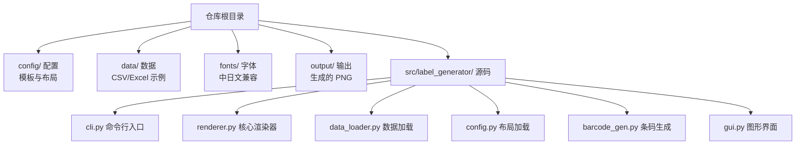
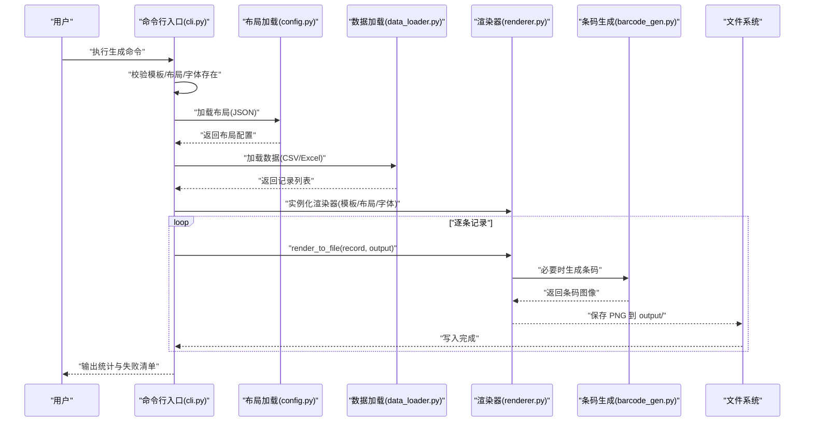
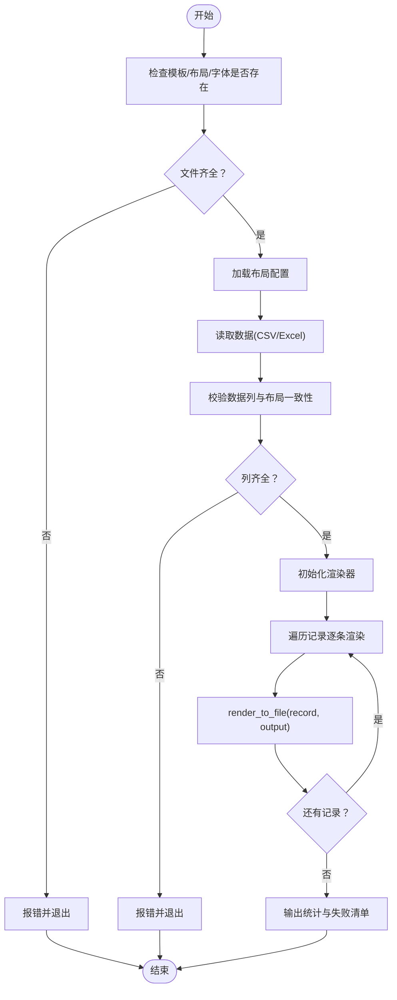
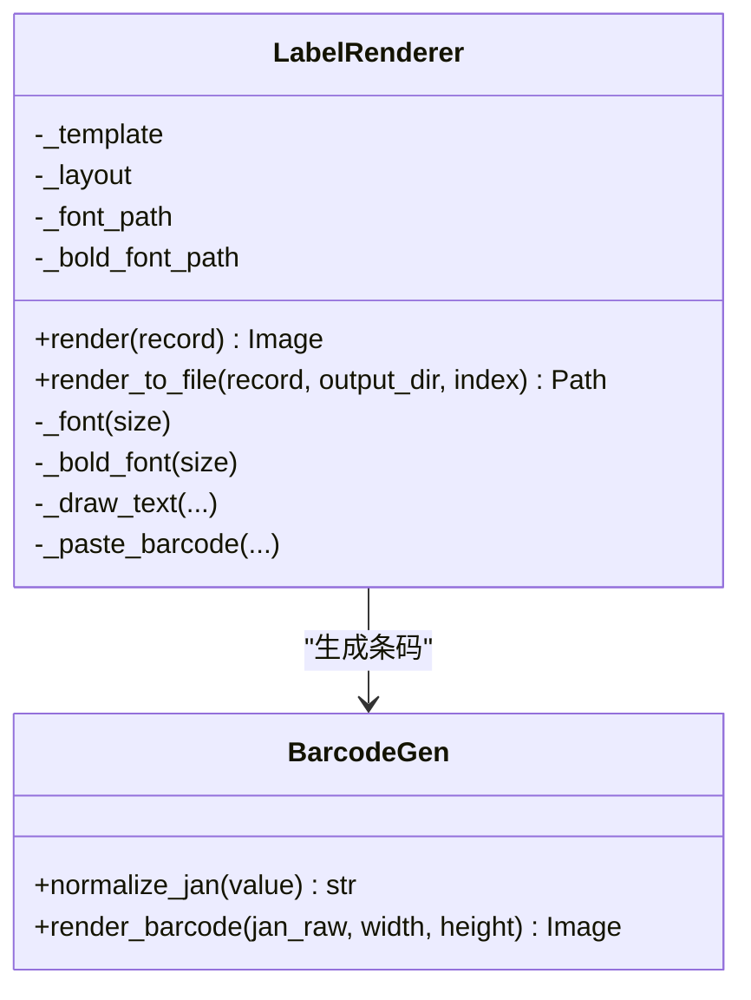
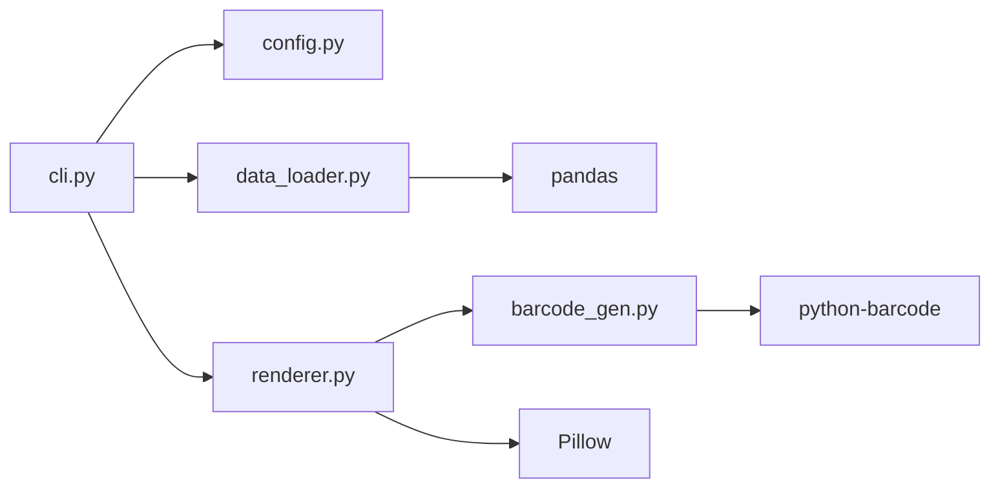

# 快速开始

<cite>
**本文引用的文件**
- [README.md](file://README.md)
- [SPEC.md](file://SPEC.md)
- [pyproject.toml](file://pyproject.toml)
- [requirements.txt](file://requirements.txt)
- [src/label_generator/cli.py](file://src/label_generator/cli.py)
- [src/label_generator/renderer.py](file://src/label_generator/renderer.py)
- [src/label_generator/data_loader.py](file://src/label_generator/data_loader.py)
- [src/label_generator/config.py](file://src/label_generator/config.py)
- [src/label_generator/barcode_gen.py](file://src/label_generator/barcode_gen.py)
- [src/label_generator/gui.py](file://src/label_generator/gui.py)
- [config/layout.json](file://config/layout.json)
- [data/products.csv](file://data/products.csv)
</cite>

## 目录
1. [简介](#简介)
2. [项目结构](#项目结构)
3. [核心组件](#核心组件)
4. [架构总览](#架构总览)
5. [详细组件解析](#详细组件解析)
6. [依赖关系分析](#依赖关系分析)
7. [性能注意事项](#性能注意事项)
8. [故障排查指南](#故障排查指南)
9. [结论](#结论)
10. [附录](#附录)

## 简介
本指南面向首次使用者，帮助你在约 30 分钟内完成环境准备、安装与配置，并成功运行第一个标签生成任务。你将学会：
- 环境要求与依赖安装（三种方式：标准安装、可编辑安装、无需安装直接运行）
- 基本使用（命令行最小可用示例 → 带参数调用）
- 实战演练：准备数据、配置模板与布局、生成并验证输出
- 常见初始配置问题与解决思路

## 项目结构
项目采用“源码分离 + 配置/数据/字体/输出独立目录”的清晰组织方式，便于维护与扩展。

图表来源
- [SPEC.md: 120-148:120-148](file://SPEC.md#L120-L148)

章节来源
- [SPEC.md: 120-148:120-148](file://SPEC.md#L120-L148)

## 核心组件
- 命令行入口：负责解析参数、校验文件存在性、加载数据与布局、实例化渲染器并逐条生成输出。
- 渲染器：将模板图与文本/条码叠加，输出打印就绪的 PNG。
- 数据加载器：支持 CSV/Excel，统一转为字典列表。
- 布局加载器：读取 JSON，提供字段坐标、字号、锚点、条码尺寸等配置。
- 条码生成器：支持 EAN-13（JAN-13），自动校验与旋转。
- 图形界面：提供可视化配置、数据预览与批量生成。

章节来源
- [src/label_generator/cli.py: 16-94:16-94](file://src/label_generator/cli.py#L16-L94)
- [src/label_generator/renderer.py: 53-251:53-251](file://src/label_generator/renderer.py#L53-L251)
- [src/label_generator/data_loader.py: 9-32:9-32](file://src/label_generator/data_loader.py#L9-L32)
- [src/label_generator/config.py: 8-14:8-14](file://src/label_generator/config.py#L8-L14)
- [src/label_generator/barcode_gen.py: 17-60:17-60](file://src/label_generator/barcode_gen.py#L17-L60)
- [src/label_generator/gui.py: 19-384:19-384](file://src/label_generator/gui.py#L19-L384)

## 架构总览
下面的序列图展示了从命令行到输出的端到端流程。

图表来源
- [src/label_generator/cli.py: 16-94:16-94](file://src/label_generator/cli.py#L16-L94)
- [src/label_generator/renderer.py: 83-102:83-102](file://src/label_generator/renderer.py#L83-L102)
- [src/label_generator/barcode_gen.py: 40-60:40-60](file://src/label_generator/barcode_gen.py#L40-L60)

## 详细组件解析

### 环境要求与安装
- Python 版本：3.11 及以上
- 依赖来源：
  - requirements.txt：标准依赖清单
  - pyproject.toml：项目元数据与可执行入口定义

安装方式（任选其一）：
1) 标准安装
- 创建并激活虚拟环境
- 安装依赖
- 该方式适合将项目作为第三方包使用

2) 可编辑安装
- 使用 pip 的可编辑模式安装项目
- 修改源码后无需重复安装即可生效
- 适合开发调试

3) 无需安装直接运行
- 通过设置 PYTHONPATH 并使用模块形式运行
- 适合临时试用或不希望安装的场景

章节来源
- [README.md: 5-22:5-22](file://README.md#L5-L22)
- [pyproject.toml: 9-20:9-20](file://pyproject.toml#L9-L20)
- [requirements.txt: 1-6:1-6](file://requirements.txt#L1-L6)

### 基本使用示例
- 最小可用命令（无需额外参数）
  - 在仓库根目录执行命令，使用内置默认路径
- 带参数调用
  - 显式指定数据文件、模板、布局 JSON、输出目录与字体文件

输出说明
- 每条记录生成一张 PNG，文件名为 {sku}.png，位于 output/ 目录

章节来源
- [README.md: 24-38:24-38](file://README.md#L24-L38)

### 第一个标签生成实战
目标：使用示例数据生成 5 张标签，验证输出与条码可扫性。

前置准备
- 确认已安装依赖
- 准备好模板图片、布局 JSON、字体文件与示例数据

操作步骤
1) 准备数据
- 使用仓库提供的示例 CSV，包含必需列：sku、size、category、sku_code、color_name、jan
- 若需更多样例，可参考规格文档中的示例数据格式

2) 配置模板与布局
- 模板图片：config/template.png（尺寸 591×354）
- 布局 JSON：config/layout.json（定义字段坐标、字号、锚点、条码尺寸与旋转等）
- 字体：fonts/NotoSansCJK-Regular.otf 与 NotoSansCJK-Bold.otf（必须存在）

3) 生成标签
- 执行命令行生成（或使用图形界面）
- 生成完成后，output/ 目录下将出现与数据行数相同的 PNG 文件

4) 验证结果
- 校验文件名与数量：应与数据行数一致
- 视觉核对：关键字段（尺码、品类、颜色、条码位置）与设计稿一致
- 条码验证：使用手机扫码应用扫描任意一张图，确认可识别对应 JAN 码
- 中日文显示：确认中日文字符正常显示，无方块

章节来源
- [SPEC.md: 18-28:18-28](file://SPEC.md#L18-L28)
- [SPEC.md: 231-242:231-242](file://SPEC.md#L231-L242)
- [SPEC.md: 244-251:244-251](file://SPEC.md#L244-L251)
- [config/layout.json: 1-56:1-56](file://config/layout.json#L1-L56)
- [data/products.csv: 1-7:1-7](file://data/products.csv#L1-L7)

### 命令行工作流详解
- 参数解析与校验
  - 检查模板、布局、字体是否存在；若缺省，fail-fast 提示
  - 若未提供粗体字体，将回退到常规字体并发出警告
- 数据与布局校验
  - 读取数据后，检查布局中声明的字段是否都在数据列中
- 渲染与输出
  - 逐条渲染，输出到指定目录
  - 统计成功/失败数量，失败项汇总输出

图表来源
- [src/label_generator/cli.py: 36-85:36-85](file://src/label_generator/cli.py#L36-L85)

章节来源
- [src/label_generator/cli.py: 16-94:16-94](file://src/label_generator/cli.py#L16-L94)

### 渲染器与条码生成
- 渲染器职责
  - 加载模板与字体，缓存字体对象
  - 根据布局对每条记录绘制文本或粘贴条码
  - 支持锚点对齐、多行文本换行与截断、旋转粘贴
- 条码生成
  - 自动校验 JAN-13（12 位补校验或 13 位校验）
  - 使用 ImageWriter 直接输出 PNG，再按布局尺寸缩放与旋转
  - 可选在条码下方显示数字

图表来源
- [src/label_generator/renderer.py: 53-251:53-251](file://src/label_generator/renderer.py#L53-L251)
- [src/label_generator/barcode_gen.py: 17-60:17-60](file://src/label_generator/barcode_gen.py#L17-L60)

章节来源
- [src/label_generator/renderer.py: 83-102:83-102](file://src/label_generator/renderer.py#L83-L102)
- [src/label_generator/renderer.py: 133-197:133-197](file://src/label_generator/renderer.py#L133-L197)
- [src/label_generator/barcode_gen.py: 17-60:17-60](file://src/label_generator/barcode_gen.py#L17-L60)

### 图形界面（GUI）使用
- 功能概览
  - 配置面板：数据文件、模板图片、布局 JSON、输出目录、字体文件
  - 数据预览：Treeview 展示 CSV/Excel 内容
  - 预览：选择某行，实时渲染预览
  - 生成：批量生成并显示进度与结果
- 使用建议
  - 先加载数据与布局，确认列匹配
  - 预览关键行，确认渲染效果
  - 批量生成，关注失败项

章节来源
- [src/label_generator/gui.py: 19-384:19-384](file://src/label_generator/gui.py#L19-L384)

## 依赖关系分析
- CLI 依赖于配置加载、数据加载与渲染器
- 渲染器依赖于布局配置、字体文件与条码生成器
- 条码生成器依赖于 python-barcode 与 Pillow
- 数据加载器依赖于 pandas 与 openpyxl

图表来源
- [src/label_generator/cli.py: 7-9:7-9](file://src/label_generator/cli.py#L7-L9)
- [src/label_generator/renderer.py: 9](file://src/label_generator/renderer.py#L9)
- [src/label_generator/barcode_gen.py: 6-8:6-8](file://src/label_generator/barcode_gen.py#L6-L8)
- [src/label_generator/data_loader.py: 6](file://src/label_generator/data_loader.py#L6)
- [pyproject.toml: 10-16:10-16](file://pyproject.toml#L10-L16)

章节来源
- [pyproject.toml: 10-16:10-16](file://pyproject.toml#L10-L16)

## 性能注意事项
- 字体缓存：渲染器对字体对象进行缓存，避免重复 IO，提升批量渲染效率
- 条码缓存：条码生成函数对输入进行缓存，减少重复计算
- 建议
  - 使用合适的布局尺寸与锚点，减少不必要的重绘
  - 批量生成时注意磁盘写入开销，尽量在 SSD 上进行

章节来源
- [src/label_generator/renderer.py: 75-81:75-81](file://src/label_generator/renderer.py#L75-L81)
- [src/label_generator/barcode_gen.py: 40-40:40-40](file://src/label_generator/barcode_gen.py#L40-L40)

## 故障排查指南
常见问题与解决思路
- Python 版本过低
  - 现象：安装或运行时报版本不满足要求
  - 解决：升级至 Python 3.11+

- 依赖安装失败
  - 现象：安装 Pillow/python-barcode/pandas 等时报错
  - 解决：检查网络与镜像源；优先使用 requirements.txt 或 pyproject.toml 的依赖清单

- 文件缺失（模板/布局/字体）
  - 现象：启动时报错提示文件不存在
  - 解决：确认 config/、fonts/、data/ 目录结构与文件名；或显式传入正确路径

- 数据列缺失
  - 现象：启动时报错提示缺少布局所需的列
  - 解决：对照 layout.json 的键名补齐 CSV 列，或调整布局

- 条码校验失败
  - 现象：某条记录失败，汇总输出失败清单
  - 解决：检查 jan 字段是否为 12 位纯数字（自动补校验）或 13 位有效校验码

- 中日文显示异常
  - 现象：出现方块或乱码
  - 解决：确认 fonts/ 目录下字体文件存在且路径正确

- 输出文件名异常
  - 现象：文件名包含非法字符导致无法创建
  - 解决：确保 sku 值合法；渲染器会替换非法字符为下划线

章节来源
- [src/label_generator/cli.py: 36-58:36-58](file://src/label_generator/cli.py#L36-L58)
- [src/label_generator/data_loader.py: 9-23:9-23](file://src/label_generator/data_loader.py#L9-L23)
- [src/label_generator/barcode_gen.py: 17-32:17-32](file://src/label_generator/barcode_gen.py#L17-L32)
- [src/label_generator/renderer.py: 14-15:14-15](file://src/label_generator/renderer.py#L14-L15)

## 结论
通过本指南，你已经完成了环境准备、安装与配置，并成功运行了第一个标签生成任务。建议后续：
- 根据实际业务调整布局 JSON 与模板图片
- 使用 GUI 进行可视化配置与预览
- 扩展更多字段与样式，满足复杂排版需求

## 附录

### 附录 A：命令行入口与默认参数
- 默认参数指向仓库内的默认路径（config/、data/、fonts/、output/）
- 可通过命令行参数覆盖默认路径

章节来源
- [src/label_generator/cli.py: 17-28:17-28](file://src/label_generator/cli.py#L17-L28)
- [README.md: 24-38:24-38](file://README.md#L24-L38)

### 附录 B：布局 JSON 字段说明
- 通用字段：type、xy、anchor
- 文本专属：font_size、color、bold、max_width
- 条码专属：format、width、height、rotation、show_text
- 锚点：PIL 标准记法，推荐使用 "mm"（中心对齐）

章节来源
- [SPEC.md: 89-104:89-104](file://SPEC.md#L89-L104)
- [config/layout.json: 1-56:1-56](file://config/layout.json#L1-L56)