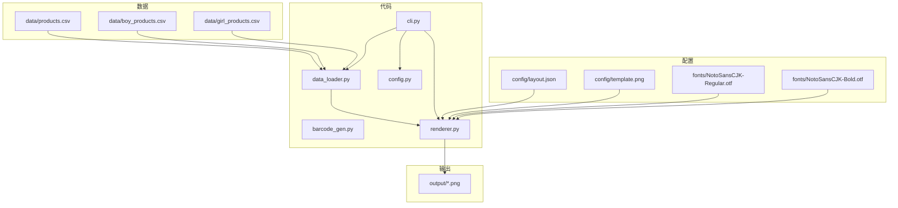
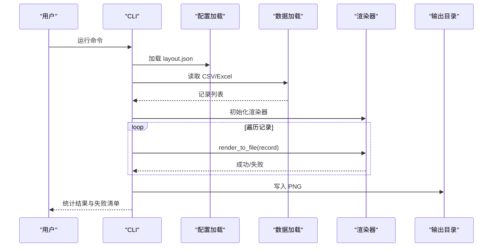
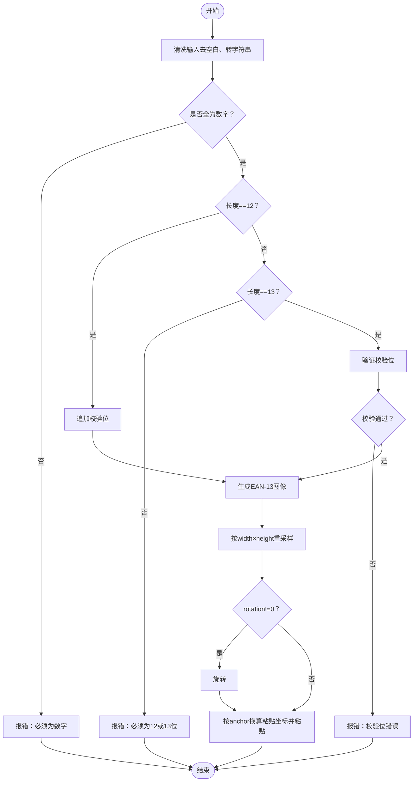
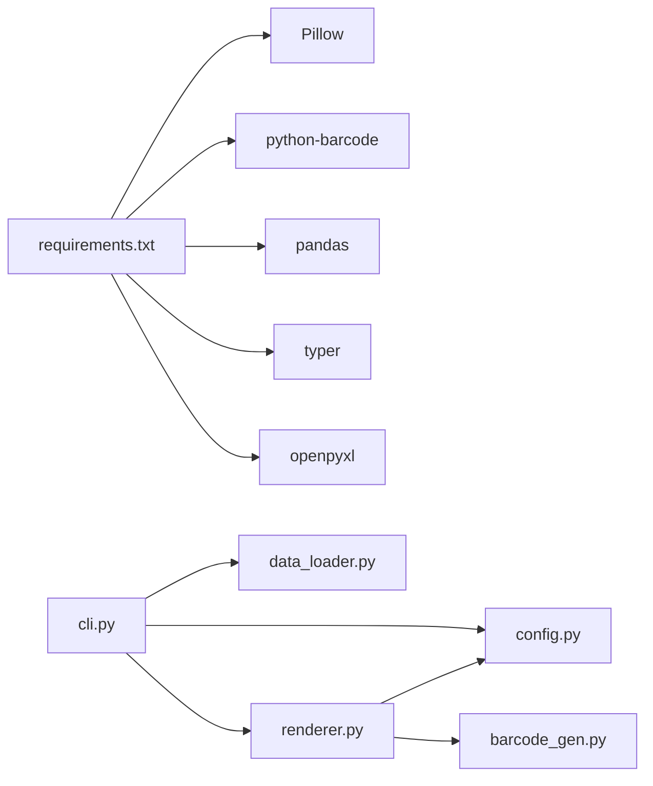

# 数据格式与规范

<cite>
**本文引用的文件**
- [README.md](file://README.md)
- [SPEC.md](file://SPEC.md)
- [config/layout.json](file://config/layout.json)
- [src/label_generator/data_loader.py](file://src/label_generator/data_loader.py)
- [src/label_generator/barcode_gen.py](file://src/label_generator/barcode_gen.py)
- [src/label_generator/renderer.py](file://src/label_generator/renderer.py)
- [src/label_generator/cli.py](file://src/label_generator/cli.py)
- [src/label_generator/config.py](file://src/label_generator/config.py)
- [data/products.csv](file://data/products.csv)
- [data/boy_products.csv](file://data/boy_products.csv)
- [data/girl_products.csv](file://data/girl_products.csv)
- [requirements.txt](file://requirements.txt)
</cite>

## 目录
1. [简介](#简介)
2. [项目结构](#项目结构)
3. [核心组件](#核心组件)
4. [架构总览](#架构总览)
5. [详细组件分析](#详细组件分析)
6. [依赖分析](#依赖分析)
7. [性能考虑](#性能考虑)
8. [故障排查指南](#故障排查指南)
9. [结论](#结论)
10. [附录](#附录)

## 简介
本文件面向标签生成器的使用者与维护者，系统性阐述数据格式与规范，包括：
- CSV 数据字段定义、数据类型与验证规则
- Excel 文件支持与数据提取方法
- 完整示例数据格式与数据结构说明
- JAN-13 条码标准格式、校验位计算与数据验证机制
- 数据质量检查与错误处理最佳实践
- 数据导入前的准备工作与常见问题解决方案

目标是帮助用户正确准备与格式化输入数据，以获得最佳的标签生成效果。

## 项目结构
项目采用“配置外置 + 数据外置”的设计，通过 layout.json 将字段布局与渲染参数与数据解耦，便于更换模板或调整布局而无需改动代码。

图表来源
- [config/layout.json:1-56](file://config/layout.json#L1-L56)
- [src/label_generator/data_loader.py:9-32](file://src/label_generator/data_loader.py#L9-L32)
- [src/label_generator/renderer.py:53-102](file://src/label_generator/renderer.py#L53-L102)
- [src/label_generator/cli.py:16-94](file://src/label_generator/cli.py#L16-L94)

章节来源
- [README.md: 40-59:40-59](file://README.md#L40-L59)
- [SPEC.md: 120-148:120-148](file://SPEC.md#L120-L148)

## 核心组件
- 数据加载器：支持 CSV 与 Excel（.xlsx/.xls），统一读取为字典列表，并进行列缺失校验。
- 条码生成器：实现 JAN-13 校验与校验位计算，生成高质量条码图像。
- 渲染器：根据 layout.json 将文本与条码叠加到模板图像上，支持锚点、旋转、换行与截断。
- CLI：命令行入口，负责参数解析、文件存在性检查、逐行渲染与失败统计。

章节来源
- [src/label_generator/data_loader.py: 9-32:9-32](file://src/label_generator/data_loader.py#L9-L32)
- [src/label_generator/barcode_gen.py: 11-60:11-60](file://src/label_generator/barcode_gen.py#L11-L60)
- [src/label_generator/renderer.py: 53-251:53-251](file://src/label_generator/renderer.py#L53-L251)
- [src/label_generator/cli.py: 16-94:16-94](file://src/label_generator/cli.py#L16-L94)

## 架构总览
下图展示从数据到输出的关键流程：CLI 解析参数 → 加载布局与数据 → 校验列 → 渲染器逐行渲染 → 输出 PNG。

图表来源
- [src/label_generator/cli.py: 16-94:16-94](file://src/label_generator/cli.py#L16-L94)
- [src/label_generator/data_loader.py: 9-32:9-32](file://src/label_generator/data_loader.py#L9-L32)
- [src/label_generator/renderer.py: 233-251:233-251](file://src/label_generator/renderer.py#L233-L251)

## 详细组件分析

### CSV 数据格式与字段规范
- 支持字段与用途
  - sku：商品唯一标识，作为输出文件名；若缺失，回退到 sku_code，再回退到 jan，最后使用行号。
  - size：尺码，如 S/M/L/XL。
  - category：品类标签，通常置于圆角框内。
  - sku_code：商品型号码，如 J25011BLM。
  - color_name：颜色/款式说明，如 A．ブルーチェック。
  - jan：JAN-13 条码，支持两种输入形式：
    - 12 位：自动追加校验位
    - 13 位：验证校验位正确性，错误则报错并跳过该行
- 数据类型与取值范围
  - 所有字段均为字符串类型（dtype=str），便于保持原始格式一致性。
  - jan 必须为纯数字字符串，长度为 12 或 13。
- 列缺失与校验
  - CLI 启动时一次性报告 layout.json 引用但数据中缺失的所有列，避免逐行报错。
- 示例数据
  - 提供多组示例 CSV 文件，覆盖不同 size、品类、颜色与条码，便于测试中日文渲染与条码识别。

章节来源
- [SPEC.md: 18-28:18-28](file://SPEC.md#L18-L28)
- [SPEC.md: 231-242:231-242](file://SPEC.md#L231-L242)
- [data/products.csv: 1-7:1-7](file://data/products.csv#L1-L7)
- [data/boy_products.csv: 1-19:1-19](file://data/boy_products.csv#L1-L19)
- [data/girl_products.csv: 1-27:1-27](file://data/girl_products.csv#L1-L27)

### Excel 文件支持与数据提取方法
- 支持格式：.xlsx 与 .xls
- 读取方式：使用 pandas 读取为 DataFrame，再转换为字典列表（dtype=str），统一后续处理。
- 注意事项
  - 读取时将缺失值填充为空字符串，避免渲染阶段出现 None。
  - 若列名与 layout.json 的键不一致，将触发列缺失错误。

章节来源
- [src/label_generator/data_loader.py: 14-23:14-23](file://src/label_generator/data_loader.py#L14-L23)
- [SPEC.md: 12](file://SPEC.md#L12)

### layout.json 字段定义与渲染规则
- 结构概览
  - _meta：模板尺寸与字体路径等元信息，渲染时跳过。
  - 每个字段键对应 CSV 列名，值定义渲染参数。
- 字段类型
  - text：文本渲染
    - type: "text"
    - xy: [x, y] 像素坐标
    - anchor: 锚点（PIL 标准：lt/mm/rt 等）
    - font_size: 字号
    - color: 十六进制颜色
    - bold: 是否使用粗体
    - max_width: 最大宽度，超宽时按规则换行或截断
  - barcode：条码渲染
    - type: "barcode"
    - format: "ean13"
    - xy: [x, y] 像素坐标
    - anchor: 锚点
    - width/height: 条码旋转前的尺寸
    - rotation: 旋转角度（度，逆时针为正）
    - show_text: 是否在条码下方显示数字
- 坐标与锚点
  - 原点在左上角，x 向右，y 向下。
  - anchor 用于将中心坐标换算为粘贴时的左上角坐标。
- 示例布局
  - 提供了 size、category、sku_code、color_name、jan 的布局示例，便于对照调整。

章节来源
- [SPEC.md: 29-105:29-105](file://SPEC.md#L29-L105)
- [SPEC.md: 172-187:172-187](file://SPEC.md#L172-L187)
- [config/layout.json: 1-56:1-56](file://config/layout.json#L1-L56)

### JAN-13 条码标准与校验位计算
- 标准格式
  - EAN-13（JAN-13），支持两种输入：
    - 12 位：自动追加校验位
    - 13 位：验证校验位正确性
- 校验位计算
  - 奇数位之和与偶数位之和按特定权重组合，取模运算得到校验位。
- 渲染流程
  - 生成水平 EAN-13 PNG（由 python-barcode 决定原始尺寸）
  - 按 layout 的 width×height resize
  - 若设置 rotation≠0，则按角度旋转
  - 根据 anchor 与 xy 计算粘贴左上角坐标，粘贴到模板
  - 若 show_text=true，会在条码下方绘制数字
- 错误处理
  - 输入非数字、长度非法、校验位错误时抛出异常并跳过该行，不影响其他行。

图表来源
- [src/label_generator/barcode_gen.py: 17-32:17-32](file://src/label_generator/barcode_gen.py#L17-L32)
- [src/label_generator/renderer.py: 133-196:133-196](file://src/label_generator/renderer.py#L133-L196)

章节来源
- [SPEC.md: 162-171:162-171](file://SPEC.md#L162-L171)
- [src/label_generator/barcode_gen.py: 11-60:11-60](file://src/label_generator/barcode_gen.py#L11-L60)
- [src/label_generator/renderer.py: 133-196:133-196](file://src/label_generator/renderer.py#L133-L196)

### 文本换行与截断策略
- 自动换行
  - 当指定 max_width 时，按字符断行（中日文按字符，英文按单词）。
  - 最多两行，超过两行时对最后一行进行截断并添加省略号。
- 行高计算
  - 使用字体 getbbox 计算行高，保证行间距合理。
- 渲染锚点
  - 文本渲染直接使用 PIL 的 anchor 参数，无需手动换算。

章节来源
- [SPEC.md: 157-161:157-161](file://SPEC.md#L157-L161)
- [src/label_generator/renderer.py: 23-51:23-51](file://src/label_generator/renderer.py#L23-L51)
- [src/label_generator/renderer.py: 104-132:104-132](file://src/label_generator/renderer.py#L104-L132)

### 文件命名与输出
- 命名优先级：sku → sku_code → jan → row_{i}
- 非法字符替换：斜杠、反斜杠、冒号、星号、问号、引号、小于号、大于号、竖线 替换为下划线
- 输出格式：PNG，保存于 output/ 目录

章节来源
- [SPEC.md: 189-192:189-192](file://SPEC.md#L189-L192)
- [src/label_generator/renderer.py: 233-251:233-251](file://src/label_generator/renderer.py#L233-L251)

## 依赖分析
- 外部依赖
  - Pillow：图像处理与渲染
  - python-barcode：条码生成
  - pandas：CSV/Excel 读取
  - typer：命令行接口
  - openpyxl：Excel 读取支持
- 内部模块耦合
  - CLI 依赖配置加载、数据加载与渲染器
  - 渲染器依赖布局配置与字体资源
  - 条码生成器独立于渲染器，被渲染器调用

图表来源
- [requirements.txt: 1-6:1-6](file://requirements.txt#L1-L6)
- [src/label_generator/cli.py: 7-9:7-9](file://src/label_generator/cli.py#L7-L9)
- [src/label_generator/renderer.py: 140-L140](file://src/label_generator/renderer.py#L140)

章节来源
- [requirements.txt: 1-6:1-6](file://requirements.txt#L1-L6)

## 性能考虑
- 字体缓存：渲染器对字体对象进行缓存，避免重复加载，提升批量渲染效率。
- 条码缓存：条码生成函数对常用输入进行缓存，减少重复计算。
- 图像操作：resize 使用高质量插值，旋转使用 expand 以避免裁剪。
- 数据读取：pandas 读取时 dtype=str，避免类型推断开销与潜在格式变化。

章节来源
- [SPEC.md: 152-156:152-156](file://SPEC.md#L152-L156)
- [SPEC.md: 162-171:162-171](file://SPEC.md#L162-L171)
- [src/label_generator/renderer.py: 75-81:75-81](file://src/label_generator/renderer.py#L75-L81)
- [src/label_generator/barcode_gen.py: 40-L40](file://src/label_generator/barcode_gen.py#L40)

## 故障排查指南
- 模板/字体/layout 文件缺失
  - 启动时 fail-fast，直接报错并提示具体路径。
- 布局引用了 CSV 不存在的列
  - 启动时一次性报出缺失列，避免逐行报错。
- JAN 校验失败
  - 跳过该行，汇总失败清单，不影响其他行。
- 文本渲染异常
  - 检查 layout.json 中的 font_size、max_width、anchor 设置是否合理。
- 条码方向或位置不对
  - 检查 layout.json 中的 rotation、anchor、xy、width/height 设置。
- 输出文件名非法
  - 确保 sku/sku_code/jan 中至少有一个有效且不含非法字符。

章节来源
- [SPEC.md: 205-213:205-213](file://SPEC.md#L205-L213)
- [src/label_generator/cli.py: 35-60:35-60](file://src/label_generator/cli.py#L35-L60)
- [src/label_generator/renderer.py: 149-154:149-154](file://src/label_generator/renderer.py#L149-L154)

## 结论
通过将布局与数据分离、严格的数据类型与校验规则、完善的错误处理与性能优化，标签生成器能够在保证质量的前提下高效批量生成打印就绪的 PNG 标签。遵循本文档的数据格式与规范，可显著降低数据准备与调试成本，提升整体生产效率。

## 附录

### 数据导入前准备工作
- 准备模板与布局
  - 确认 config/template.png 与 config/layout.json 存在且与模板尺寸一致。
  - 如需更换模板，仅需更新 template.png 与 layout.json，无需改动代码。
- 准备数据文件
  - 使用 CSV 或 Excel（.xlsx/.xls），列名需与 layout.json 的键一致。
  - 确保 jan 字段为纯数字字符串，长度为 12 或 13。
- 准备字体
  - fonts/NotoSansCJK-Regular.otf 与 NotoSansCJK-Bold.otf 必须存在，否则会回退或报错。
- 运行环境
  - 安装依赖并使用 Python 3.11+。

章节来源
- [README.md: 5-22:5-22](file://README.md#L5-L22)
- [SPEC.md: 10-17:10-17](file://SPEC.md#L10-L17)

### 常见数据问题与解决方案
- 列名不匹配
  - 症状：启动时报缺失列。
  - 解决：统一列名与 layout.json 键一致。
- jan 非数字或长度错误
  - 症状：该行被跳过并记录失败。
  - 解决：修正为 12 位纯数字（自动补校验）或 13 位正确校验码。
- 文本溢出
  - 症状：文字越界或截断。
  - 解决：调整 layout.json 中的 max_width、font_size 或拆分字段。
- 条码不可读
  - 症状：扫描失败。
  - 解决：检查 rotation、anchor、xy、width/height 设置，确保条码区域未被遮挡。

章节来源
- [SPEC.md: 205-213:205-213](file://SPEC.md#L205-L213)
- [config/layout.json: 1-L56:1-56](file://config/layout.json#L1-L56)