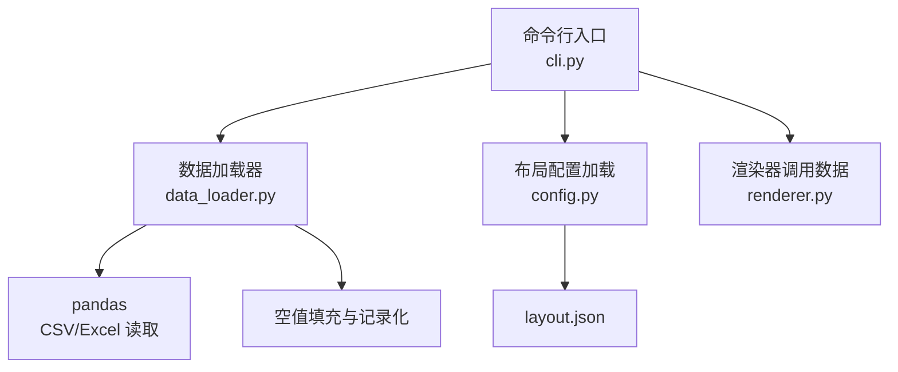
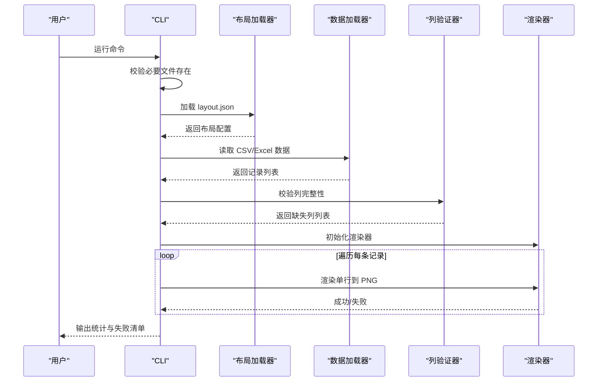
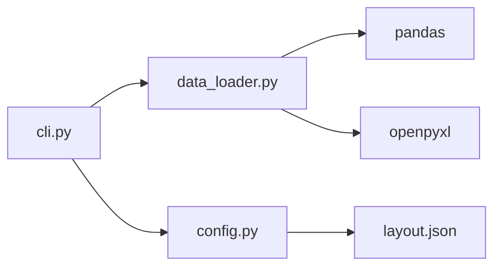

# 数据处理模块

<cite>
**本文引用的文件**
- [data_loader.py](file://src/label_generator/data_loader.py)
- [cli.py](file://src/label_generator/cli.py)
- [config.py](file://src/label_generator/config.py)
- [layout.json](file://config/layout.json)
- [README.md](file://README.md)
- [SPEC.md](file://SPEC.md)
- [requirements.txt](file://requirements.txt)
- [products.csv](file://data/products.csv)
- [boy_products.csv](file://data/boy_products.csv)
- [girl_products.csv](file://data/girl_products.csv)
</cite>

## 目录
1. [简介](#简介)
2. [项目结构](#项目结构)
3. [核心组件](#核心组件)
4. [架构总览](#架构总览)
5. [详细组件分析](#详细组件分析)
6. [依赖分析](#依赖分析)
7. [性能考虑](#性能考虑)
8. [故障排查指南](#故障排查指南)
9. [结论](#结论)
10. [附录](#附录)

## 简介
本文件聚焦于标签生成器中的“数据处理模块”，系统性阐述数据加载器的设计与实现，涵盖：
- CSV/Excel 文件读取与格式检测
- 数据验证与列映射
- 类型转换与空值处理
- 字符编码与列名一致性保障
- 错误处理与失败回退策略
- 面向初学者的使用指导与面向高级用户的性能优化建议

## 项目结构
数据处理模块位于 src/label_generator/data_loader.py，配合 CLI 入口 src/label_generator/cli.py、布局配置加载 src/label_generator/config.py 以及示例数据 config/layout.json、data/*.csv 共同构成完整的数据输入链路。

图表来源
- [cli.py:16-86](file://src/label_generator/cli.py#L16-L86)
- [data_loader.py:9-23](file://src/label_generator/data_loader.py#L9-L23)
- [config.py:8-13](file://src/label_generator/config.py#L8-L13)

章节来源
- [README.md:40-59](file://README.md#L40-L59)
- [SPEC.md:120-148](file://SPEC.md#L120-L148)

## 核心组件
- 数据加载器：负责根据文件扩展名选择 CSV 或 Excel 解析，统一将数据转换为字典列表，并进行空值填充。
- 列验证器：基于布局配置检查数据列完整性，确保渲染阶段不会因缺列而失败。
- 布局配置加载器：读取 layout.json 并返回字典结构，供渲染器与验证器使用。

章节来源
- [data_loader.py:9-31](file://src/label_generator/data_loader.py#L9-L31)
- [config.py:8-13](file://src/label_generator/config.py#L8-L13)
- [cli.py:49-58](file://src/label_generator/cli.py#L49-L58)

## 架构总览
数据处理模块在 CLI 层触发，先加载布局配置，再读取数据，最后进行列验证，随后交由渲染器逐行生成标签。

图表来源
- [cli.py:16-86](file://src/label_generator/cli.py#L16-L86)
- [data_loader.py:9-23](file://src/label_generator/data_loader.py#L9-L23)
- [config.py:8-13](file://src/label_generator/config.py#L8-L13)

## 详细组件分析

### 数据加载器（CSV/Excel 读取与清洗）
- 功能职责
  - 路径存在性校验与错误抛出
  - 基于文件扩展名选择解析器（CSV 或 Excel）
  - 统一将数值/文本转换为字符串类型，避免后续渲染层类型不一致
  - 将 DataFrame 空值统一填充为空字符串，保证渲染一致性
  - 将 DataFrame 转换为字典列表，便于逐行处理

- 支持格式与扩展名
  - CSV：.csv
  - Excel：.xlsx、.xls
  - 其他扩展名将触发不支持格式异常

- 字符编码与类型转换
  - CSV 默认使用 pandas 的默认编码读取（通常为 UTF-8）
  - Excel 使用 openpyxl 引擎读取，pandas 自动处理常见编码
  - dtype=str 强制将所有单元格读取为字符串，避免整数/浮点导致的渲染差异

- 空值处理
  - 使用 fillna("") 将 NaN/None 统一替换为空字符串，确保渲染阶段不会出现 None 导致的异常

- 错误处理
  - 文件不存在：抛出 FileNotFoundError
  - 不支持的扩展名：抛出 ValueError
  - 无数据记录：返回空列表，不影响后续流程

- 性能与内存
  - dtype=str 降低类型推断成本
  - to_dict(orient="records") 生成列表字典，适合迭代器式遍历
  - 对于超大文件，建议分批处理或外部切分

章节来源
- [data_loader.py:9-23](file://src/label_generator/data_loader.py#L9-L23)
- [requirements.txt:1-5](file://requirements.txt#L1-L5)

### 列验证器（列映射与完整性检查）
- 功能职责
  - 基于布局配置的键集合，检查数据首行的列名集合
  - 忽略以 "_" 开头的元数据键（如 _meta），不参与渲染
  - 返回缺失的布局键列表，便于 CLI 一次性报错退出

- 输入输出
  - 输入：records（字典列表）、layout（布局字典）
  - 输出：缺失列名列表（字符串数组）

- 边界条件
  - records 为空：返回空列表
  - 首行列名为空：返回全部非元数据键

- 使用场景
  - CLI 在渲染前一次性校验，避免逐行报错
  - 与 layout.json 的键保持强一致，减少运行期异常

章节来源
- [data_loader.py:26-31](file://src/label_generator/data_loader.py#L26-L31)
- [cli.py:52-58](file://src/label_generator/cli.py#L52-L58)

### 布局配置加载器
- 功能职责
  - 读取 layout.json，使用 UTF-8 编码
  - 返回字典结构，供渲染器与验证器使用

- 错误处理
  - 文件不存在：抛出 FileNotFoundError
  - 编码问题：显式指定 encoding="utf-8"，避免平台默认编码差异

章节来源
- [config.py:8-13](file://src/label_generator/config.py#L8-L13)
- [layout.json:1-56](file://config/layout.json#L1-L56)

### CLI 集成与数据流
- CLI 在启动时执行 fail-fast 检查：模板、布局、字体是否存在
- 加载布局配置与数据
- 列验证：若缺失列，一次性报错并退出
- 初始化渲染器，逐行渲染并统计成功/失败
- 输出汇总与失败清单

章节来源
- [cli.py:35-86](file://src/label_generator/cli.py#L35-L86)

## 依赖分析
- pandas：提供 CSV/Excel 读取能力，dtype=str 与 fillna 实现类型统一与空值处理
- openpyxl：pandas 读取 .xlsx/.xls 的底层引擎
- typer：CLI 参数解析与帮助输出
- Pillow/python-barcode：渲染与条码生成（与数据加载器解耦）

图表来源
- [data_loader.py:6](file://src/label_generator/data_loader.py#L6)
- [requirements.txt:1-5](file://requirements.txt#L1-L5)
- [cli.py:7-9](file://src/label_generator/cli.py#L7-L9)
- [config.py:8-13](file://src/label_generator/config.py#L8-L13)

章节来源
- [requirements.txt:1-5](file://requirements.txt#L1-L5)

## 性能考虑
- 类型与编码
  - dtype=str 避免类型推断开销，统一字符串处理，利于后续渲染
  - CSV/Excel 默认编码由 pandas/openpyxl 处理，建议确保数据源为 UTF-8 或兼容编码
- 内存占用
  - DataFrame 转字典列表会复制数据，超大文件建议分批读取或外部切分
- I/O 优化
  - 优先使用本地磁盘，避免网络挂载导致的延迟
  - 批量写入 PNG 时注意磁盘吞吐，必要时调整并发策略（渲染器层面）
- 大数据量处理策略
  - 分批处理：将 CSV/Excel 拆分为多个小文件，分别运行 CLI
  - 预处理：在外部工具中完成去重、清洗与列映射，减少运行期校验成本
  - 并发渲染：渲染器可独立并发生成 PNG（需自行扩展），数据加载器保持串行读取

## 故障排查指南
- 文件不存在
  - 现象：抛出 FileNotFoundError
  - 排查：确认路径与权限，检查 CLI 选项与默认路径
  - 参考
    - [data_loader.py:11-12](file://src/label_generator/data_loader.py#L11-L12)
    - [config.py:10-11](file://src/label_generator/config.py#L10-L11)
    - [cli.py:36-40](file://src/label_generator/cli.py#L36-L40)

- 不支持的数据格式
  - 现象：抛出 ValueError
  - 排查：确认扩展名为 .csv、.xlsx 或 .xls
  - 参考
    - [data_loader.py:19-20](file://src/label_generator/data_loader.py#L19-L20)

- 列缺失
  - 现象：CLI 报告缺失列并退出
  - 排查：核对 layout.json 的键与数据列名是否一致（忽略 _meta）
  - 参考
    - [data_loader.py:26-31](file://src/label_generator/data_loader.py#L26-L31)
    - [cli.py:52-58](file://src/label_generator/cli.py#L52-L58)

- 空值导致的渲染异常
  - 现象：渲染阶段出现空白或异常
  - 排查：确认数据中无 None，load_data 已将空值填充为空字符串
  - 参考
    - [data_loader.py:22](file://src/label_generator/data_loader.py#L22)

- 字符编码问题
  - 现象：中文/日文乱码
  - 排查：确保 CSV/Excel 保存为 UTF-8；layout.json 使用 UTF-8 编码
  - 参考
    - [config.py:12](file://src/label_generator/config.py#L12)

## 结论
数据处理模块通过简洁的接口实现了 CSV/Excel 的统一读取、类型与空值标准化，以及列完整性校验，为渲染阶段提供了稳定可靠的数据输入。结合 CLI 的 fail-fast 设计与错误汇总，能够在大规模批量生成场景中快速定位问题并高效产出标签。

## 附录

### 支持的数据类型与字段要求
- 数据类型
  - 所有单元格读取为字符串（dtype=str），避免类型差异
  - 空值统一填充为空字符串
- 字段要求
  - 至少包含 layout.json 中定义的键（忽略 _meta）
  - 建议包含：sku、size、category、sku_code、color_name、jan
- 字段规范参考
  - [SPEC.md:18-27](file://SPEC.md#L18-L27)
  - [README.md:61-71](file://README.md#L61-L71)

### 数据格式与示例
- CSV 示例
  - [products.csv:1-7](file://data/products.csv#L1-L7)
  - [boy_products.csv:1-19](file://data/boy_products.csv#L1-L19)
  - [girl_products.csv:1-27](file://data/girl_products.csv#L1-L27)
- 布局配置
  - [layout.json:1-56](file://config/layout.json#L1-L56)

### API 使用示例（路径指引）
- 读取数据
  - 函数：load_data(path)
  - 用途：读取 CSV/Excel，返回字典列表
  - 参考
    - [data_loader.py:9-23](file://src/label_generator/data_loader.py#L9-L23)
- 列验证
  - 函数：validate_columns(records, layout)
  - 用途：检查缺失列
  - 参考
    - [data_loader.py:26-31](file://src/label_generator/data_loader.py#L26-L31)
- 加载布局
  - 函数：load_layout(path)
  - 用途：读取 layout.json
  - 参考
    - [config.py:8-13](file://src/label_generator/config.py#L8-L13)
- CLI 使用
  - 命令：python -m label_generator.cli
  - 选项：--data、--template、--layout、--output、--font、--bold_font
  - 参考
    - [README.md:24-38](file://README.md#L24-L38)
    - [SPEC.md:193-201](file://SPEC.md#L193-L201)