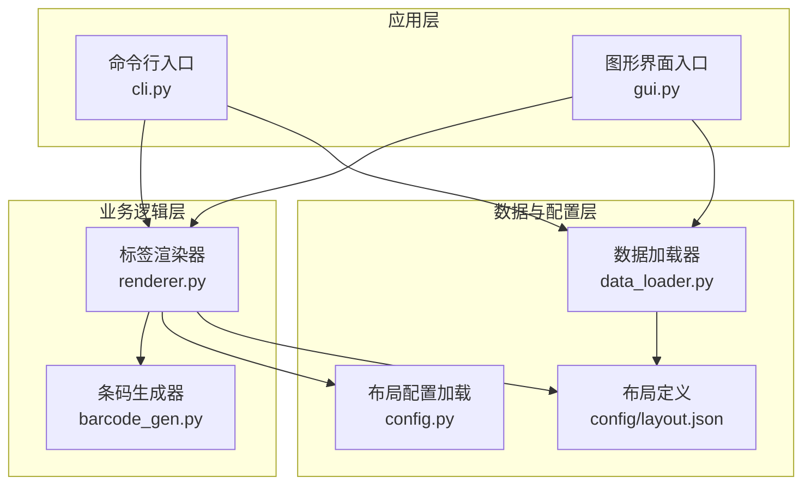
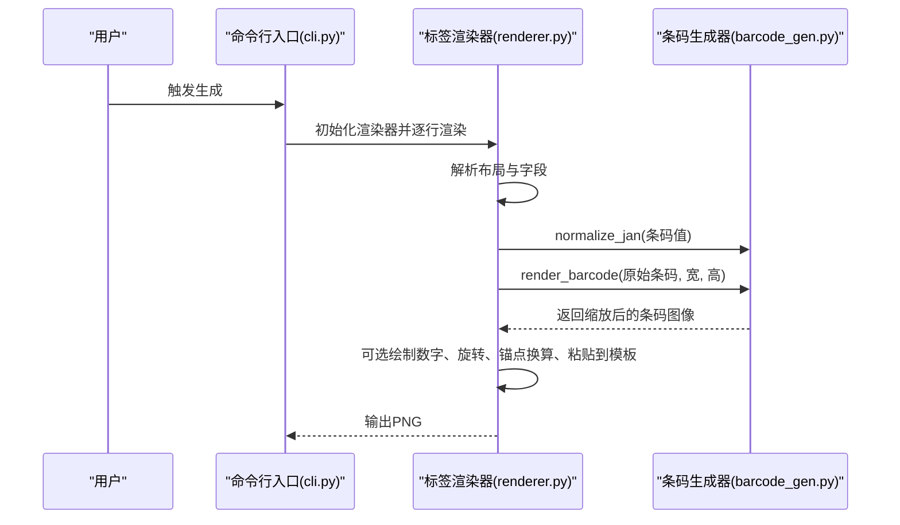
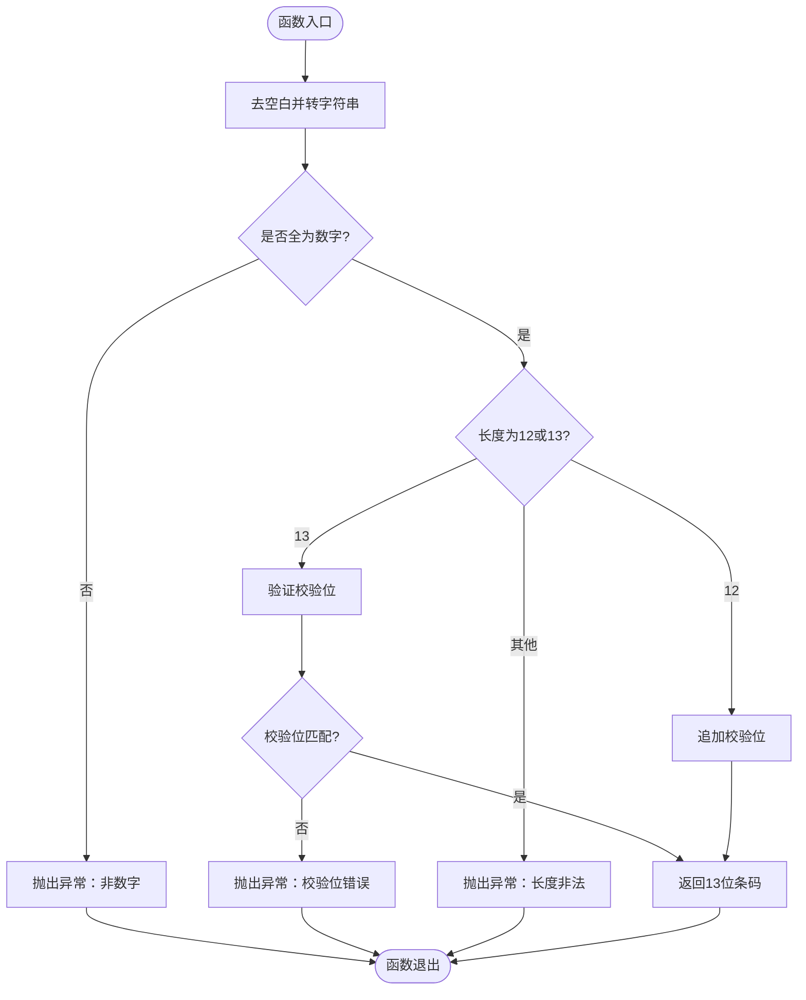
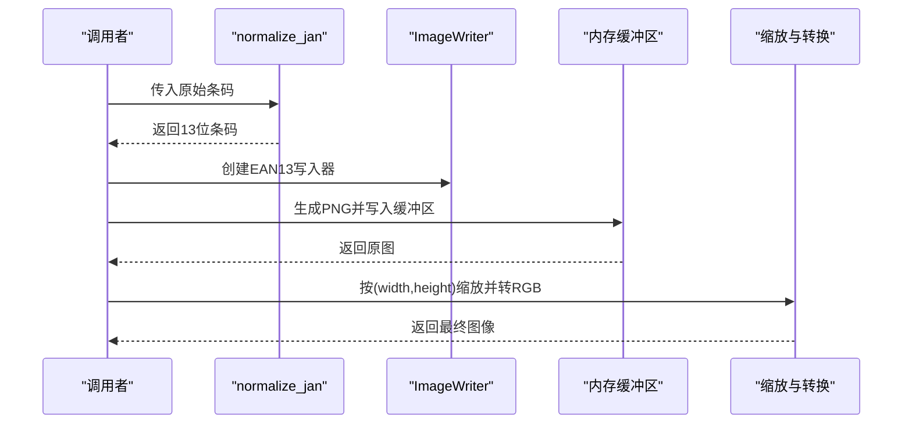
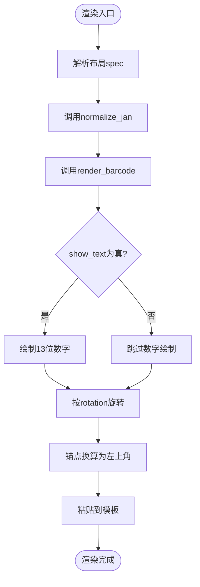
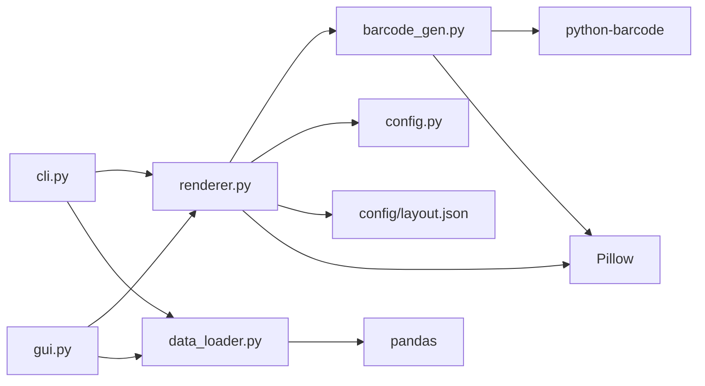

# 条码生成器

<cite>
**本文引用的文件**
- [src/label_generator/barcode_gen.py](file://src/label_generator/barcode_gen.py)
- [src/label_generator/renderer.py](file://src/label_generator/renderer.py)
- [src/label_generator/cli.py](file://src/label_generator/cli.py)
- [src/label_generator/data_loader.py](file://src/label_generator/data_loader.py)
- [src/label_generator/config.py](file://src/label_generator/config.py)
- [src/label_generator/gui.py](file://src/label_generator/gui.py)
- [config/layout.json](file://config/layout.json)
- [README.md](file://README.md)
- [SPEC.md](file://SPEC.md)
</cite>

## 目录
1. [简介](#简介)
2. [项目结构](#项目结构)
3. [核心组件](#核心组件)
4. [架构总览](#架构总览)
5. [详细组件分析](#详细组件分析)
6. [依赖关系分析](#依赖关系分析)
7. [性能考量](#性能考量)
8. [故障排查指南](#故障排查指南)
9. [结论](#结论)
10. [附录](#附录)

## 简介
本文件为“标签生成器”的条码生成器模块提供专业级技术文档，聚焦于 JAN-13 条码的实现与使用。内容涵盖：
- 校验位计算算法与条码编码规则
- 数字验证与标准化处理（normalize_jan）
- 图像生成与渲染流程（render_barcode）
- API 使用示例与最佳实践
- 质量控制、错误检测与异常处理
- 标准规范、应用场景与兼容性要求

目标读者既包括有经验的开发者，也包括希望理解条码标准基础的初学者。

## 项目结构
该项目是一个批量生成服装标签图片的工具，条码生成器位于 src/label_generator/barcode_gen.py，渲染器位于 src/label_generator/renderer.py，CLI 与 GUI 提供交互入口，配置与数据加载分别在 config.py 与 data_loader.py 中。

图表来源
- [src/label_generator/cli.py:16-94](file://src/label_generator/cli.py#L16-L94)
- [src/label_generator/gui.py:19-384](file://src/label_generator/gui.py#L19-L384)
- [src/label_generator/renderer.py:53-251](file://src/label_generator/renderer.py#L53-L251)
- [src/label_generator/barcode_gen.py:11-60](file://src/label_generator/barcode_gen.py#L11-L60)
- [src/label_generator/data_loader.py:9-32](file://src/label_generator/data_loader.py#L9-L32)
- [src/label_generator/config.py:8-14](file://src/label_generator/config.py#L8-L14)
- [config/layout.json:1-56](file://config/layout.json#L1-L56)

章节来源
- [README.md:40-107](file://README.md#L40-L107)
- [SPEC.md:120-148](file://SPEC.md#L120-L148)

## 核心组件
- 条码生成器（barcode_gen.py）
  - 校验位计算：_calc_check_digit
  - 数字验证与标准化：normalize_jan
  - 图像渲染：render_barcode（基于 python-barcode 的 EAN13）
- 标签渲染器（renderer.py）
  - 组合文本与条码，进行锚点、旋转、粘贴与输出
  - 条码渲染集成：调用 normalize_jan 与 render_barcode，并可选绘制数字
- CLI 与 GUI（cli.py、gui.py）
  - 提供批处理与可视化操作入口
- 数据与配置（data_loader.py、config.py、layout.json）
  - 加载数据、校验列、加载布局配置

章节来源
- [src/label_generator/barcode_gen.py:11-60](file://src/label_generator/barcode_gen.py#L11-L60)
- [src/label_generator/renderer.py:53-251](file://src/label_generator/renderer.py#L53-L251)
- [src/label_generator/cli.py:16-94](file://src/label_generator/cli.py#L16-L94)
- [src/label_generator/gui.py:19-384](file://src/label_generator/gui.py#L19-L384)
- [src/label_generator/data_loader.py:9-32](file://src/label_generator/data_loader.py#L9-L32)
- [src/label_generator/config.py:8-14](file://src/label_generator/config.py#L8-L14)
- [config/layout.json:1-56](file://config/layout.json#L1-L56)

## 架构总览
条码生成器在渲染流程中的位置如下：

图表来源
- [src/label_generator/cli.py:66-86](file://src/label_generator/cli.py#L66-L86)
- [src/label_generator/renderer.py:133-197](file://src/label_generator/renderer.py#L133-L197)
- [src/label_generator/barcode_gen.py:40-59](file://src/label_generator/barcode_gen.py#L40-L59)

## 详细组件分析

### 校验位计算与条码编码规则
- 校验位算法
  - 输入：12 位数字
  - 步骤：奇数位求和，偶数位求和并乘以 3，两者之和对 10 取模，再用 10 减之并对 10 取模，得到校验位
  - 实现参考：[src/label_generator/barcode_gen.py:11-14](file://src/label_generator/barcode_gen.py#L11-L14)
- 条码类型
  - 使用 EAN-13（JAN-13）编码，底层通过 python-barcode 的 EAN13 类与 ImageWriter 生成 PNG
  - 实现参考：[src/label_generator/barcode_gen.py:44-45](file://src/label_generator/barcode_gen.py#L44-L45)

章节来源
- [src/label_generator/barcode_gen.py:11-14](file://src/label_generator/barcode_gen.py#L11-L14)
- [SPEC.md:162-171](file://SPEC.md#L162-L171)

### normalize_jan()：数字验证与标准化
功能要点
- 输入清理：去除空白并强制转为字符串
- 数字校验：仅允许纯数字
- 长度处理：
  - 12 位：自动追加校验位
  - 13 位：验证校验位，不匹配则抛出异常
  - 其他长度：抛出异常
- 返回：13 位标准化条码字符串

图表来源
- [src/label_generator/barcode_gen.py:17-32](file://src/label_generator/barcode_gen.py#L17-L32)

章节来源
- [src/label_generator/barcode_gen.py:17-32](file://src/label_generator/barcode_gen.py#L17-L32)

### render_barcode()：图像生成与缩放
处理流程
- 标准化：调用 normalize_jan
- 生成：使用 python-barcode 的 EAN13 + ImageWriter 输出 PNG 到内存缓冲区
- 参数：模块宽度、模块高度、安静区、字体大小、文本距离、DPI 等
- 缩放：按指定宽高进行 Lanczos 插值缩放，并转换为 RGB
- 缓存：对输入组合进行缓存，减少重复计算

图表来源
- [src/label_generator/barcode_gen.py:40-59](file://src/label_generator/barcode_gen.py#L40-L59)

章节来源
- [src/label_generator/barcode_gen.py:40-59](file://src/label_generator/barcode_gen.py#L40-L59)

### 标签渲染器中的条码集成
- 调用链：renderer.py 在渲染条码字段时，调用 normalize_jan 与 render_barcode
- 可选绘制数字：当 show_text 为真时，在条码下方均匀绘制 13 个数字
- 旋转与锚点：根据 spec 的 rotation 与 anchor，计算粘贴坐标并粘贴到模板
- 异常处理：捕获 ValueError 并跳过该条目，继续后续渲染

图表来源
- [src/label_generator/renderer.py:133-197](file://src/label_generator/renderer.py#L133-L197)

章节来源
- [src/label_generator/renderer.py:133-197](file://src/label_generator/renderer.py#L133-L197)

### API 使用示例（方法调用路径）
- 验证与标准化
  - 调用路径：[src/label_generator/barcode_gen.py:17-32](file://src/label_generator/barcode_gen.py#L17-L32)
  - 典型场景：输入 12 位或 13 位条码，返回 13 位标准化结果
- 图像渲染
  - 调用路径：[src/label_generator/barcode_gen.py:40-59](file://src/label_generator/barcode_gen.py#L40-L59)
  - 典型场景：传入原始条码与目标宽高，返回缩放后的 RGB 图像
- 集成渲染（带数字）
  - 调用路径：[src/label_generator/renderer.py:133-197](file://src/label_generator/renderer.py#L133-L197)
  - 典型场景：在布局中设置 type=barcode，width/height/rotation/show_text，自动渲染并粘贴

章节来源
- [src/label_generator/barcode_gen.py:17-32](file://src/label_generator/barcode_gen.py#L17-L32)
- [src/label_generator/barcode_gen.py:40-59](file://src/label_generator/barcode_gen.py#L40-L59)
- [src/label_generator/renderer.py:133-197](file://src/label_generator/renderer.py#L133-L197)

## 依赖关系分析
- 条码生成器依赖
  - python-barcode：EAN13 编码与 ImageWriter
  - Pillow：图像打开、复制、缩放与转换
  - functools.lru_cache：缓存标准化与渲染结果
- 渲染器依赖
  - 条码生成器：normalize_jan、render_barcode
  - Pillow：绘图、字体、图像合成
  - 布局配置：config/layout.json
- CLI/GUI 依赖
  - pandas：读取 CSV/Excel
  - typer/tkinter：命令行与图形界面

图表来源
- [src/label_generator/renderer.py:53-251](file://src/label_generator/renderer.py#L53-L251)
- [src/label_generator/barcode_gen.py:11-60](file://src/label_generator/barcode_gen.py#L11-L60)
- [src/label_generator/cli.py:16-94](file://src/label_generator/cli.py#L16-L94)
- [src/label_generator/gui.py:19-384](file://src/label_generator/gui.py#L19-L384)
- [src/label_generator/data_loader.py:9-32](file://src/label_generator/data_loader.py#L9-L32)

章节来源
- [SPEC.md:111-118](file://SPEC.md#L111-L118)

## 性能考量
- 缓存策略
  - render_barcode 使用 lru_cache(maxsize=128)，对相同输入组合复用结果，显著降低重复渲染开销
  - LabelRenderer 的字体与渲染结果也有相应缓存，减少重复 IO 与计算
- 图像处理
  - 使用 Lanczos 插值缩放，保证缩放质量
  - 生成阶段关闭内部文本绘制（write_text=False），避免重复渲染
- 批处理
  - CLI/GUI 支持批量生成，建议合理设置缓存大小与 DPI，平衡质量与速度

章节来源
- [src/label_generator/barcode_gen.py:40-59](file://src/label_generator/barcode_gen.py#L40-L59)
- [SPEC.md:162-171](file://SPEC.md#L162-L171)

## 故障排查指南
常见问题与处理
- 输入非数字
  - 现象：抛出异常，提示必须为数字
  - 处理：确保条码为纯数字字符串
  - 参考：[src/label_generator/barcode_gen.py:20-21](file://src/label_generator/barcode_gen.py#L20-L21)
- 长度非法
  - 现象：抛出异常，提示长度必须为 12 或 13
  - 处理：修正条码长度
  - 参考：[src/label_generator/barcode_gen.py:31-32](file://src/label_generator/barcode_gen.py#L31-L32)
- 校验位错误
  - 现象：抛出异常，提示期望值与实际值
  - 处理：核对条码或改为 12 位自动补校验
  - 参考：[src/label_generator/barcode_gen.py:25-29](file://src/label_generator/barcode_gen.py#L25-L29)
- 渲染跳过
  - 现象：打印“skip — 条码错误”，继续处理下一条
  - 处理：修复条码或调整布局配置
  - 参考：[src/label_generator/renderer.py:149-154](file://src/label_generator/renderer.py#L149-L154)
- 字体缺失
  - 现象：初始化渲染器时报错
  - 处理：确认字体路径存在且可读
  - 参考：[src/label_generator/renderer.py:62-66](file://src/label_generator/renderer.py#L62-L66)
- 模板/布局缺失
  - 现象：启动时报错，提示文件不存在
  - 处理：检查路径与文件名
  - 参考：[src/label_generator/cli.py:36-40](file://src/label_generator/cli.py#L36-L40)

章节来源
- [src/label_generator/barcode_gen.py:17-32](file://src/label_generator/barcode_gen.py#L17-L32)
- [src/label_generator/renderer.py:133-197](file://src/label_generator/renderer.py#L133-L197)
- [src/label_generator/cli.py:36-40](file://src/label_generator/cli.py#L36-L40)

## 结论
本条码生成器模块以简洁可靠的实现满足 JAN-13 条码生成需求：通过标准化处理与校验位算法保障数据质量，借助 python-barcode 与 Pillow 实现高质量图像生成与缩放，并在渲染器中提供灵活的布局与锚点控制。配合 CLI/GUI 的批处理能力，可在服装标签批量生成场景中稳定运行。

## 附录

### 标准规范与兼容性
- 标准类型：EAN-13（JAN-13）
- 编码库：python-barcode（建议版本 ≥0.15.1，避免与 Pillow 10+ 的兼容问题）
- 图像库：Pillow
- 数据库：pandas（CSV/Excel）

章节来源
- [SPEC.md:111-118](file://SPEC.md#L111-L118)

### 应用场景
- 批量生成服装标签图片，叠加条码与文本信息
- 支持旋转与锚点控制，适配不同模板布局
- 提供 CLI 与 GUI 两种使用方式，便于自动化与交互式操作

章节来源
- [README.md:24-38](file://README.md#L24-L38)
- [SPEC.md:193-204](file://SPEC.md#L193-L204)