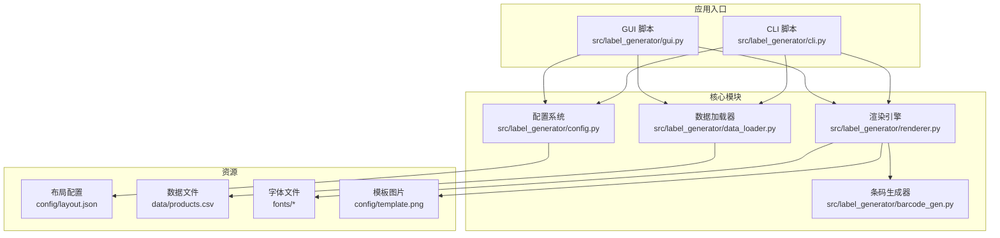
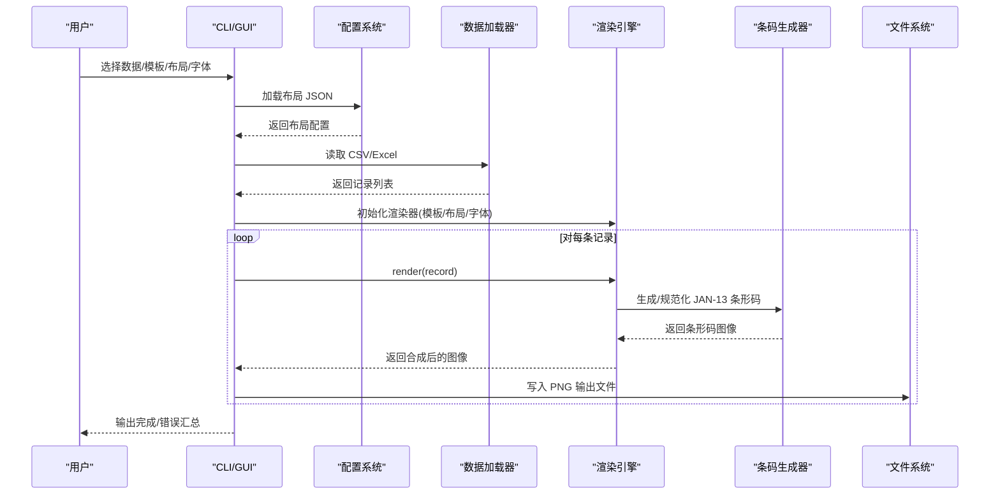
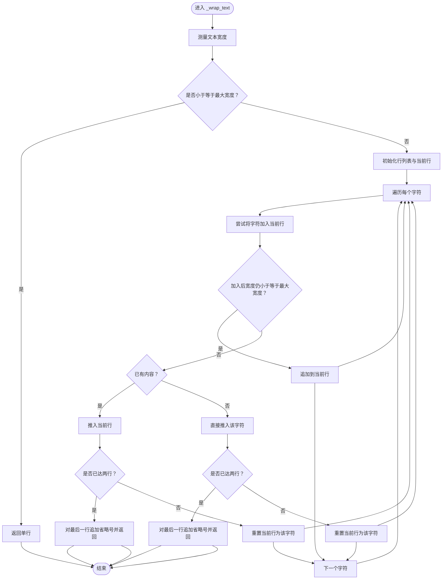
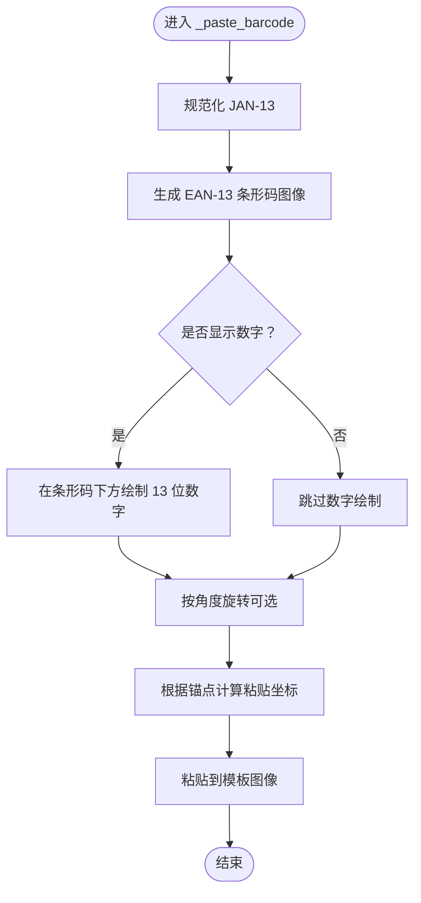
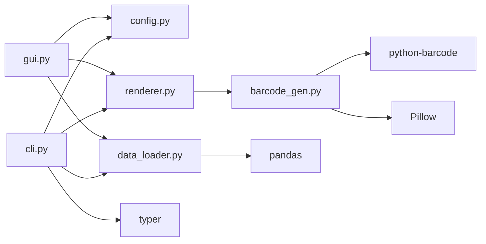

# 核心功能模块

<cite>
**本文引用的文件**
- [renderer.py](file://src/label_generator/renderer.py)
- [data_loader.py](file://src/label_generator/data_loader.py)
- [barcode_gen.py](file://src/label_generator/barcode_gen.py)
- [config.py](file://src/label_generator/config.py)
- [cli.py](file://src/label_generator/cli.py)
- [gui.py](file://src/label_generator/gui.py)
- [layout.json](file://config/layout.json)
- [products.csv](file://data/products.csv)
- [README.md](file://README.md)
- [requirements.txt](file://requirements.txt)
- [pyproject.toml](file://pyproject.toml)
</cite>

## 目录
1. [简介](#简介)
2. [项目结构](#项目结构)
3. [核心组件](#核心组件)
4. [架构总览](#架构总览)
5. [详细组件分析](#详细组件分析)
6. [依赖分析](#依赖分析)
7. [性能考虑](#性能考虑)
8. [故障排查指南](#故障排查指南)
9. [结论](#结论)
10. [附录](#附录)

## 简介
本项目是一个批量生成服装标签的工具，支持从 CSV/Excel 数据读取字段，并将文本与 JAN-13 条形码叠加到模板图片上，输出每条记录对应的 PNG 文件。四个核心模块分别负责：
- LabelRenderer 渲染引擎：负责图像合成、文本换行与排版、条形码粘贴与旋转等。
- 数据加载器：负责读取 CSV/Excel 并进行列校验。
- 条码生成器：负责 JAN-13 标准的校验位计算与条形码图像生成。
- 配置管理系统：负责布局 JSON 的解析与加载。

这些模块通过 CLI 或 GUI 入口协同工作，形成完整的批处理流水线。

## 项目结构
项目采用“模块化+入口脚本”的组织方式，核心逻辑集中在 src/label_generator 下，配置与数据位于 config/ 与 data/ 目录，输出目录 output/ 默认为空，由程序生成。

图表来源
- [cli.py:16-86](file://src/label_generator/cli.py#L16-L86)
- [gui.py:19-384](file://src/label_generator/gui.py#L19-L384)
- [config.py:8-14](file://src/label_generator/config.py#L8-L14)
- [data_loader.py:9-32](file://src/label_generator/data_loader.py#L9-L32)
- [renderer.py:53-102](file://src/label_generator/renderer.py#L53-L102)
- [barcode_gen.py:40-60](file://src/label_generator/barcode_gen.py#L40-L60)

章节来源
- [README.md:40-59](file://README.md#L40-L59)
- [pyproject.toml:18-20](file://pyproject.toml#L18-L20)

## 核心组件
- LabelRenderer：基于 PIL/Pillow 的图像合成器，支持文本绘制、自动换行、锚点对齐、条形码粘贴与旋转、缓存字体以提升性能。
- 数据加载器：使用 pandas 读取 CSV/Excel，统一转为字符串字典列表，并进行列缺失校验。
- 条码生成器：实现 JAN-13 校验位算法与 EAN-13 图像生成，提供 LRU 缓存优化。
- 配置管理系统：加载布局 JSON，解析字段位置、字体、颜色、锚点、尺寸等渲染参数。

章节来源
- [renderer.py:53-102](file://src/label_generator/renderer.py#L53-L102)
- [data_loader.py:9-32](file://src/label_generator/data_loader.py#L9-L32)
- [barcode_gen.py:17-60](file://src/label_generator/barcode_gen.py#L17-L60)
- [config.py:8-14](file://src/label_generator/config.py#L8-L14)

## 架构总览
下图展示了从输入到输出的端到端流程，以及模块间的调用关系与数据流。

图表来源
- [cli.py:49-85](file://src/label_generator/cli.py#L49-L85)
- [gui.py:209-373](file://src/label_generator/gui.py#L209-L373)
- [config.py:8-14](file://src/label_generator/config.py#L8-L14)
- [data_loader.py:9-32](file://src/label_generator/data_loader.py#L9-L32)
- [renderer.py:83-102](file://src/label_generator/renderer.py#L83-L102)
- [barcode_gen.py:40-60](file://src/label_generator/barcode_gen.py#L40-L60)

## 详细组件分析

### LabelRenderer 渲染引擎
- 设计理念
  - 将布局配置映射为实际绘制指令，支持文本与条形码两类元素。
  - 使用锚点系统与坐标体系，确保在不同分辨率下保持一致的视觉效果。
  - 通过 LRU 缓存字体对象，减少重复字体加载开销。
- 实现要点
  - 文本绘制：根据是否加粗选择字体，按行高逐行绘制；支持最大宽度自动换行与省略号截断。
  - 条形码绘制：规范化 JAN-13，生成 EAN-13 图像，可选显示数字与旋转；支持锚点转换为左上角粘贴坐标。
  - 输出：统一转换为 RGB，保存为 PNG。
- 关键流程（文本换行）

图表来源
- [renderer.py:23-50](file://src/label_generator/renderer.py#L23-L50)

- 关键流程（条形码粘贴）

图表来源
- [renderer.py:133-196](file://src/label_generator/renderer.py#L133-L196)
- [barcode_gen.py:17-60](file://src/label_generator/barcode_gen.py#L17-L60)

- API 使用方法
  - 初始化：传入模板路径、布局字典、常规字体路径与可选粗体字体路径。
  - 渲染：render(record) 返回合成后的 PIL 图像；render_to_file(record, output_dir, index) 直接写入 PNG 文件。
  - 文本字段：type=text，支持 xy、font_size、anchor、color、bold、max_width。
  - 条形码字段：type=barcode，支持 xy、anchor、width、height、rotation、show_text。

章节来源
- [renderer.py:53-251](file://src/label_generator/renderer.py#L53-L251)

### 数据加载器
- 设计理念
  - 统一 CSV/Excel 输入格式，保证后续渲染一致性。
  - 自动填充空值为字符串空串，避免渲染阶段的类型问题。
- 实现要点
  - 支持 .csv、.xlsx、.xls 后缀；不支持的格式抛出异常。
  - 列缺失检测：对比布局键与数据列集合，返回缺失项列表。
- API 使用方法
  - load_data(path)：返回记录列表。
  - validate_columns(records, layout)：返回缺失列名列表。

章节来源
- [data_loader.py:9-32](file://src/label_generator/data_loader.py#L9-L32)

### 条码生成器（JAN-13 标准）
- 设计理念
  - 实现 EAN-13（JAN-13）校验位算法，兼容 12/13 位输入。
  - 使用 python-barcode 生成 PNG，再缩放至指定尺寸，避免渲染时重复生成。
- 实现要点
  - 校验位计算：奇数位与偶数位加权求和，结合模运算得到校验位。
  - 规范化：12 位自动补全，13 位验证末位。
  - 图像生成：关闭文本绘制，设置模块宽高与空白区，使用高质量重采样。
  - 缓存：LRU 缓存结果，避免重复生成相同尺寸的条形码。
- API 使用方法
  - normalize_jan(value)：规范化为 13 位。
  - render_barcode(jan_raw, width, height)：返回指定尺寸的 RGB 图像。

章节来源
- [barcode_gen.py:17-60](file://src/label_generator/barcode_gen.py#L17-L60)

### 配置管理系统（布局解析）
- 设计理念
  - 通过 JSON 描述每个字段的绘制参数，便于非程序员快速调整。
  - 提供元信息（如模板尺寸、默认字体）以辅助渲染。
- 实现要点
  - 加载布局 JSON，不做运行时校验，交由渲染器在运行时处理。
  - 支持锚点、颜色、字体大小、最大宽度等参数。
- API 使用方法
  - load_layout(path)：返回布局字典。

章节来源
- [config.py:8-14](file://src/label_generator/config.py#L8-L14)
- [layout.json:1-56](file://config/layout.json#L1-L56)

## 依赖分析
- 外部依赖
  - Pillow：图像处理与绘制。
  - python-barcode：条形码生成。
  - pandas + openpyxl：Excel 读取。
  - typer：命令行接口。
- 模块内依赖
  - renderer 依赖 barcode_gen（条形码生成）。
  - cli/gui 依赖 config、data_loader、renderer。
  - data_loader 依赖 pandas。
  - barcode_gen 依赖 python-barcode 与 PIL。
- 依赖关系图

图表来源
- [cli.py:7-9](file://src/label_generator/cli.py#L7-L9)
- [gui.py:12-14](file://src/label_generator/gui.py#L12-L14)
- [data_loader.py:6-6](file://src/label_generator/data_loader.py#L6-L6)
- [renderer.py:140-140](file://src/label_generator/renderer.py#L140-L140)
- [barcode_gen.py:6-8](file://src/label_generator/barcode_gen.py#L6-L8)
- [requirements.txt:1-6](file://requirements.txt#L1-L6)

章节来源
- [requirements.txt:1-6](file://requirements.txt#L1-L6)
- [pyproject.toml:10-16](file://pyproject.toml#L10-L16)

## 性能考虑
- 字体缓存
  - renderer 使用 LRU 缓存字体对象，减少重复加载开销。建议合理控制字体尺寸种类，避免缓存命中率下降。
- 条形码缓存
  - barcode_gen 对相同尺寸的条形码进行缓存，显著降低重复生成成本。
- 批量生成
  - GUI 使用后台线程执行批量生成，主线程保持响应；进度通过主线程安全更新。
- 图像质量与尺寸
  - 条形码生成时使用高质量重采样；渲染阶段尽量避免不必要的缩放。
- I/O 优化
  - 输出目录在循环前创建一次；文件名使用安全函数避免非法字符。

章节来源
- [renderer.py:75-81](file://src/label_generator/renderer.py#L75-L81)
- [barcode_gen.py:40-60](file://src/label_generator/barcode_gen.py#L40-L60)
- [gui.py:316-348](file://src/label_generator/gui.py#L316-L348)

## 故障排查指南
- 常见错误与定位
  - 文件未找到：检查模板、布局、字体是否存在；CLI 会在启动时快速失败。
  - 数据格式不支持：仅支持 .csv/.xlsx/.xls；其他格式会报错。
  - 列缺失：validate_columns 会列出布局中需要但数据缺少的列。
  - 条形码错误：normalize_jan 会验证输入长度与数字合法性，或校验位不匹配。
  - 字体缺失：若粗体字体不存在，会回退到常规字体并发出警告。
- 排查步骤
  - 确认输入数据与布局键一致。
  - 检查条形码字段是否为 12/13 位纯数字。
  - 确保模板与字体路径正确且可访问。
  - 在 GUI 中先“加载数据”，再“预览选中行”确认渲染效果。
- 错误处理策略
  - CLI：逐条记录捕获异常并汇总失败清单。
  - GUI：后台线程生成，完成后弹窗提示成功/失败数量与前若干条错误摘要。

章节来源
- [cli.py:36-58](file://src/label_generator/cli.py#L36-L58)
- [cli.py:74-85](file://src/label_generator/cli.py#L74-L85)
- [gui.py:200-252](file://src/label_generator/gui.py#L200-L252)
- [gui.py:322-373](file://src/label_generator/gui.py#L322-L373)
- [data_loader.py:11-20](file://src/label_generator/data_loader.py#L11-L20)
- [renderer.py:149-154](file://src/label_generator/renderer.py#L149-L154)

## 结论
本项目通过清晰的模块划分与简洁的 API 设计，实现了从数据到图像的完整自动化流水线。LabelRenderer 提供了灵活的排版能力与高性能的渲染路径；数据加载器与配置系统降低了使用门槛；条码生成器严格遵循 JAN-13 标准并具备良好的缓存策略。CLI 与 GUI 双入口满足不同用户的操作习惯，适合在生产环境中进行批量标签生成。

## 附录

### 使用示例与最佳实践
- 命令行使用
  - 设置 PYTHONPATH 指向 src，运行 CLI 并指定数据、模板、布局与输出目录。
  - 输出文件名为记录中的 sku/sku_code/jan/行索引，避免非法字符。
- GUI 使用
  - 通过“浏览”按钮选择文件；点击“加载数据”后可在左侧表格查看数据；点击“预览选中行”查看渲染效果；点击“生成全部标签”批量导出。
- 布局配置要点
  - 使用 anchor 与 xy 精确定位；max_width 控制文本换行；条形码字段需提供 width/height/rotation/show_text。
  - 参考布局示例与模板尺寸，确保元素不越界。

章节来源
- [README.md:24-38](file://README.md#L24-L38)
- [layout.json:1-56](file://config/layout.json#L1-L56)
- [products.csv:1-7](file://data/products.csv#L1-L7)