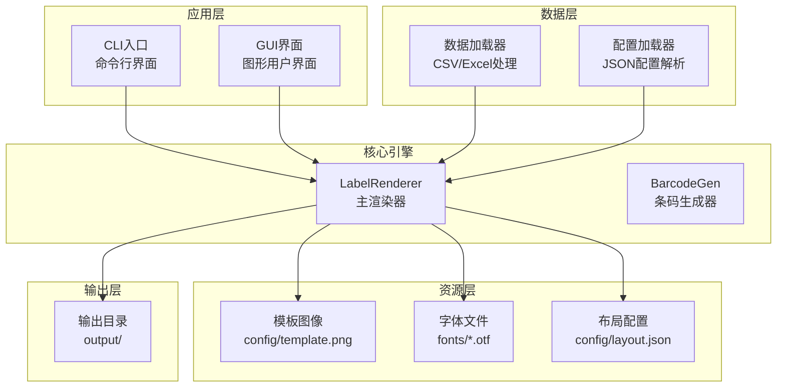
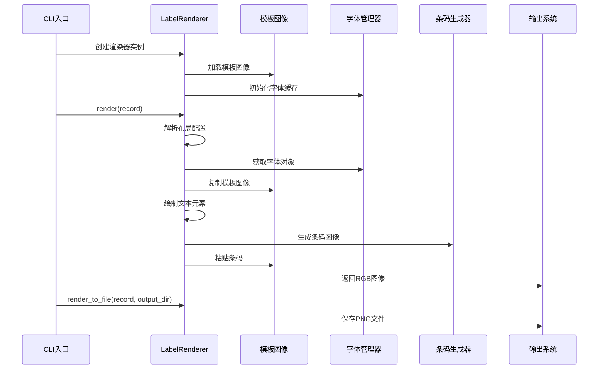
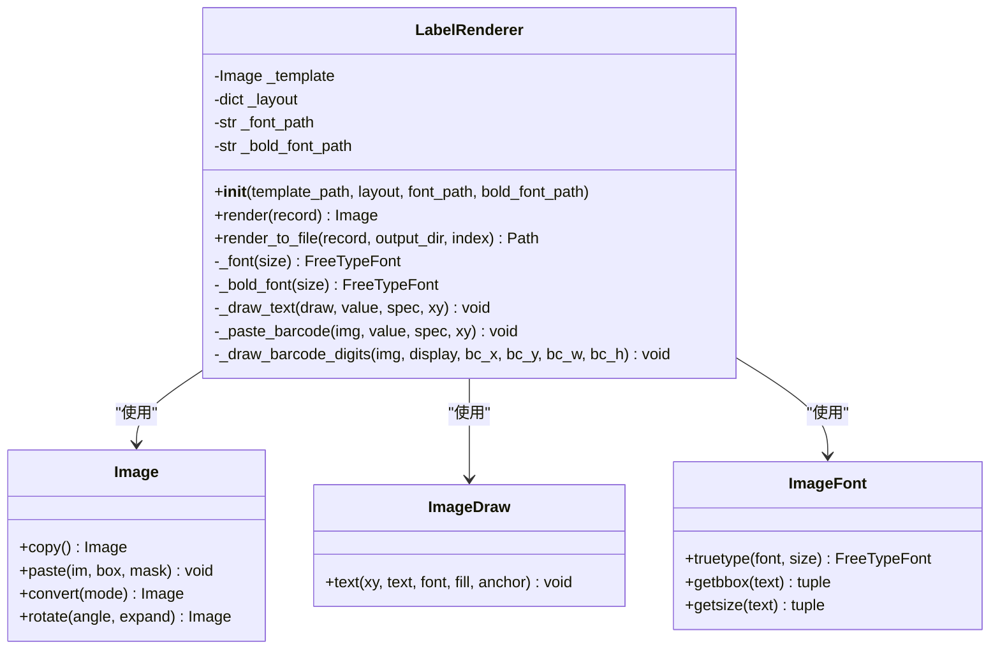
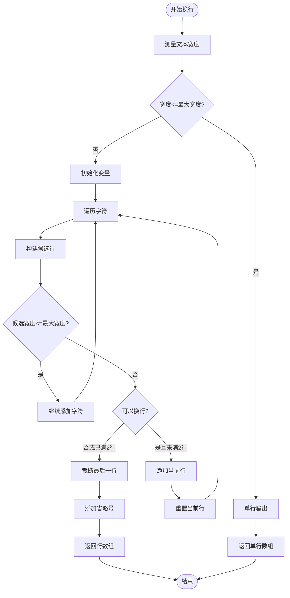
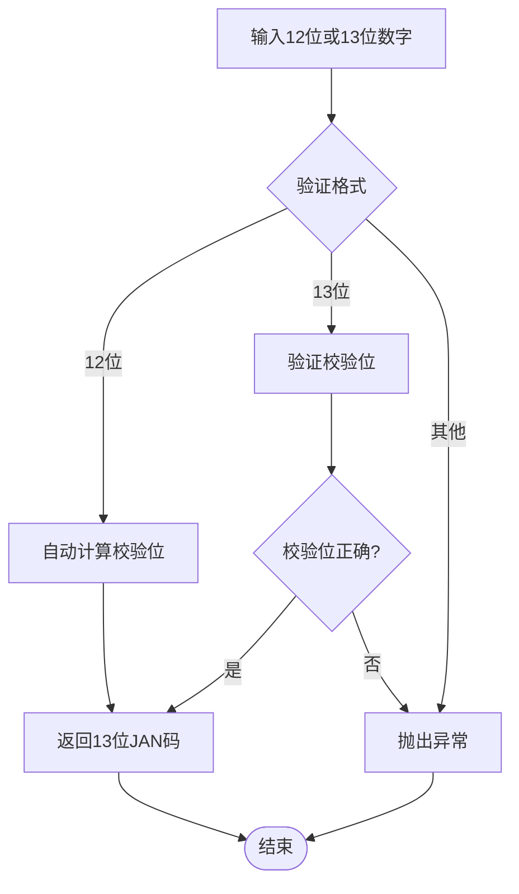
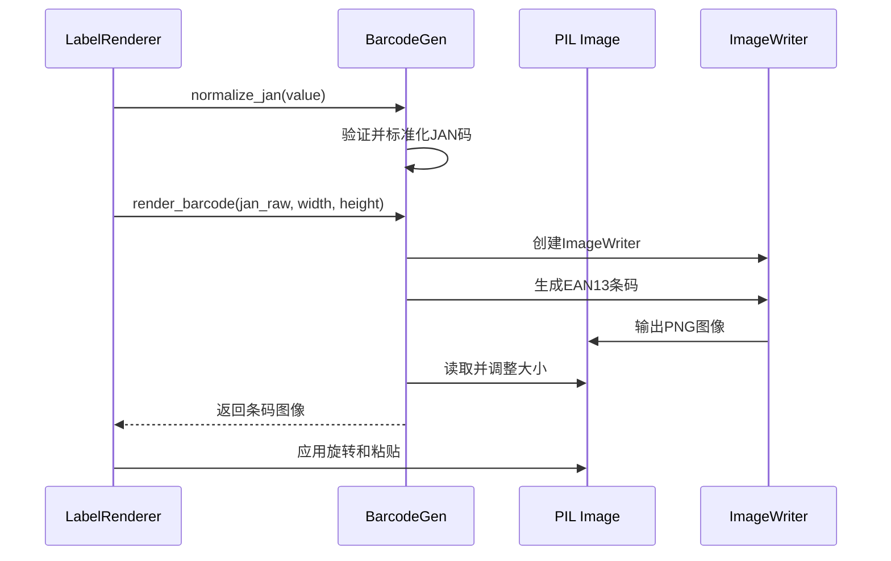
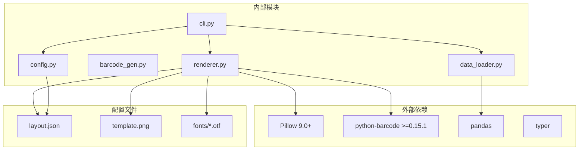

# 渲染引擎

<cite>
**本文档引用的文件**
- [renderer.py](file://src/label_generator/renderer.py)
- [barcode_gen.py](file://src/label_generator/barcode_gen.py)
- [cli.py](file://src/label_generator/cli.py)
- [config.py](file://src/label_generator/config.py)
- [data_loader.py](file://src/label_generator/data_loader.py)
- [layout.json](file://config/layout.json)
- [README.md](file://README.md)
- [SPEC.md](file://SPEC.md)
- [products.csv](file://data/products.csv)
</cite>

## 目录
1. [简介](#简介)
2. [项目结构](#项目结构)
3. [核心组件](#核心组件)
4. [架构概览](#架构概览)
5. [详细组件分析](#详细组件分析)
6. [依赖关系分析](#依赖关系分析)
7. [性能考虑](#性能考虑)
8. [故障排除指南](#故障排除指南)
9. [结论](#结论)
10. [附录](#附录)

## 简介

标签生成器是一个批量生成服装标签PNG图片的Python应用程序。它通过将文本和JAN-13条码叠加到模板图像上来创建打印就绪的标签。该系统的核心是LabelRenderer类，它提供了强大的图像合成机制、文本渲染算法、条码生成和贴图功能。

该渲染引擎专注于中日韩(CJK)字符的精确渲染，支持粗体字体、多行文本处理、宽度限制和智能换行算法。系统采用LRU缓存机制优化性能，确保在大量标签生成场景中的高效运行。

## 项目结构

项目采用模块化设计，主要组件分布如下：



**图表来源**
- [cli.py:16-94](file://src/label_generator/cli.py#L16-L94)
- [renderer.py:53-251](file://src/label_generator/renderer.py#L53-L251)
- [data_loader.py:9-32](file://src/label_generator/data_loader.py#L9-L32)
- [config.py:8-14](file://src/label_generator/config.py#L8-L14)

**章节来源**
- [README.md:40-59](file://README.md#L40-L59)
- [SPEC.md:120-148](file://SPEC.md#L120-L148)

## 核心组件

### LabelRenderer类

LabelRenderer是渲染引擎的核心类，负责将数据记录渲染到模板图像上。它实现了以下关键功能：

- **图像合成**: 将文本和条码元素叠加到模板图像上
- **字体管理**: 管理常规和粗体字体的加载和缓存
- **坐标转换**: 实现锚点系统，支持多种对齐方式
- **文本处理**: 提供CJK字符智能换行和宽度限制
- **条码生成**: 集成JAN-13条码生成和渲染

### BarcodeGen模块

专门处理JAN-13条码的生成和验证，包括：
- 校验位计算和验证
- 条码图像生成
- 尺寸调整和旋转

### 配置系统

- **布局配置**: JSON格式定义渲染参数
- **数据验证**: 确保数据完整性
- **文件管理**: 统一的文件路径处理

**章节来源**
- [renderer.py:53-102](file://src/label_generator/renderer.py#L53-L102)
- [SPEC.md:150-188](file://SPEC.md#L150-L188)

## 架构概览

渲染引擎采用分层架构，各层职责清晰分离：



**图表来源**
- [cli.py:60-85](file://src/label_generator/cli.py#L60-L85)
- [renderer.py:83-102](file://src/label_generator/renderer.py#L83-L102)
- [renderer.py:233-250](file://src/label_generator/renderer.py#L233-L250)

## 详细组件分析

### LabelRenderer类深度分析

#### 类设计架构



**图表来源**
- [renderer.py:53-251](file://src/label_generator/renderer.py#L53-L251)

#### 图像合成机制

LabelRenderer采用"模板复制 + 元素叠加"的合成策略：

1. **模板初始化**: 加载并转换为RGBA模式
2. **逐元素渲染**: 按布局配置顺序绘制每个元素
3. **最终转换**: 将结果转换为RGB模式用于输出

#### 字体管理系统

字体管理采用LRU缓存优化：

```mermaid
flowchart TD
Request[请求字体(size)] --> CheckCache{检查缓存}
CheckCache --> |命中| ReturnFont[返回缓存字体]
CheckCache --> |未命中| LoadFont[加载新字体]
LoadFont --> CacheFont[缓存字体对象]
CacheFont --> ReturnFont
ReturnFont --> UseFont[使用字体进行渲染]
```

**图表来源**
- [renderer.py:75-81](file://src/label_generator/renderer.py#L75-L81)

#### CJK字符换行算法

系统实现了针对CJK字符的智能换行算法：



**图表来源**
- [renderer.py:23-50](file://src/label_generator/renderer.py#L23-L50)

#### 锚点定位系统

系统支持PIL标准的锚点系统，实现坐标转换：

```mermaid
flowchart TD
Input[输入: (xy, anchor)] --> CheckAnchor{检查锚点类型}
CheckAnchor --> |lt| LT[左上角]
CheckAnchor --> |mm| MM[中心点]
CheckAnchor --> |rt| RT[右上角]
CheckAnchor --> |rb| RB[右下角]
CheckAnchor --> |lb| LB[左下角]
LT --> CalcLT[计算左上角坐标]
MM --> CalcMM[计算左上角坐标]
RT --> CalcRT[计算左上角坐标]
RB --> CalcRB[计算左上角坐标]
LB --> CalcLB[计算左上角坐标]
CalcLT --> Output[输出左上角坐标]
CalcMM --> Output
CalcRT --> Output
CalcRB --> Output
CalcLB --> Output
```

**图表来源**
- [renderer.py:184-196](file://src/label_generator/renderer.py#L184-L196)

### 条码生成系统

#### JAN-13校验算法



**图表来源**
- [barcode_gen.py:17-32](file://src/label_generator/barcode_gen.py#L17-L32)

#### 条码渲染流程



**图表来源**
- [renderer.py:133-196](file://src/label_generator/renderer.py#L133-L196)
- [barcode_gen.py:40-59](file://src/label_generator/barcode_gen.py#L40-L59)

**章节来源**
- [renderer.py:53-251](file://src/label_generator/renderer.py#L53-L251)
- [barcode_gen.py:1-60](file://src/label_generator/barcode_gen.py#L1-L60)

## 依赖关系分析

渲染引擎的依赖关系清晰且模块化：



**图表来源**
- [SPEC.md:111-118](file://SPEC.md#L111-L118)
- [cli.py:7-9](file://src/label_generator/cli.py#L7-L9)

**章节来源**
- [SPEC.md:111-118](file://SPEC.md#L111-L118)
- [README.md:5-22](file://README.md#L5-L22)

## 性能考虑

### LRU缓存优化

系统在多个层面实现了LRU缓存以提升性能：

1. **字体缓存**: `@lru_cache(maxsize=32)` 缓存字体对象
2. **条码缓存**: `@lru_cache(maxsize=128)` 缓存生成的条码图像
3. **测量缓存**: 内部函数缓存文本测量结果

### 内存管理策略

- **延迟加载**: 字体和条码按需加载，避免不必要的内存占用
- **图像复用**: 使用模板图像的副本进行渲染，避免修改原始模板
- **及时释放**: 处理完成后及时释放中间图像对象

### 批处理优化

- **单次实例**: 建议在批处理场景中复用同一个LabelRenderer实例
- **缓存利用**: 充分利用LRU缓存减少重复计算
- **错误隔离**: 单行错误不影响整体批处理进程

**章节来源**
- [SPEC.md:150-156](file://SPEC.md#L150-L156)
- [renderer.py:75-81](file://src/label_generator/renderer.py#L75-L81)
- [barcode_gen.py:40-40](file://src/label_generator/barcode_gen.py#L40-L40)

## 故障排除指南

### 常见问题及解决方案

#### 字体加载失败
- **症状**: `FileNotFoundError: Font not found`
- **原因**: 字体文件路径错误或文件不存在
- **解决**: 确认字体文件位于`fonts/`目录下，路径配置正确

#### 模板文件缺失
- **症状**: `FileNotFoundError: Template not found`
- **原因**: 模板图像文件路径错误
- **解决**: 检查`config/template.png`是否存在

#### 布局配置错误
- **症状**: `KeyError`或`TypeError`
- **原因**: `layout.json`格式不正确或缺少必要字段
- **解决**: 验证JSON格式，确保包含必需的字段

#### 数据格式问题
- **症状**: `ValueError: Unsupported data format`
- **原因**: 数据文件格式不受支持
- **解决**: 使用CSV或Excel格式

#### 条码生成错误
- **症状**: 条码显示异常或无法识别
- **原因**: JAN码格式错误或校验失败
- **解决**: 验证JAN码为12位或13位数字，检查校验位

**章节来源**
- [renderer.py:62-66](file://src/label_generator/renderer.py#L62-L66)
- [config.py:10-11](file://src/label_generator/config.py#L10-L11)
- [data_loader.py:19-20](file://src/label_generator/data_loader.py#L19-L20)
- [barcode_gen.py:20-32](file://src/label_generator/barcode_gen.py#L20-L32)

## 结论

标签渲染引擎是一个设计精良的批量图像生成系统，具有以下特点：

1. **模块化设计**: 清晰的职责分离和接口定义
2. **性能优化**: 多层次的缓存机制和内存管理
3. **国际化支持**: 完善的CJK字符处理能力
4. **错误处理**: 健壮的错误检测和恢复机制
5. **可扩展性**: 易于添加新的渲染元素和功能

该系统特别适合大规模标签生成场景，能够高效处理数千甚至数万张标签的批量渲染需求。通过合理的配置和使用，可以满足各种复杂的标签设计要求。

## 附录

### API参考

#### LabelRenderer类

**构造函数**
```python
LabelRenderer(
    template_path: str | Path,
    layout: dict[str, Any],
    font_path: str | Path,
    bold_font_path: str | Path | None = None
)
```

**render方法**
- **参数**: `record: dict[str, Any]` - 数据记录
- **返回值**: `Image.Image` - 渲染完成的RGB图像
- **用途**: 将单个记录渲染为图像

**render_to_file方法**
- **参数**: `record: dict[str, Any]`, `output_dir: str | Path`, `index: int = 0`
- **返回值**: `Path` - 生成文件的路径
- **用途**: 直接将渲染结果保存为PNG文件

#### 配置文件格式

**layout.json结构**
- `_meta`: 元信息块，包含模板尺寸和字体路径
- 字段配置: 每个字段对应CSV列名，包含渲染参数
- 支持字段: `type`, `xy`, `font_size`, `anchor`, `color`, `bold`, `max_width`等

**章节来源**
- [SPEC.md:72-107](file://SPEC.md#L72-L107)
- [renderer.py:83-102](file://src/label_generator/renderer.py#L83-L102)
- [renderer.py:233-250](file://src/label_generator/renderer.py#L233-L250)