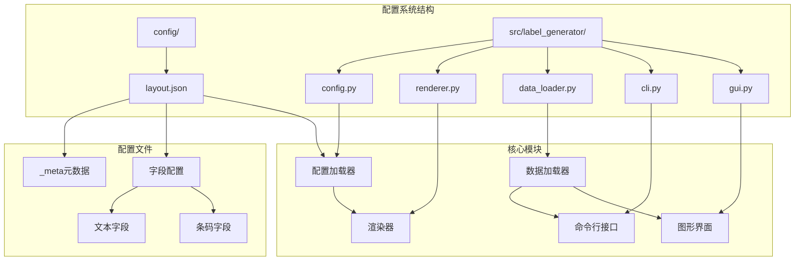
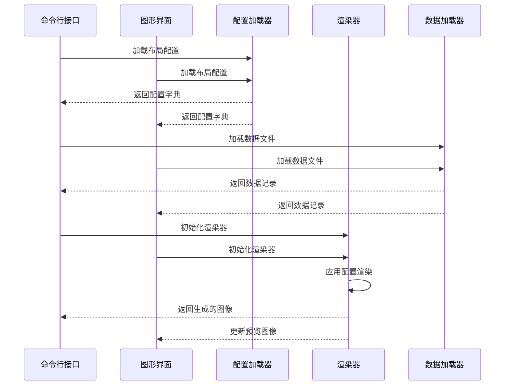
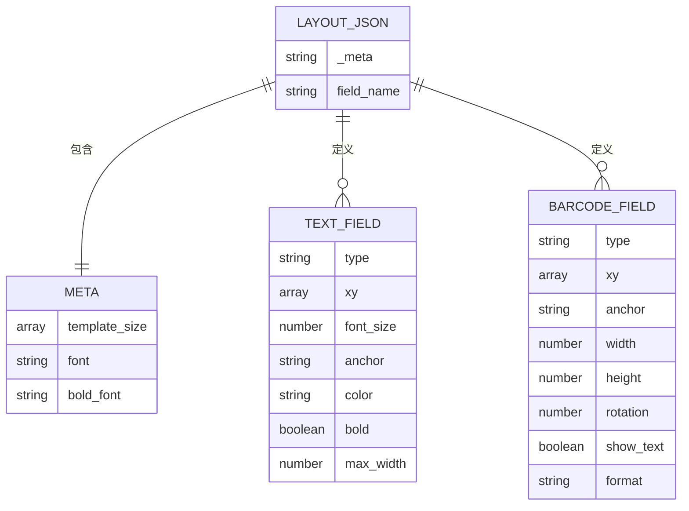
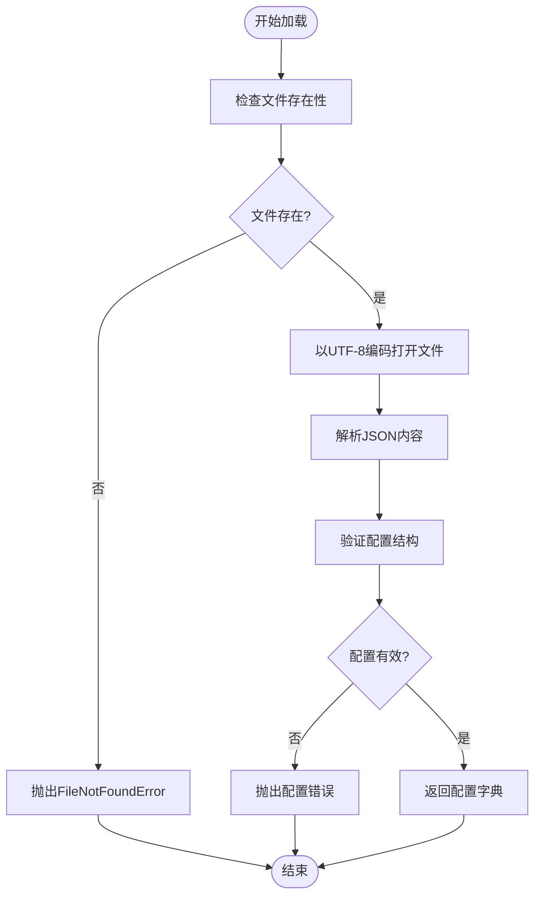
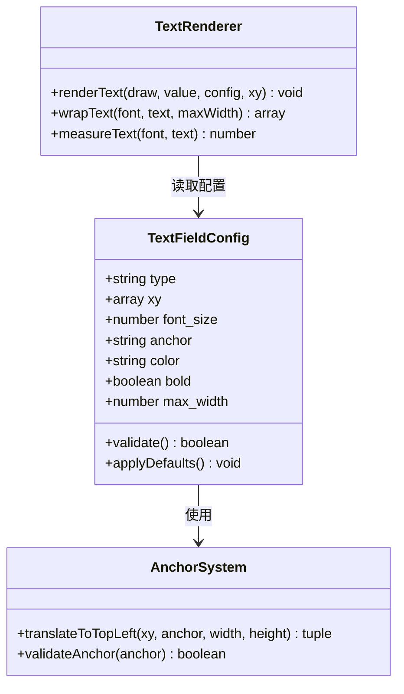
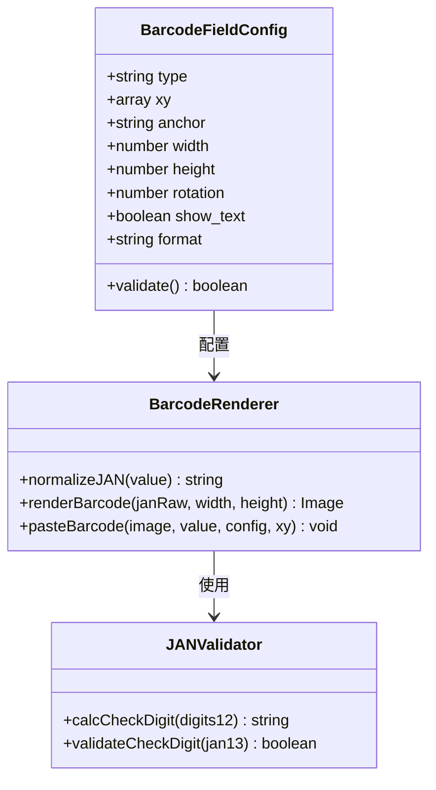
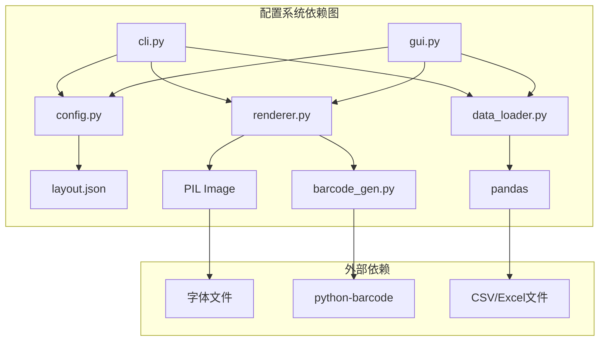
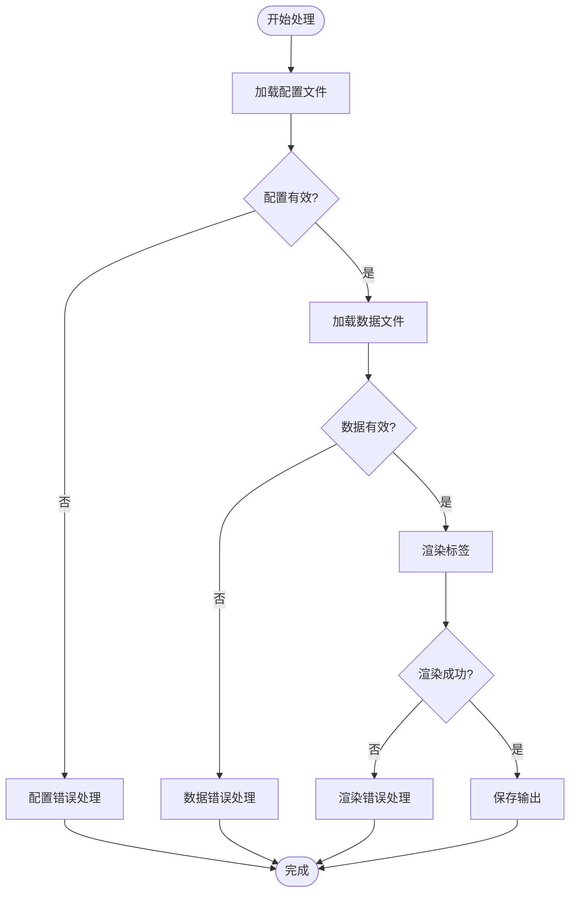

# 配置管理系统

<cite>
**本文档引用的文件**
- [layout.json](file://config/layout.json)
- [config.py](file://src/label_generator/config.py)
- [cli.py](file://src/label_generator/cli.py)
- [gui.py](file://src/label_generator/gui.py)
- [data_loader.py](file://src/label_generator/data_loader.py)
- [renderer.py](file://src/label_generator/renderer.py)
- [SPEC.md](file://SPEC.md)
- [README.md](file://README.md)
</cite>

## 目录
1. [简介](#简介)
2. [项目结构](#项目结构)
3. [核心组件](#核心组件)
4. [架构概览](#架构概览)
5. [详细组件分析](#详细组件分析)
6. [依赖分析](#依赖分析)
7. [性能考虑](#性能考虑)
8. [故障排除指南](#故障排除指南)
9. [结论](#结论)
10. [附录](#附录)

## 简介

标签生成器的配置管理系统是一个基于JSON的布局配置引擎，负责定义和管理标签生成过程中的所有视觉元素配置。该系统通过单一的配置文件控制文本字段的位置、样式、条码生成参数以及整体模板设置。

系统的核心设计理念是"配置外置化"，即通过外部配置文件来定义模板布局，使得模板设计和代码逻辑分离，便于维护和定制。配置文件采用标准化的JSON格式，包含元数据信息和各个字段的具体配置。

## 项目结构

配置管理系统位于项目的`config`目录中，主要包含以下关键文件：



**图表来源**
- [layout.json:1-56](file://config/layout.json#L1-L56)
- [config.py:8-13](file://src/label_generator/config.py#L8-L13)
- [renderer.py:53-102](file://src/label_generator/renderer.py#L53-L102)

**章节来源**
- [SPEC.md:120-148](file://SPEC.md#L120-L148)
- [README.md:40-59](file://README.md#L40-L59)

## 核心组件

### 配置文件加载器

配置文件加载器是整个配置系统的核心组件，负责安全地加载和解析JSON配置文件。其主要功能包括：

- **文件存在性验证**：确保配置文件存在于指定路径
- **JSON解析**：使用UTF-8编码安全解析JSON内容
- **异常处理**：对不存在的文件抛出明确的错误信息

### 布局配置结构

布局配置采用分层结构设计，包含元数据和字段定义两个主要部分：

#### 元数据区域 (`_meta`)
- `template_size`: 模板图像的像素尺寸 `[width, height]`
- `font`: 常规字体文件路径
- `bold_font`: 粗体字体文件路径

#### 字段配置区域
每个字段配置包含以下通用属性：
- `type`: 字段类型（`"text"` 或 `"barcode"`）
- `xy`: 二维坐标 `[x, y]`
- `anchor`: 锚点定位方式

**章节来源**
- [layout.json:1-56](file://config/layout.json#L1-L56)
- [SPEC.md:29-85](file://SPEC.md#L29-L85)

## 架构概览

配置管理系统采用分层架构设计，各组件职责明确且相互独立：



**图表来源**
- [cli.py:49-60](file://src/label_generator/cli.py#L49-L60)
- [gui.py:208-225](file://src/label_generator/gui.py#L208-L225)
- [config.py:8-13](file://src/label_generator/config.py#L8-L13)

### 组件交互流程

配置系统的核心交互流程如下：

1. **初始化阶段**：CLI或GUI组件调用配置加载器
2. **验证阶段**：检查配置文件和数据文件的存在性
3. **加载阶段**：解析JSON配置并进行基本验证
4. **渲染阶段**：根据配置渲染标签图像
5. **输出阶段**：保存生成的PNG文件

**章节来源**
- [SPEC.md:205-213](file://SPEC.md#L205-L213)

## 详细组件分析

### 配置文件格式规范

#### 基本结构定义

配置文件采用严格的JSON格式，包含以下必需元素：



**图表来源**
- [layout.json:1-56](file://config/layout.json#L1-L56)
- [SPEC.md:87-105](file://SPEC.md#L87-L105)

#### 字段映射和验证规则

系统实现了完整的字段映射机制，确保配置与数据源的正确对应：

| 字段名称 | 类型 | 必需 | 默认值 | 验证规则 |
|---------|------|------|--------|----------|
| `_meta` | 对象 | 是 | - | 元数据容器 |
| `template_size` | 数组 | 是 | - | `[width, height]` |
| `font` | 字符串 | 是 | - | 字体文件路径 |
| `bold_font` | 字符串 | 是 | - | 粗体字体路径 |
| `type` | 字符串 | 是 | - | `"text"` 或 `"barcode"` |
| `xy` | 数组 | 是 | - | `[x, y]` 坐标 |
| `anchor` | 字符串 | 否 | `"lt"` | PIL锚点标准 |
| `font_size` | 数字 | 否 | `24` | 正整数 |
| `color` | 字符串 | 否 | `"#000000"` | 十六进制颜色 |
| `bold` | 布尔值 | 否 | `false` | 布尔类型 |
| `max_width` | 数字 | 否 | - | 正整数 |
| `width` | 数字 | 否 | `300` | 正整数 |
| `height` | 数字 | 否 | `80` | 正整数 |
| `rotation` | 数字 | 否 | `0` | 角度值 |
| `show_text` | 布尔值 | 否 | `true` | 布尔类型 |
| `format` | 字符串 | 否 | `"ean13"` | 条码类型 |

**章节来源**
- [SPEC.md:87-105](file://SPEC.md#L87-L105)
- [layout.json:1-56](file://config/layout.json#L1-L56)

### 配置加载和解析机制

#### 文件加载流程

配置文件的加载过程遵循严格的安全检查和错误处理机制：



**图表来源**
- [config.py:8-13](file://src/label_generator/config.py#L8-L13)

#### 锚点定位系统

系统实现了完整的PIL锚点定位系统，支持多种对齐方式：

| 锚点值 | 含义 | 用途 |
|--------|------|------|
| `"lt"` | left-top | 左上角对齐 |
| `"lm"` | left-middle | 左中对齐 |
| `"lb"` | left-bottom | 左下角对齐 |
| `"mt"` | middle-top | 上中对齐 |
| `"mm"` | middle-middle | 中心对齐（推荐） |
| `"mb"` | middle-bottom | 下中对齐 |
| `"rt"` | right-top | 右上角对齐 |
| `"rm"` | right-middle | 右中对齐 |
| `"rb"` | right-bottom | 右下角对齐 |

**章节来源**
- [SPEC.md:106-109](file://SPEC.md#L106-L109)
- [renderer.py:117-118](file://src/label_generator/renderer.py#L117-L118)

### 配置项结构定义

#### 文本字段配置

文本字段配置支持丰富的样式控制选项：



**图表来源**
- [renderer.py:104-132](file://src/label_generator/renderer.py#L104-L132)
- [renderer.py:17-51](file://src/label_generator/renderer.py#L17-L51)

#### 条码字段配置

条码字段配置专门针对EAN-13条码生成：



**图表来源**
- [renderer.py:133-197](file://src/label_generator/renderer.py#L133-L197)
- [barcode_gen.py:17-33](file://src/label_generator/barcode_gen.py#L17-L33)

**章节来源**
- [SPEC.md:100-104](file://SPEC.md#L100-L104)
- [layout.json:45-54](file://config/layout.json#L45-L54)

### 数据类型要求和默认值设置

#### 类型系统定义

配置系统实现了严格的类型检查机制：

| 属性 | 预期类型 | 实际类型 | 验证结果 |
|------|----------|----------|----------|
| `template_size` | `array` | `[591, 354]` | ✅ |
| `xy` | `array` | `[235, 272]` | ✅ |
| `font_size` | `number` | `22` | ✅ |
| `anchor` | `string` | `"mm"` | ✅ |
| `bold` | `boolean` | `true` | ✅ |
| `max_width` | `number` | `320` | ✅ |
| `width` | `number` | `220` | ✅ |
| `height` | `number` | `140` | ✅ |
| `rotation` | `number` | `90` | ✅ |
| `show_text` | `boolean` | `true` | ✅ |

#### 默认值应用策略

系统采用渐进式默认值应用策略：

1. **运行时默认值**：在渲染过程中为缺失的配置项提供合理默认值
2. **配置级默认值**：在配置文件中定义的可选字段
3. **系统级默认值**：当所有其他默认值都不可用时的最终兜底

**章节来源**
- [renderer.py:111-116](file://src/label_generator/renderer.py#L111-L116)
- [renderer.py:142-147](file://src/label_generator/renderer.py#L142-L147)

### 配置示例和使用方法

#### 模板图片配置示例

模板图片配置示例展示了完整的布局定义：

```json
{
  "_meta": {
    "template_size": [591, 354],
    "font": "fonts/NotoSansCJK-Regular.otf",
    "bold_font": "fonts/NotoSansCJK-Bold.otf"
  },
  
  "size": {
    "type": "text",
    "xy": [190, 114],
    "font_size": 64,
    "anchor": "rt",
    "color": "#000000",
    "bold": true
  },
  
  "category": {
    "type": "text",
    "xy": [304, 138],
    "font_size": 48,
    "anchor": "mm",
    "color": "#000000",
    "bold": true,
    "max_width": 150
  },
  
  "sku_code": {
    "type": "text",
    "xy": [236, 238],
    "font_size": 22,
    "anchor": "mm",
    "color": "#000000"
  },
  
  "color_name": {
    "type": "text",
    "xy": [235, 272],
    "font_size": 22,
    "anchor": "mm",
    "color": "#000000",
    "max_width": 320
  },
  
  "jan": {
    "type": "barcode",
    "format": "ean13",
    "xy": [498, 214],
    "anchor": "mm",
    "width": 220,
    "height": 140,
    "rotation": 90,
    "show_text": true
  }
}
```

#### 字段位置设置示例

字段位置设置展示了坐标系统和锚点的使用：

| 字段 | 坐标 | 锚点 | 说明 |
|------|------|------|------|
| `size` | `[190, 114]` | `"rt"` | 尺码右上角对齐，适合右对齐的数字 |
| `category` | `[304, 138]` | `"mm"` | 品类居中对齐，位于圆角框中心 |
| `sku_code` | `[236, 238]` | `"mm"` | 商品代码居中对齐 |
| `color_name` | `[235, 272]` | `"mm"` | 颜色名称居中对齐，支持最大宽度150像素 |
| `jan` | `[498, 214]` | `"mm"` | 条码居中对齐，旋转90度竖排显示 |

#### 样式参数调整示例

样式参数调整展示了如何优化视觉效果：

```mermaid
flowchart LR
subgraph "样式优化策略"
A[字体大小] --> B[64px for size<br/>48px for category<br/>22px for details]
C[颜色方案] --> D[黑色#000000为主色调]
E[对齐方式] --> F[推荐使用"mm"中心对齐]
G[最大宽度] --> H[150px for category<br/>320px for color_name]
I[旋转角度] --> J[90度竖排条码]
end
```

**图表来源**
- [layout.json:9-54](file://config/layout.json#L9-L54)

**章节来源**
- [SPEC.md:74-84](file://SPEC.md#L74-L84)
- [README.md:72-106](file://README.md#L72-L106)

## 依赖分析

### 组件耦合关系

配置管理系统展现了良好的模块化设计，各组件之间保持低耦合高内聚：



**图表来源**
- [config.py:1-6](file://src/label_generator/config.py#L1-L6)
- [cli.py:7-9](file://src/label_generator/cli.py#L7-L9)
- [gui.py:12-14](file://src/label_generator/gui.py#L12-L14)

### 直接和间接依赖

系统采用了清晰的依赖层次结构：

1. **基础层**：`config.py` 提供配置加载功能
2. **业务层**：`renderer.py` 实现渲染逻辑
3. **接口层**：`cli.py` 和 `gui.py` 提供用户接口
4. **数据层**：`data_loader.py` 处理数据输入

这种分层设计确保了：
- **可测试性**：每个组件都可以独立测试
- **可维护性**：修改某个组件不影响其他组件
- **可扩展性**：可以轻松添加新的字段类型或渲染器

**章节来源**
- [SPEC.md:150-156](file://SPEC.md#L150-L156)

## 性能考虑

### 配置缓存策略

系统实现了多级缓存机制来优化性能：

1. **字体缓存**：使用 `functools.lru_cache` 缓存字体对象
2. **条码缓存**：缓存生成的条码图像
3. **配置缓存**：避免重复解析相同的配置文件

### 性能优化建议

基于代码分析，以下是具体的性能优化建议：

#### 字体加载优化
- **缓存策略**：字体对象按 `(path, size)` 缓存，避免重复加载
- **内存管理**：合理设置缓存大小，平衡内存使用和性能
- **字体预加载**：在应用启动时预加载常用字体

#### 渲染性能优化
- **批量处理**：支持批量生成标签，减少I/O操作
- **异步处理**：GUI模式下使用多线程避免界面阻塞
- **图像缓存**：缓存预览图像，提高界面响应速度

#### 配置验证优化
- **早期验证**：在加载数据之前验证配置的有效性
- **增量验证**：对配置文件进行结构化验证，及时发现错误

**章节来源**
- [SPEC.md:152-156](file://SPEC.md#L152-L156)
- [renderer.py:75-81](file://src/label_generator/renderer.py#L75-L81)

## 故障排除指南

### 常见配置错误及解决方案

#### 配置文件加载错误

| 错误类型 | 错误信息 | 解决方案 |
|----------|----------|----------|
| 文件不存在 | `FileNotFoundError: Layout file not found` | 检查配置文件路径是否正确 |
| JSON解析错误 | `JSONDecodeError` | 验证JSON语法格式 |
| 编码问题 | `UnicodeDecodeError` | 确保文件使用UTF-8编码 |
| 结构错误 | `KeyError` | 检查必需字段是否存在 |

#### 数据验证错误

| 错误类型 | 错误信息 | 解决方案 |
|----------|----------|----------|
| 列缺失 | `ERROR: CSV is missing columns required by layout` | 添加缺失的数据列 |
| 数据类型错误 | `ValueError` | 检查数据格式是否正确 |
| 条码验证失败 | `ValueError: JAN check digit wrong` | 验证条码长度和校验位 |

#### 渲染错误

| 错误类型 | 错误信息 | 解决方案 |
|----------|----------|----------|
| 字体加载失败 | `FileNotFoundError: Font not found` | 检查字体文件路径 |
| 模板加载失败 | `FileNotFoundError: Template not found` | 验证模板文件存在性 |
| 坐标越界 | `IndexError` | 检查坐标值是否在模板范围内 |

### 错误处理机制

系统实现了多层次的错误处理机制：



**图表来源**
- [cli.py:36-58](file://src/label_generator/cli.py#L36-L58)
- [gui.py:200-225](file://src/label_generator/gui.py#L200-L225)

**章节来源**
- [SPEC.md:205-213](file://SPEC.md#L205-L213)
- [README.md:24-38](file://README.md#L24-L38)

## 结论

标签生成器的配置管理系统展现了优秀的软件工程实践，通过以下关键特性实现了高效、可靠的配置管理：

### 设计优势

1. **配置外置化**：通过外部JSON文件实现配置与代码分离
2. **类型安全**：严格的类型检查和默认值应用机制
3. **错误处理**：完善的错误检测和用户友好的错误信息
4. **性能优化**：多级缓存和异步处理机制
5. **可扩展性**：模块化设计支持功能扩展

### 最佳实践总结

基于代码分析和项目规范，以下是配置管理的最佳实践：

1. **配置文件组织**：使用清晰的层级结构和注释说明
2. **默认值策略**：合理设置默认值，减少配置复杂度
3. **错误预防**：在加载阶段进行充分的配置验证
4. **性能监控**：定期评估配置对性能的影响
5. **文档维护**：保持配置文档与实际实现同步

该系统为标签生成器提供了稳定可靠的基础，通过合理的配置管理机制支持了复杂的标签生成需求。

## 附录

### 配置优化建议

#### 性能优化建议
- **字体缓存**：合理设置字体缓存大小，平衡内存使用
- **批量处理**：利用批处理能力提高生成效率
- **异步渲染**：在GUI模式下使用异步处理避免界面卡顿

#### 兼容性检查机制
- **模板尺寸验证**：确保配置的模板尺寸与实际模板一致
- **坐标范围检查**：验证所有坐标值在模板范围内
- **字体可用性检查**：确认字体文件存在且可访问

#### 配置迁移指南
- **版本兼容性**：新版本配置的向后兼容性保证
- **字段重命名**：提供字段重命名的迁移工具
- **默认值演进**：合理处理默认值的变更

**章节来源**
- [SPEC.md:214-230](file://SPEC.md#L214-L230)
- [README.md:10-16](file://README.md#L10-L16)