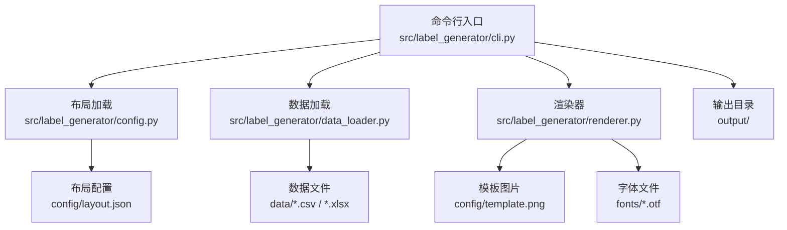
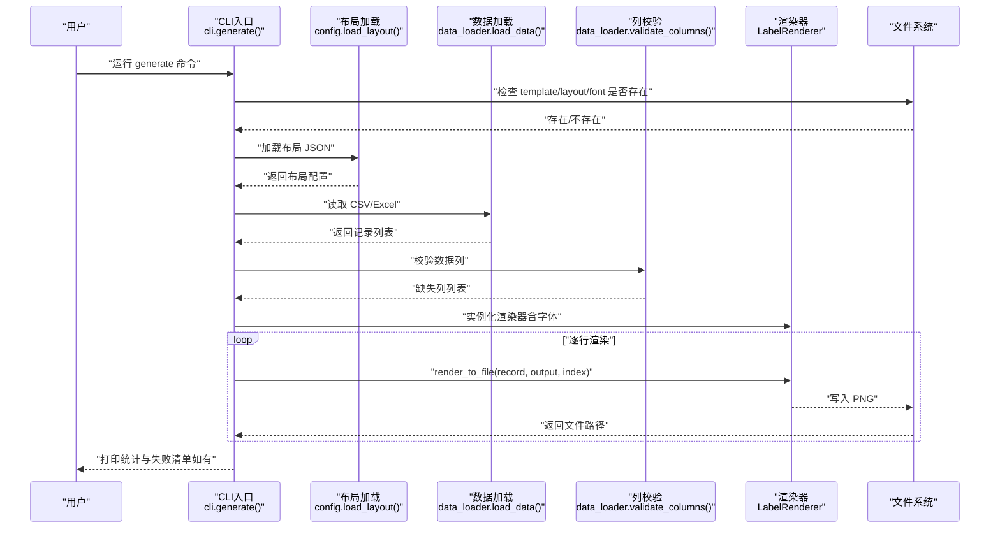
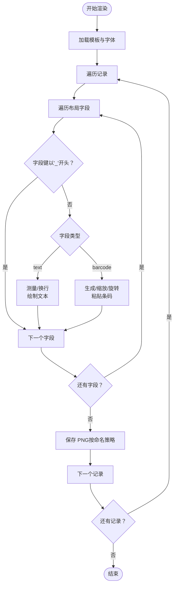
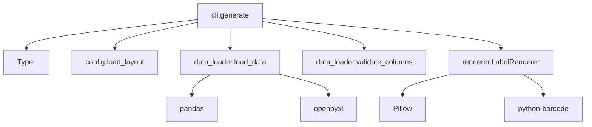

# CLI命令行界面

<cite>
**本文引用的文件**
- [cli.py](file://src/label_generator/cli.py)
- [config.py](file://src/label_generator/config.py)
- [data_loader.py](file://src/label_generator/data_loader.py)
- [renderer.py](file://src/label_generator/renderer.py)
- [layout.json](file://config/layout.json)
- [products.csv](file://data/products.csv)
- [README.md](file://README.md)
- [SPEC.md](file://SPEC.md)
- [pyproject.toml](file://pyproject.toml)
- [gui.py](file://src/label_generator/gui.py)
</cite>

## 目录
1. [简介](#简介)
2. [项目结构](#项目结构)
3. [核心组件](#核心组件)
4. [架构总览](#架构总览)
5. [详细组件分析](#详细组件分析)
6. [依赖分析](#依赖分析)
7. [性能考虑](#性能考虑)
8. [故障排除指南](#故障排除指南)
9. [结论](#结论)
10. [附录](#附录)

## 简介
本指南面向标签生成器的命令行界面（CLI），围绕 generate 子命令的参数、行为、输出与错误处理进行系统说明。内容涵盖参数详解、默认值与可选值、使用示例、错误处理与故障排除、性能优化与批处理最佳实践，以及如何解读生成结果。

## 项目结构
- CLI入口位于 src/label_generator/cli.py，通过 Typer 提供命令行接口。
- 配置加载与数据加载分别由 config.py 与 data_loader.py 实现。
- 核心渲染逻辑集中在 renderer.py，负责将模板、布局与数据合成 PNG。
- 默认资源路径位于 config/、data/、fonts/、output/，可通过命令行参数覆盖。
- README.md 与 SPEC.md 提供项目背景、CSV列规范、layout.json格式与字段说明。

图表来源
- [cli.py:16-86](file://src/label_generator/cli.py#L16-L86)
- [config.py:8-14](file://src/label_generator/config.py#L8-L14)
- [data_loader.py:9-31](file://src/label_generator/data_loader.py#L9-L31)
- [renderer.py:53-102](file://src/label_generator/renderer.py#L53-L102)

章节来源
- [README.md:40-59](file://README.md#L40-L59)
- [SPEC.md:120-148](file://SPEC.md#L120-L148)

## 核心组件
- 命令定义与参数
  - generate 子命令提供以下选项：
    - data：输入数据文件（CSV或Excel），默认指向 data/products.csv。
    - template：模板图片，用于叠加文字与条码，默认指向 config/template.png。
    - layout：布局配置JSON，决定各字段在模板上的位置与样式，默认指向 config/layout.json。
    - output：输出目录，默认 output/。
    - font：常规字体文件（中日文兼容），默认 fonts/NotoSansCJK-Regular.otf。
    - bold_font：粗体字体文件（可选），默认 fonts/NotoSansCJK-Bold.otf；若不存在则回退到常规字体。
- 初始化与校验
  - 启动时检查 template、layout、font 是否存在，缺失则立即报错退出。
  - 若 bold_font 不存在，输出警告并回退到常规字体继续执行。
  - 加载布局与数据后，校验数据列是否满足布局要求，缺失列一次性列出。
- 渲染与输出
  - 逐行渲染，输出文件名优先使用 sku，其次 sku_code，再其次 jan，最后使用 row_{i}。
  - 输出目录自动创建；渲染异常的行会被记录并汇总，不影响其余行生成。
  - 结束时打印“已生成”和“失败数”，若有失败则以非零状态码退出。

章节来源
- [cli.py:16-86](file://src/label_generator/cli.py#L16-L86)
- [config.py:8-14](file://src/label_generator/config.py#L8-L14)
- [data_loader.py:26-31](file://src/label_generator/data_loader.py#L26-L31)
- [renderer.py:233-250](file://src/label_generator/renderer.py#L233-L250)

## 架构总览
下图展示了 generate 命令从启动到输出的端到端流程。

图表来源
- [cli.py:16-86](file://src/label_generator/cli.py#L16-L86)
- [config.py:8-14](file://src/label_generator/config.py#L8-L14)
- [data_loader.py:9-31](file://src/label_generator/data_loader.py#L9-L31)
- [renderer.py:233-250](file://src/label_generator/renderer.py#L233-L250)

## 详细组件分析

### 命令与参数详解
- data
  - 类型：路径（Path）
  - 默认值：根目录下 data/products.csv
  - 必需性：否（但必须存在）
  - 支持格式：CSV、XLSX、XLS（通过 pandas 读取）
  - 行为：读取整表为记录列表；空值统一填充为空字符串；列名需与布局 JSON 的键匹配。
- template
  - 类型：路径（Path）
  - 默认值：根目录下 config/template.png
  - 必需性：是（启动时 fail-fast 检查）
  - 行为：作为底图加载，RGBA 转换为 RGB 输出 PNG。
- layout
  - 类型：路径（Path）
  - 默认值：根目录下 config/layout.json
  - 必需性：是（启动时 fail-fast 检查）
  - 行为：解析 JSON，忽略以“_”开头的元数据键；其余键需与数据列一一对应。
- output
  - 类型：路径（Path）
  - 默认值：根目录下 output/
  - 必需性：否（不存在时自动创建）
  - 行为：保存 PNG 文件，文件名为 {sku}.png；若 sku 缺失则尝试 {sku_code}.png 或 {jan}.png，均缺失则使用 row_{i}.png。
- font
  - 类型：路径（Path）
  - 默认值：根目录下 fonts/NotoSansCJK-Regular.otf
  - 必需性：是（启动时 fail-fast 检查）
  - 行为：常规字体；渲染文本时按 bold 设置选择粗体或常规字体。
- bold_font
  - 类型：路径（Path）
  - 默认值：根目录下 fonts/NotoSansCJK-Bold.otf
  - 必需性：否（不存在时回退到常规字体）
  - 行为：当布局中某字段启用 bold 时使用；否则使用 font。

章节来源
- [cli.py:17-34](file://src/label_generator/cli.py#L17-L34)
- [data_loader.py:9-24](file://src/label_generator/data_loader.py#L9-L24)
- [renderer.py:53-82](file://src/label_generator/renderer.py#L53-L82)
- [SPEC.md:190-191](file://SPEC.md#L190-L191)

### 布局配置（layout.json）要点
- 顶层键分为两类：
  - 普通字段键：与数据列名对应（如 size、category、sku_code、color_name、jan）。
  - 元数据键（以“_”开头，如 _meta）：不参与渲染，仅提供元信息。
- 字段类型与关键属性：
  - text：支持 xy、font_size、anchor、color、bold、max_width 等。
  - barcode：支持 xy、anchor、width、height、rotation、show_text、format 等。
- anchor 采用 PIL 标准：lt（左上）、mm（中心）、rt（右上）等。
- 建议使用 anchor="mm"，使 xy 更直观地指向字符中心。

章节来源
- [layout.json:1-56](file://config/layout.json#L1-L56)
- [SPEC.md:89-104](file://SPEC.md#L89-L104)

### 渲染流程与文件命名
- 渲染流程
  - 逐字段遍历布局，跳过元数据键。
  - 文本字段：按 bold 选择字体，按 max_width 自动换行，多行时最多两行并末尾加省略号。
  - 条码字段：规范化 JAN-13，生成 PNG，按 width/height 重采样，按 rotation 旋转，按 anchor 计算粘贴左上角坐标。
  - 输出：模板复制 RGBA，绘制文本/粘贴条码，最终转换为 RGB 并保存 PNG。
- 文件命名策略
  - 优先级：sku → sku_code → jan → row_{i}
  - 非法字符替换为下划线，确保跨平台兼容。

图表来源
- [renderer.py:83-102](file://src/label_generator/renderer.py#L83-L102)
- [renderer.py:104-197](file://src/label_generator/renderer.py#L104-L197)
- [renderer.py:233-250](file://src/label_generator/renderer.py#L233-L250)

章节来源
- [renderer.py:83-102](file://src/label_generator/renderer.py#L83-L102)
- [renderer.py:104-197](file://src/label_generator/renderer.py#L104-L197)
- [renderer.py:233-250](file://src/label_generator/renderer.py#L233-L250)

### 命令行使用示例
- 基础用法（使用默认路径）
  - 在仓库根目录执行：
    - 使用 PYTHONPATH 方式：PYTHONPATH=src python -m label_generator.cli
    - 或安装为可执行脚本后：label-generator
- 指定路径
  - 指定数据、模板、布局与输出目录：
    - label-generator --data data/products.csv --template config/template.png --layout config/layout.json --output output/
- 自定义字体
  - 指定常规与粗体字体：
    - label-generator --font fonts/NotoSansCJK-Regular.otf --bold-font fonts/NotoSansCJK-Bold.otf
- 批量处理
  - 将多个SKU合并为 CSV 后一次生成：
    - label-generator --data data/products.csv --output output/

章节来源
- [README.md:24-38](file://README.md#L24-L38)
- [SPEC.md:193-201](file://SPEC.md#L193-L201)
- [pyproject.toml:18-20](file://pyproject.toml#L18-L20)

## 依赖分析
- CLI 依赖
  - Typer：命令行框架，提供 generate 子命令与参数解析。
  - Pillow：图像处理与字体渲染。
  - python-barcode：EAN-13 条码生成。
  - pandas：读取 CSV/Excel。
  - openpyxl：Excel 读取支持。
- CLI 与模块关系
  - cli.generate 调用 config.load_layout、data_loader.load_data、data_loader.validate_columns、renderer.LabelRenderer。
  - renderer 依赖 barcode_gen（内部导入）进行条码生成与规范化。

图表来源
- [cli.py:1-11](file://src/label_generator/cli.py#L1-L11)
- [config.py:1-14](file://src/label_generator/config.py#L1-L14)
- [data_loader.py:1-31](file://src/label_generator/data_loader.py#L1-L31)
- [renderer.py:1-12](file://src/label_generator/renderer.py#L1-L12)
- [pyproject.toml:10-16](file://pyproject.toml#L10-L16)

章节来源
- [pyproject.toml:10-16](file://pyproject.toml#L10-L16)

## 性能考虑
- 字体缓存
  - 渲染器对字体对象使用 LRU 缓存，避免重复加载同一字号的字体，显著降低 IO 与初始化开销。
- 批处理建议
  - 将大量 SKU 合并到单个 CSV，减少多次启动开销。
  - 使用默认字体与布局，避免频繁切换资源路径。
  - 控制条码尺寸与旋转角度，减少重采样与旋转成本。
- I/O 优化
  - 输出目录尽量使用本地磁盘，避免网络路径导致的写入延迟。
  - 避免同时运行多个生成任务写入同一输出目录，防止竞争与锁争用。

章节来源
- [SPEC.md:152-155](file://SPEC.md#L152-L155)
- [renderer.py:75-81](file://src/label_generator/renderer.py#L75-L81)

## 故障排除指南
- 文件缺失
  - 现象：启动时报错，提示某文件不存在。
  - 原因：template、layout、font 任一缺失；或 bold_font 不存在。
  - 处理：确认路径正确，确保文件存在；若使用自定义字体，请提供有效路径。
- 数据列缺失
  - 现象：启动时报错，列出缺失的列名。
  - 原因：布局 JSON 中的键在数据中不存在。
  - 处理：补齐数据列或调整布局 JSON。
- JAN 校验失败
  - 现象：某行生成失败，控制台输出条码相关跳过信息。
  - 原因：输入 JAN 非法（12位未补校验或13位校验错误）。
  - 处理：修正 JAN 数据或跳过该行。
- 输出统计与失败清单
  - 现象：命令结束后打印“已生成 X 个，失败 Y 个”，并列出失败的 SKU。
  - 处理：根据失败清单定位问题数据，修复后再运行。
- GUI 与 CLI 的差异
  - GUI 会在加载数据时进行更友好的交互提示；CLI 则在启动阶段快速失败，便于自动化脚本排查。

章节来源
- [cli.py:36-58](file://src/label_generator/cli.py#L36-L58)
- [SPEC.md:205-212](file://SPEC.md#L205-L212)
- [gui.py:200-226](file://src/label_generator/gui.py#L200-L226)

## 结论
CLI 提供了简洁高效的批量标签生成能力。通过合理设置参数与布局，可在保证质量的前提下快速产出大量打印就绪的 PNG 标签。建议在生产环境中结合批处理脚本与错误监控，确保大规模生成的稳定性与可追溯性。

## 附录

### 参数对照表
- data
  - 类型：路径
  - 默认：data/products.csv
  - 必需：否（但必须存在）
  - 支持：CSV、XLSX、XLS
- template
  - 类型：路径
  - 默认：config/template.png
  - 必需：是
- layout
  - 类型：路径
  - 默认：config/layout.json
  - 必需：是
- output
  - 类型：路径
  - 默认：output/
  - 必需：否（不存在自动创建）
- font
  - 类型：路径
  - 默认：fonts/NotoSansCJK-Regular.otf
  - 必需：是
- bold_font
  - 类型：路径
  - 默认：fonts/NotoSansCJK-Bold.otf
  - 必需：否（不存在回退到常规字体）

章节来源
- [cli.py:17-34](file://src/label_generator/cli.py#L17-L34)
- [SPEC.md:190-191](file://SPEC.md#L190-L191)

### 常见使用场景与参数组合
- 快速试跑
  - 使用默认路径：label-generator
- 自定义数据与输出
  - 指定数据与输出目录：label-generator --data data/products.csv --output output/
- 自定义模板与布局
  - 指定模板与布局：label-generator --template config/template.png --layout config/layout.json
- 自定义字体
  - 指定常规与粗体字体：label-generator --font fonts/NotoSansCJK-Regular.otf --bold-font fonts/NotoSansCJK-Bold.otf
- 批量生成（多SKU）
  - 将多个 SKU 合并到 CSV，一次生成：label-generator --data data/products.csv --output output/

章节来源
- [README.md:24-38](file://README.md#L24-L38)
- [SPEC.md:193-201](file://SPEC.md#L193-L201)

### 输出解读
- 控制台输出
  - “Processing N records → output/”：开始处理的记录总数与输出目录。
  - “✓ 文件名”：单条记录成功生成。
  - “✗ SKU: 错误信息”：单条记录失败原因。
  - “Done: X generated, Y failed.”：本次运行的统计结果。
  - “Failed SKUs: [列表]”：失败的 SKU 列表（若有）。
- 输出文件
  - 位于 output/，文件名为 {sku}.png；若缺少 sku，则依次尝试 sku_code、jan，均无则使用 row_{i}.png。

章节来源
- [cli.py:66-85](file://src/label_generator/cli.py#L66-L85)
- [renderer.py:233-250](file://src/label_generator/renderer.py#L233-L250)