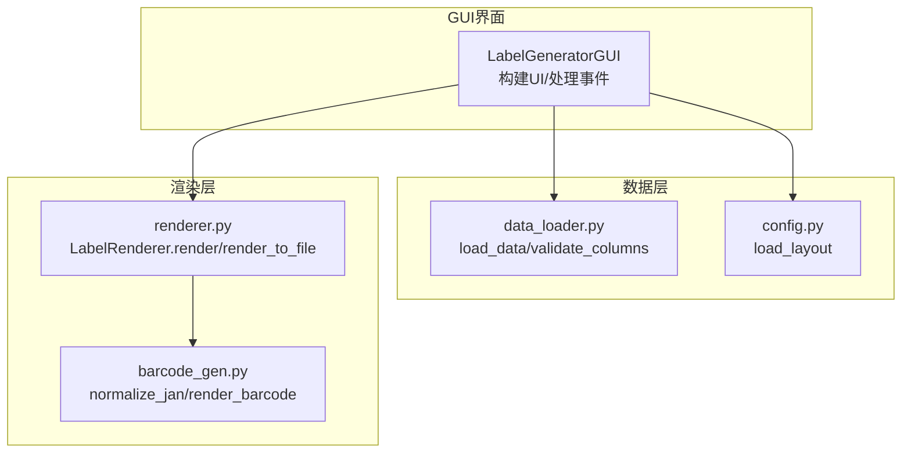
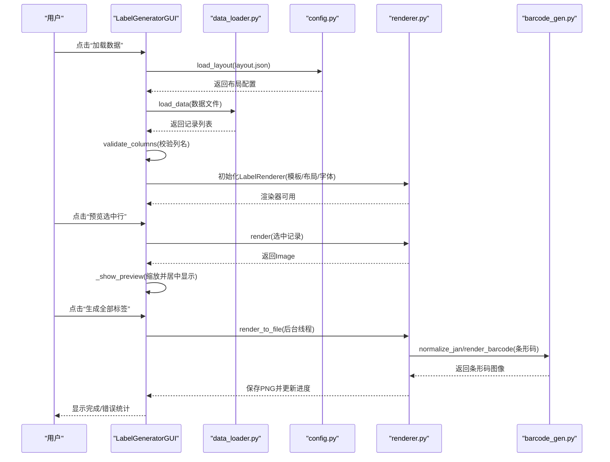
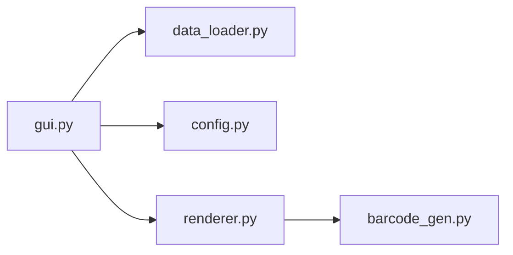

# GUI图形界面

<cite>
**本文引用的文件**
- [gui.py](file://src/label_generator/gui.py)
- [renderer.py](file://src/label_generator/renderer.py)
- [data_loader.py](file://src/label_generator/data_loader.py)
- [config.py](file://src/label_generator/config.py)
- [layout.json](file://config/layout.json)
- [README.md](file://README.md)
- [products.csv](file://data/products.csv)
- [boy_products.csv](file://data/boy_products.csv)
- [barcode_gen.py](file://src/label_generator/barcode_gen.py)
</cite>

## 目录
1. [简介](#简介)
2. [项目结构](#项目结构)
3. [核心组件](#核心组件)
4. [架构总览](#架构总览)
5. [详细组件分析](#详细组件分析)
6. [依赖分析](#依赖分析)
7. [性能考虑](#性能考虑)
8. [故障排除指南](#故障排除指南)
9. [结论](#结论)
10. [附录](#附录)

## 简介
本指南面向标签生成器的GUI图形界面使用者，帮助您快速掌握从启动程序到批量生成标签的完整流程。GUI界面采用分层布局：上方为“配置区”，中部为“数据预览+标签预览”的左右分区，下方为“进度条与状态栏”。通过该界面，您可以：
- 选择数据文件（CSV/Excel）、模板图片、布局配置、输出目录与字体
- 实时预览单条记录生成效果
- 批量生成全部标签并查看进度与结果

## 项目结构
GUI位于 src/label_generator/gui.py，负责构建界面、处理用户交互、调用数据加载与渲染模块，并提供实时预览与批量导出能力。核心模块如下：
- 数据加载：读取CSV/Excel，校验列名
- 布局解析：加载并验证 layout.json
- 渲染引擎：根据布局在模板上绘制文本与条形码
- 条形码生成：规范化并渲染EAN-13条形码
- GUI主控：组织界面、事件与线程

图表来源
- [gui.py:19-130](file://src/label_generator/gui.py#L19-L130)
- [data_loader.py:9-31](file://src/label_generator/data_loader.py#L9-L31)
- [config.py:8-13](file://src/label_generator/config.py#L8-L13)
- [renderer.py:53-102](file://src/label_generator/renderer.py#L53-L102)
- [barcode_gen.py:17-59](file://src/label_generator/barcode_gen.py#L17-L59)

章节来源
- [gui.py:19-130](file://src/label_generator/gui.py#L19-L130)
- [README.md:40-59](file://README.md#L40-L59)

## 核心组件
- 配置区（顶部）
  - 数据文件（CSV/Excel）
  - 模板图片（PNG/JPG）
  - 布局JSON（定义字段位置、字号、锚点等）
  - 输出目录
  - 常规字体与可选粗体字体
  - “浏览…”按钮用于选择文件或目录
- 操作按钮区（配置区下方）
  - 加载数据：读取数据与布局，校验列名，构建渲染器
  - 预览选中行：在右侧画布中显示当前选中记录的标签预览
  - 生成全部标签：后台线程批量导出PNG至输出目录
- 中部区域（左右分区）
  - 左侧：数据预览树视图（Treeview），展示CSV/Excel列与行
  - 右侧：标签预览画布（Canvas），按比例缩放显示生成的标签
- 底部区域
  - 进度条：显示当前生成进度
  - 状态栏：显示当前状态信息（如“就绪”、“生成中...”）

章节来源
- [gui.py:44-130](file://src/label_generator/gui.py#L44-L130)

## 架构总览
GUI以LabelGeneratorGUI为中心，协调数据加载、布局解析与渲染执行。下图展示了从用户点击“加载数据”到“生成全部标签”的关键交互序列。

图表来源
- [gui.py:193-373](file://src/label_generator/gui.py#L193-L373)
- [data_loader.py:9-31](file://src/label_generator/data_loader.py#L9-L31)
- [config.py:8-13](file://src/label_generator/config.py#L8-L13)
- [renderer.py:53-102](file://src/label_generator/renderer.py#L53-L102)
- [barcode_gen.py:17-59](file://src/label_generator/barcode_gen.py#L17-L59)

## 详细组件分析

### 配置区与文件选择
- 数据文件（CSV/Excel）
  - 用途：提供每行一个标签的数据源
  - 列建议：至少包含模板布局所需的字段（例如 size、category、sku_code、color_name、jan）
  - 选择方式：点击“浏览...”弹出文件对话框，支持CSV与Excel格式
- 模板图片（PNG/JPG）
  - 用途：作为标签背景，渲染后的文字与条形码叠加其上
  - 选择方式：点击“浏览...”选择图片文件
- 布局JSON
  - 用途：定义每个字段在模板上的位置、字号、颜色、锚点、是否加粗、最大宽度等
  - 选择方式：点击“浏览...”选择JSON文件
  - 默认布局参考：config/layout.json
- 输出目录
  - 用途：批量导出PNG的位置
  - 选择方式：点击“浏览...”选择目录
- 字体
  - 常规字体：用于普通文本
  - 粗体字体：可选，用于加粗文本
  - 选择方式：点击“浏览...”选择OTF/TTF字体文件

最佳实践
- 在选择布局前，先确认数据文件中的列名与布局键一致
- 若未找到默认字体，可在字体路径处手动选择
- 输出目录会自动创建，无需预先存在

章节来源
- [gui.py:50-76](file://src/label_generator/gui.py#L50-L76)
- [layout.json:1-56](file://config/layout.json#L1-L56)

### 数据预览与列校验
- 加载数据后，左侧树视图会显示所有列与行
- 若布局中声明的字段在数据中缺失，会弹出警告提示
- 渲染器会在初始化时使用模板、布局与字体进行准备

操作要点
- 先加载数据，再进行预览或生成
- 若出现“列缺失”警告，请检查数据列名与布局键是否一致

章节来源
- [gui.py:193-254](file://src/label_generator/gui.py#L193-L254)
- [data_loader.py:26-31](file://src/label_generator/data_loader.py#L26-L31)

### 实时预览功能
- 选中树视图中的一行，点击“预览选中行”
- GUI调用渲染器对当前记录进行渲染，并在右侧画布中居中显示
- 图像会按画布尺寸等比缩放，保持原始宽高比

使用技巧
- 预览时可调整窗口大小观察缩放效果
- 若预览空白，检查对应字段在数据中是否有值

章节来源
- [gui.py:259-299](file://src/label_generator/gui.py#L259-L299)
- [renderer.py:83-102](file://src/label_generator/renderer.py#L83-L102)

### 批量生成与导出
- 点击“生成全部标签”后，GUI在后台线程中逐条渲染并保存为PNG
- 输出文件名优先使用数据中的sku/sku_code/jan，否则回退到行号
- 进度条与状态栏实时反馈生成进度；若部分失败，会汇总前若干条错误信息

注意事项
- 导出过程不会阻塞界面，可正常关闭或继续操作
- 输出目录默认为output/，可在配置区修改

章节来源
- [gui.py:303-373](file://src/label_generator/gui.py#L303-L373)
- [renderer.py:233-250](file://src/label_generator/renderer.py#L233-L250)

### 布局配置详解（layout.json）
- 元数据（_meta）
  - template_size：模板尺寸（像素）
  - font/bold_font：默认字体路径
- 字段定义
  - 文本字段：type=text，xy为坐标，font_size字号，anchor锚点，color颜色，bold是否加粗，max_width最大宽度（自动换行）
  - 条形码字段：type=barcode，xy坐标，anchor锚点，width/height尺寸，rotation旋转角度，show_text是否显示数字
- 锚点约定
  - 采用PIL锚点约定：lt（左上）、mm（中心）、rt（右上）等

章节来源
- [layout.json:1-56](file://config/layout.json#L1-L56)
- [README.md:72-107](file://README.md#L72-L107)

### 条形码生成机制
- 规范化：接受12位或13位数字，自动计算并校验校验位
- 渲染：使用EAN-13编码生成条形码图像，可选在底部显示数字
- 旋转与粘贴：根据布局配置旋转并按锚点粘贴到模板上

章节来源
- [barcode_gen.py:17-59](file://src/label_generator/barcode_gen.py#L17-L59)
- [renderer.py:133-196](file://src/label_generator/renderer.py#L133-L196)

## 依赖分析
GUI与各模块之间的依赖关系如下：

图表来源
- [gui.py:12-14](file://src/label_generator/gui.py#L12-L14)
- [data_loader.py:1-32](file://src/label_generator/data_loader.py#L1-L32)
- [config.py:1-14](file://src/label_generator/config.py#L1-L14)
- [renderer.py:1-251](file://src/label_generator/renderer.py#L1-L251)
- [barcode_gen.py:1-60](file://src/label_generator/barcode_gen.py#L1-L60)

章节来源
- [gui.py:12-14](file://src/label_generator/gui.py#L12-L14)

## 性能考虑
- 后台线程：批量生成在独立线程中执行，避免界面卡顿
- 缓存字体：渲染器对字体进行缓存，减少重复开销
- 图像缩放：预览时按画布尺寸等比缩放，避免失真
- 进度更新：通过主线程安全接口更新进度与状态

优化建议
- 使用合适的字体大小与最大宽度，减少文本换行与重绘
- 控制条形码尺寸与旋转角度，避免过度缩放导致质量下降
- 将大文件拆分为多个小批次导出，便于监控与恢复

章节来源
- [gui.py:316-348](file://src/label_generator/gui.py#L316-L348)
- [renderer.py:75-81](file://src/label_generator/renderer.py#L75-L81)

## 故障排除指南
常见问题与解决方法
- 文件缺失
  - 现象：弹出“文件缺失”错误
  - 原因：数据文件、布局JSON、模板图片或字体不存在
  - 解决：检查路径并重新选择有效文件
- 列缺失
  - 现象：弹出“列缺失”警告
  - 原因：数据列名与布局键不匹配
  - 解决：修正数据列名或调整布局键
- 渲染失败
  - 现象：预览或生成时报错
  - 原因：模板/字体路径无效、条形码格式错误
  - 解决：检查模板与字体路径；确保条形码为12或13位数字
- 生成完成但部分失败
  - 现象：弹出“生成完成（有错误）”，显示成功/失败数量
  - 原因：个别记录渲染异常
  - 解决：查看日志或输出目录中的具体文件，修复对应记录

章节来源
- [gui.py:200-218](file://src/label_generator/gui.py#L200-L218)
- [gui.py:278-279](file://src/label_generator/gui.py#L278-L279)
- [gui.py:354-373](file://src/label_generator/gui.py#L354-L373)

## 结论
GUI图形界面提供了直观、高效的标签生成体验。通过合理的布局配置与数据准备，您可以快速完成从数据导入到批量导出的全流程工作。建议在正式批量生成前，先使用“预览选中行”核对效果，并在“加载数据”后确认列匹配情况。

## 附录

### 完整操作流程（从启动到生成）
- 启动程序
  - 使用命令行进入项目根目录，运行Python模块入口
  - 示例命令参考项目说明
- 准备素材
  - 准备数据文件（CSV/Excel），确保包含布局所需列
  - 准备模板图片（PNG/JPG）
  - 准备布局JSON（默认路径见config/layout.json）
  - 准备字体（常规与可选粗体）
- 配置参数
  - 在配置区填写或选择：数据文件、模板图片、布局JSON、输出目录、字体
  - 点击“浏览...”选择对应文件或目录
- 加载数据
  - 点击“加载数据”，等待加载完成并查看列校验结果
- 预览
  - 在树视图中选中一行，点击“预览选中行”，在右侧画布查看效果
- 生成全部标签
  - 点击“生成全部标签”，在进度条与状态栏查看进度
  - 查看输出目录中的PNG文件

章节来源
- [README.md:24-38](file://README.md#L24-L38)
- [gui.py:193-373](file://src/label_generator/gui.py#L193-L373)

### 示例数据与模板
- 示例数据
  - products.csv：基础示例数据，包含常用字段
  - boy_products.csv：男孩系列示例数据
- 示例模板与布局
  - config/layout.json：默认布局配置，定义了字段位置、字号、颜色、锚点等

章节来源
- [products.csv:1-7](file://data/products.csv#L1-L7)
- [boy_products.csv:1-19](file://data/boy_products.csv#L1-L19)
- [layout.json:1-56](file://config/layout.json#L1-L56)