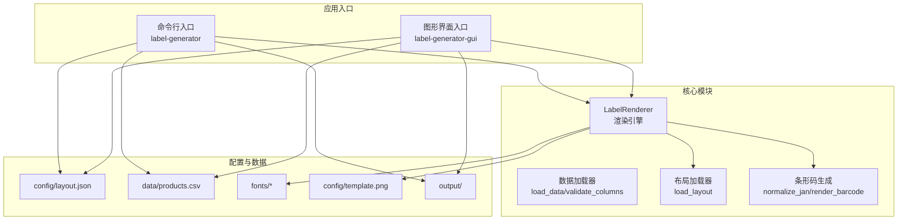
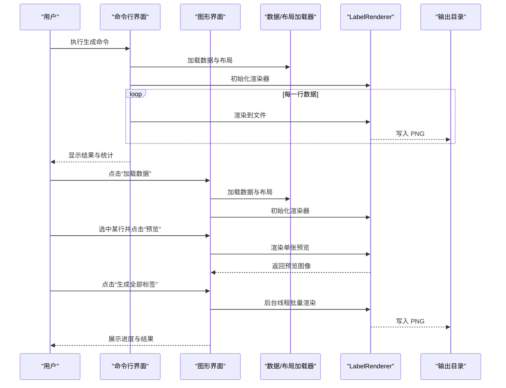
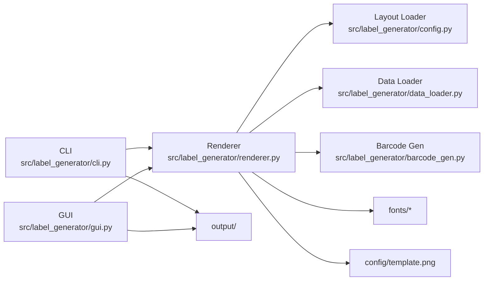
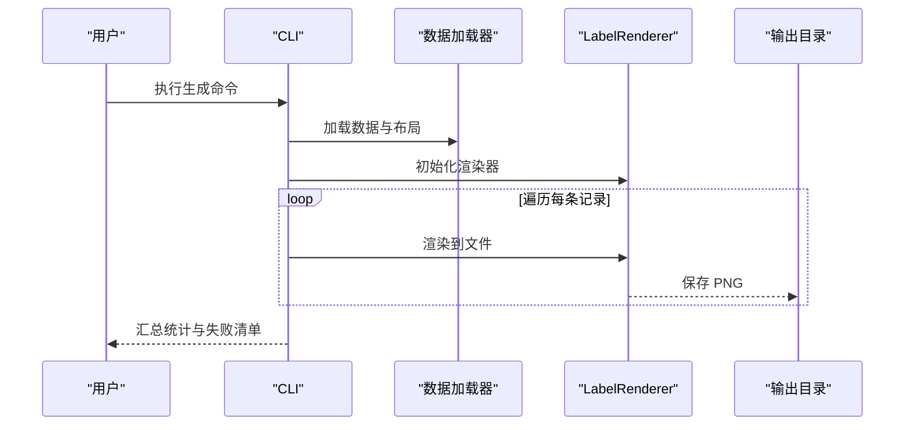

# 用户界面使用指南

<cite>
**本文档引用的文件**
- [README.md](file://README.md)
- [pyproject.toml](file://pyproject.toml)
- [cli.py](file://src/label_generator/cli.py)
- [gui.py](file://src/label_generator/gui.py)
- [renderer.py](file://src/label_generator/renderer.py)
- [data_loader.py](file://src/label_generator/data_loader.py)
- [config.py](file://src/label_generator/config.py)
- [barcode_gen.py](file://src/label_generator/barcode_gen.py)
- [layout.json](file://config/layout.json)
- [products.csv](file://data/products.csv)
</cite>

## 目录
1. [简介](#简介)
2. [项目结构](#项目结构)
3. [核心组件](#核心组件)
4. [架构总览](#架构总览)
5. [详细组件分析](#详细组件分析)
6. [依赖关系分析](#依赖关系分析)
7. [性能考虑](#性能考虑)
8. [故障排除指南](#故障排除指南)
9. [结论](#结论)
10. [附录](#附录)

## 简介
本指南面向标签生成器的两类用户界面：命令行界面（CLI）与图形界面（GUI）。您将学会如何：
- 使用 CLI 批量生成标签，掌握参数、示例与最佳实践
- 使用 GUI 完成从数据加载到实时预览再到批量导出的完整流程
- 对比两种界面的适用场景，选择最适合的工作方式
- 提升效率的操作技巧与常见问题排查

## 项目结构
项目采用模块化设计，核心逻辑集中在 src/label_generator 下，包含 CLI、GUI、渲染器、数据加载、布局解析与条形码生成等模块；配置与数据位于 config/ 与 data/ 目录。

图表来源
- [pyproject.toml:18-20](file://pyproject.toml#L18-L20)
- [cli.py:16-86](file://src/label_generator/cli.py#L16-L86)
- [gui.py:19-384](file://src/label_generator/gui.py#L19-L384)
- [renderer.py:53-251](file://src/label_generator/renderer.py#L53-L251)
- [data_loader.py:9-32](file://src/label_generator/data_loader.py#L9-L32)
- [config.py:8-14](file://src/label_generator/config.py#L8-L14)
- [barcode_gen.py:17-60](file://src/label_generator/barcode_gen.py#L17-L60)

章节来源
- [README.md:40-59](file://README.md#L40-L59)
- [pyproject.toml:18-20](file://pyproject.toml#L18-L20)

## 核心组件
- 渲染器（LabelRenderer）：负责将模板图像与文本/条形码叠加，生成最终 PNG 输出
- 数据加载器：支持 CSV 与 Excel，统一转换为字典列表，并校验布局所需字段
- 布局加载器：读取 JSON 配置，定义每个字段的类型、位置、字号、锚点等
- 条形码生成：支持 JAN-13（EAN-13）规范化与渲染，自动处理校验位
- CLI 与 GUI：分别提供命令行与图形化的调用入口

章节来源
- [renderer.py:53-251](file://src/label_generator/renderer.py#L53-L251)
- [data_loader.py:9-32](file://src/label_generator/data_loader.py#L9-L32)
- [config.py:8-14](file://src/label_generator/config.py#L8-L14)
- [barcode_gen.py:17-60](file://src/label_generator/barcode_gen.py#L17-L60)

## 架构总览
下图展示 CLI 与 GUI 的共同调用链：两者均通过 LabelRenderer 组合布局、数据与字体/模板资源，最终写入输出目录。

图表来源
- [cli.py:49-85](file://src/label_generator/cli.py#L49-L85)
- [gui.py:208-254](file://src/label_generator/gui.py#L208-L254)
- [gui.py:303-373](file://src/label_generator/gui.py#L303-L373)
- [renderer.py:83-102](file://src/label_generator/renderer.py#L83-L102)

## 详细组件分析

### CLI 命令行界面使用指南
- 入口与安装
  - 可通过脚本入口直接运行：label-generator
  - 或使用 PYTHONPATH 方式运行模块：PYTHONPATH=src python -m label_generator.cli
- 主要参数
  - --data：输入数据文件（CSV/Excel）
  - --template：模板图片路径
  - --layout：布局 JSON 路径
  - --output：输出目录
  - --font：常规字体（推荐 CJK 字体）
  - --bold-font：粗体字体（可选，若不存在则回退到常规字体）
- 基本用法与示例
  - 使用默认路径：直接执行 label-generator
  - 指定路径：label-generator --data data/products.csv --template config/template.png --layout config/layout.json --output output/
- 最佳实践
  - 在同一项目内保持相对路径一致，便于复用
  - 若未提供粗体字体，系统会自动回退到常规字体，避免渲染中断
  - 建议先用 GUI 预览确认布局，再用 CLI 批量生成
  - 输出目录会按行的标识（优先使用 sku/sku_code/jan/行索引）命名 PNG 文件
- 错误处理
  - 缺失必需文件时会明确报错并退出
  - 列缺失会在启动阶段提示，避免中途失败
  - 单行渲染异常会记录失败项并继续处理，最后汇总统计

章节来源
- [README.md:24-38](file://README.md#L24-L38)
- [cli.py:16-86](file://src/label_generator/cli.py#L16-L86)
- [data_loader.py:26-32](file://src/label_generator/data_loader.py#L26-L32)

### GUI 图形界面使用指南
- 启动
  - 通过脚本入口启动：label-generator-gui
- 界面组成
  - 配置面板：数据文件、模板图片、布局 JSON、输出目录、字体路径等
  - 数据预览：以表格形式显示数据，支持横向/纵向滚动
  - 标签预览：右侧画布实时显示当前选中行的渲染效果
  - 进度与状态：显示生成进度与状态信息
- 操作步骤
  1) 设置路径：在配置面板中填写或浏览选择各文件路径
  2) 加载数据：点击“加载数据”，系统读取数据与布局，构建渲染器
  3) 预览：在数据表中选中一行，点击“预览选中行”查看标签效果
  4) 生成：点击“生成全部标签”，后台线程批量渲染并保存至输出目录
- 实时预览
  - 预览会根据画布尺寸等比缩放，保持原始比例
  - 预览不修改任何文件，仅用于视觉验证
- 导出流程
  - 输出目录自动创建
  - 每个标签以安全文件名保存，避免非法字符
  - 成功/失败数量与前若干条错误会弹窗提示
- 适用场景
  - GUI 更适合探索性工作、反复调整布局与预览效果
  - CLI 更适合自动化与批量化生产环境

章节来源
- [gui.py:19-384](file://src/label_generator/gui.py#L19-L384)
- [renderer.py:233-251](file://src/label_generator/renderer.py#L233-L251)

### 布局与数据规范
- 布局 JSON（layout.json）
  - 支持文本字段与条形码字段
  - 文本字段关键属性：type、xy、font_size、anchor、color、bold、max_width
  - 条形码字段关键属性：type、xy、anchor、width、height、rotation、show_text
  - _meta 包含模板尺寸与字体路径等元信息
- 数据文件（CSV/Excel）
  - 必须包含与布局对应的列
  - 支持多行记录，逐行生成对应 PNG
- 条形码规范
  - 支持 12 位自动补校验位，或 13 位校验位验证
  - 渲染为 EAN-13，可选择是否显示数字文本

章节来源
- [layout.json:1-56](file://config/layout.json#L1-L56)
- [README.md:61-107](file://README.md#L61-L107)
- [data_loader.py:9-23](file://src/label_generator/data_loader.py#L9-L23)
- [barcode_gen.py:17-60](file://src/label_generator/barcode_gen.py#L17-L60)

### 两种界面的适用场景对比
- CLI 适合
  - 批量自动化生成
  - 与 CI/CD 集成
  - 固定参数的重复任务
- GUI 适合
  - 探索式设计与快速迭代
  - 需要实时预览与交互式调试
  - 非技术用户的入门与演示

## 依赖关系分析
- CLI 与 GUI 共享底层渲染能力，分别通过独立入口调用
- LabelRenderer 依赖布局、数据、字体与模板
- 条形码生成模块独立于 UI，提供通用的 JAN-13 规范化与渲染

图表来源
- [cli.py:16-86](file://src/label_generator/cli.py#L16-L86)
- [gui.py:19-384](file://src/label_generator/gui.py#L19-L384)
- [renderer.py:53-251](file://src/label_generator/renderer.py#L53-L251)
- [data_loader.py:9-32](file://src/label_generator/data_loader.py#L9-L32)
- [config.py:8-14](file://src/label_generator/config.py#L8-L14)
- [barcode_gen.py:17-60](file://src/label_generator/barcode_gen.py#L17-L60)

## 性能考虑
- 渲染缓存：LabelRenderer 对字体进行 LRU 缓存，减少重复开销
- 批处理：CLI 与 GUI 均逐行处理，避免一次性占用过多内存
- 预览优化：GUI 预览按画布尺寸等比缩放，避免大图直接渲染
- I/O 合并：输出目录自动创建，减少多次 I/O

章节来源
- [renderer.py:75-82](file://src/label_generator/renderer.py#L75-L82)
- [gui.py:281-299](file://src/label_generator/gui.py#L281-L299)

## 故障排除指南
- 文件缺失
  - 现象：启动时报错提示文件不存在
  - 处理：检查路径是否正确，确认模板、布局、字体与数据文件存在
- 列缺失
  - 现象：加载数据后提示缺少某些列
  - 处理：在布局 JSON 中添加相应字段，或在数据中补齐对应列
- 字体问题
  - 现象：渲染出现乱码或未生效
  - 处理：确保字体文件存在且为 CJK 友好字体；若未提供粗体字体，系统会回退到常规字体
- 条形码错误
  - 现象：条形码不显示或报错
  - 处理：确认 JAN 数值为 12 位（自动补校验）或 13 位（校验位正确）
- GUI 卡顿
  - 现象：生成过程中界面无响应
  - 处理：GUI 已在后台线程执行，稍候即可；如长时间无响应，检查输出目录权限
- 输出文件名冲突
  - 现象：PNG 文件名包含非法字符导致无法保存
  - 处理：系统会自动替换非法字符，确保文件名安全

章节来源
- [cli.py:36-58](file://src/label_generator/cli.py#L36-L58)
- [gui.py:200-206](file://src/label_generator/gui.py#L200-L206)
- [gui.py:274-279](file://src/label_generator/gui.py#L274-L279)
- [renderer.py:14-16](file://src/label_generator/renderer.py#L14-L16)
- [barcode_gen.py:17-32](file://src/label_generator/barcode_gen.py#L17-L32)

## 结论
- CLI 与 GUI 提供了从探索到生产的完整路径：先用 GUI 快速验证布局与预览，再用 CLI 批量生成并集成到工作流
- 通过理解布局 JSON、数据格式与条形码规范，您可以高效产出符合印刷要求的标签 PNG
- 遇到问题时，优先检查文件路径、列匹配与字体可用性，结合本指南的排障建议快速定位

## 附录

### 常用操作技巧与效率提升
- 使用 GUI 先“预览选中行”，确认无误后再“生成全部标签”
- 将常用参数固化为脚本或别名，减少重复输入
- 在布局中合理设置 max_width 与 anchor，减少手工微调
- 将输出目录置于高速磁盘，提升批量写入速度
- 使用版本控制管理 layout.json 与模板，便于追踪变更

### 关键流程可视化（CLI 生成序列）

图表来源
- [cli.py:49-85](file://src/label_generator/cli.py#L49-L85)
- [renderer.py:233-251](file://src/label_generator/renderer.py#L233-L251)