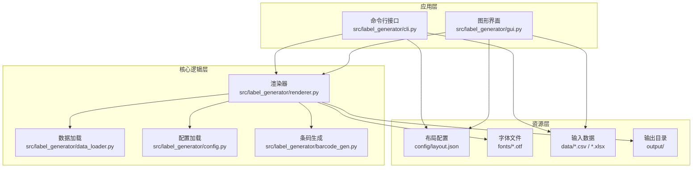
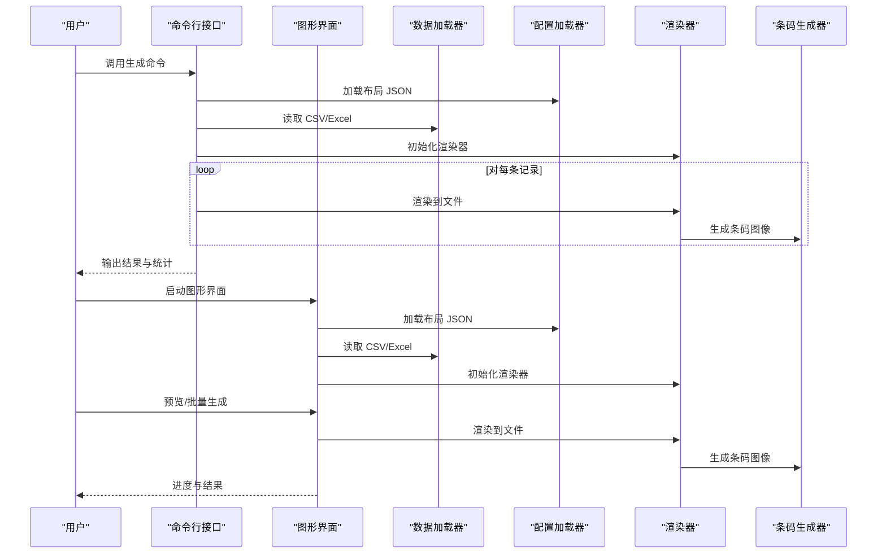
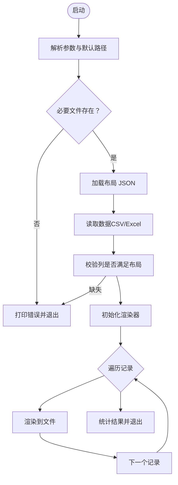
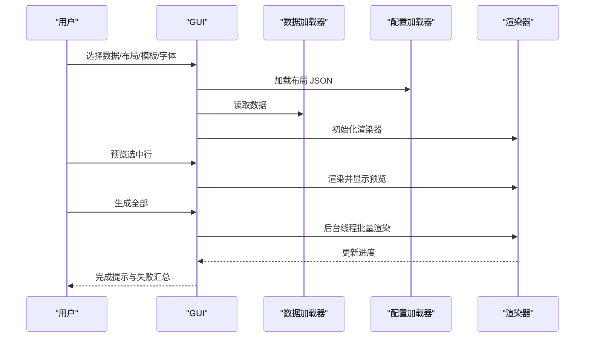
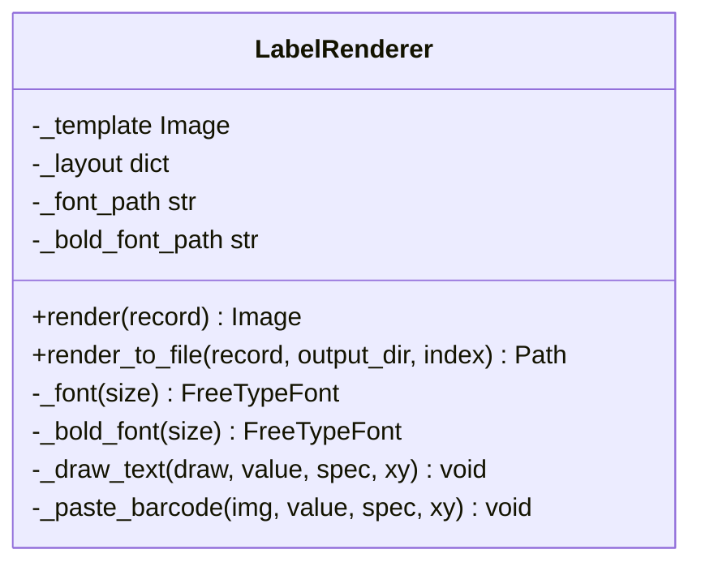
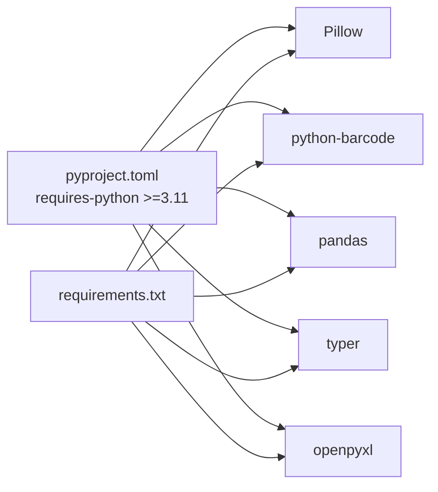

# 部署与运维

<cite>
**本文引用的文件**
- [README.md](file://README.md)
- [requirements.txt](file://requirements.txt)
- [pyproject.toml](file://pyproject.toml)
- [src/label_generator/cli.py](file://src/label_generator/cli.py)
- [src/label_generator/gui.py](file://src/label_generator/gui.py)
- [src/label_generator/renderer.py](file://src/label_generator/renderer.py)
- [src/label_generator/data_loader.py](file://src/label_generator/data_loader.py)
- [src/label_generator/config.py](file://src/label_generator/config.py)
- [src/label_generator/barcode_gen.py](file://src/label_generator/barcode_gen.py)
- [config/layout.json](file://config/layout.json)
</cite>

## 目录
1. [简介](#简介)
2. [项目结构](#项目结构)
3. [核心组件](#核心组件)
4. [架构总览](#架构总览)
5. [详细组件分析](#详细组件分析)
6. [依赖关系分析](#依赖关系分析)
7. [性能考量](#性能考量)
8. [故障排除指南](#故障排除指南)
9. [结论](#结论)
10. [附录](#附录)

## 简介
本指南面向运维与平台工程团队，提供标签生成器的完整部署与运维方案。内容涵盖环境与依赖配置、安装与虚拟环境管理、生产部署（CLI 批处理与 GUI 可视化）、监控与维护、CI/CD 集成与自动化测试策略、安全与权限管理建议，以及系统管理与故障排除要点。

## 项目结构
项目采用“源码分层 + 配置/数据资源分离”的组织方式：
- 源码位于 src/label_generator，包含命令行入口、图形界面、渲染器、数据加载、配置解析与条码生成模块
- 配置与资源：config/ 布局 JSON、data/ 输入数据、fonts/ 字体文件、output/ 输出目录（默认 git 忽略）
- 根目录提供依赖清单与打包元信息，便于安装与脚手架工具

图表来源
- [src/label_generator/cli.py:1-94](file://src/label_generator/cli.py#L1-L94)
- [src/label_generator/gui.py:1-384](file://src/label_generator/gui.py#L1-L384)
- [src/label_generator/renderer.py:1-251](file://src/label_generator/renderer.py#L1-L251)
- [src/label_generator/data_loader.py:1-32](file://src/label_generator/data_loader.py#L1-L32)
- [src/label_generator/config.py:1-14](file://src/label_generator/config.py#L1-L14)
- [src/label_generator/barcode_gen.py:1-60](file://src/label_generator/barcode_gen.py#L1-L60)
- [config/layout.json:1-56](file://config/layout.json#L1-L56)

章节来源
- [README.md: 第40-59 行:40-59](file://README.md#L40-L59)

## 核心组件
- 命令行接口：提供批处理生成能力，支持参数化路径与错误快速退出
- 图形界面：提供可视化配置、数据预览、实时预览与批量生成
- 渲染器：负责模板叠加文本与条码、排版与锚点对齐、缓存字体以提升性能
- 数据加载器：支持 CSV/Excel，统一转为字典列表并进行列校验
- 配置加载器：加载布局 JSON，含字段类型、坐标、字号、颜色等
- 条码生成器：支持 JAN/EAN-13 规范，自动校验与补全校验位，生成高分辨率条码图

章节来源
- [src/label_generator/cli.py: 第16-86 行:16-86](file://src/label_generator/cli.py#L16-L86)
- [src/label_generator/gui.py: 第19-384 行:19-384](file://src/label_generator/gui.py#L19-L384)
- [src/label_generator/renderer.py: 第53-251 行:53-251](file://src/label_generator/renderer.py#L53-L251)
- [src/label_generator/data_loader.py: 第9-32 行:9-32](file://src/label_generator/data_loader.py#L9-L32)
- [src/label_generator/config.py: 第8-14 行:8-14](file://src/label_generator/config.py#L8-L14)
- [src/label_generator/barcode_gen.py: 第17-60 行:17-60](file://src/label_generator/barcode_gen.py#L17-L60)

## 架构总览
下图展示 CLI 与 GUI 的调用链路与核心模块交互：

图表来源
- [src/label_generator/cli.py: 第16-86 行:16-86](file://src/label_generator/cli.py#L16-L86)
- [src/label_generator/gui.py: 第193-373 行:193-373](file://src/label_generator/gui.py#L193-L373)
- [src/label_generator/renderer.py: 第83-102 行:83-102](file://src/label_generator/renderer.py#L83-L102)
- [src/label_generator/barcode_gen.py: 第40-60 行:40-60](file://src/label_generator/barcode_gen.py#L40-L60)

## 详细组件分析

### 命令行接口（CLI）
- 功能：批处理生成标签，支持路径参数化、失败快速退出、逐条输出结果
- 关键流程：参数校验 → 加载布局与数据 → 列校验 → 初始化渲染器 → 循环渲染并写入文件 → 统计与异常上报
- 错误处理：缺失文件、列不匹配、渲染异常均通过标准错误输出并返回非零退出码

图表来源
- [src/label_generator/cli.py: 第16-86 行:16-86](file://src/label_generator/cli.py#L16-L86)

章节来源
- [src/label_generator/cli.py: 第16-86 行:16-86](file://src/label_generator/cli.py#L16-L86)

### 图形界面（GUI）
- 功能：可视化配置、数据预览、实时预览、后台线程批量生成、进度与状态反馈
- 关键流程：选择文件 → 校验存在性 → 加载布局与数据 → 列校验 → 初始化渲染器 → 预览/批量生成 → 结果提示
- 并发模型：后台线程执行生成任务，主线程更新进度与状态，保证 UI 响应

图表来源
- [src/label_generator/gui.py: 第193-373 行:193-373](file://src/label_generator/gui.py#L193-L373)

章节来源
- [src/label_generator/gui.py: 第19-384 行:19-384](file://src/label_generator/gui.py#L19-L384)

### 渲染器（LabelRenderer）
- 功能：根据布局配置绘制文本、粘贴条码、处理锚点与旋转、缓存字体以降低开销
- 性能特性：LRU 缓存字体对象；按需加载粗体/常规字体；文本换行与截断；条码尺寸与 DPI 控制
- 文件名安全：过滤非法字符，避免跨平台路径问题

图表来源
- [src/label_generator/renderer.py: 第53-251 行:53-251](file://src/label_generator/renderer.py#L53-L251)

章节来源
- [src/label_generator/renderer.py: 第53-251 行:53-251](file://src/label_generator/renderer.py#L53-L251)

### 数据加载与配置
- 数据加载：支持 CSV/Excel，统一为字符串类型，空值填充，转换为字典列表
- 列校验：对比布局键与数据列，报告缺失项
- 配置加载：UTF-8 解析布局 JSON，包含模板尺寸、字体路径、字段坐标与样式

章节来源
- [src/label_generator/data_loader.py: 第9-32 行:9-32](file://src/label_generator/data_loader.py#L9-L32)
- [src/label_generator/config.py: 第8-14 行:8-14](file://src/label_generator/config.py#L8-L14)
- [config/layout.json: 第1-56 行:1-56](file://config/layout.json#L1-L56)

### 条码生成
- 规范：支持 JAN/EAN-13，自动计算校验位或验证现有校验位
- 渲染：生成高分辨率条码图像，支持缩放与旋转，可选显示数字文本

章节来源
- [src/label_generator/barcode_gen.py: 第17-60 行:17-60](file://src/label_generator/barcode_gen.py#L17-L60)

## 依赖关系分析
- Python 版本：要求 3.11+，由项目元信息与 README 明确
- 主要依赖：Pillow、python-barcode、pandas、typer、openpyxl
- 安装方式：requirements.txt 或可编辑安装；打包后提供命令行脚本入口

图表来源
- [pyproject.toml: 第9-16 行:9-16](file://pyproject.toml#L9-L16)
- [requirements.txt: 第1-6 行:1-6](file://requirements.txt#L1-L6)

章节来源
- [README.md: 第5-8 行:5-8](file://README.md#L5-L8)
- [pyproject.toml: 第9-20 行:9-20](file://pyproject.toml#L9-L20)
- [requirements.txt: 第1-6 行:1-6](file://requirements.txt#L1-L6)

## 性能考量
- 字体缓存：渲染器对字体对象进行 LRU 缓存，减少重复 IO 与对象创建
- 文本换行：按最大宽度拆分与截断，避免超长文本导致渲染异常
- 条码渲染：固定 DPI 与尺寸参数，确保输出质量与一致性
- 批处理并发：GUI 使用后台线程执行批量生成，避免阻塞 UI
- I/O 优化：输出目录自动创建，文件名安全处理，减少异常重试

章节来源
- [src/label_generator/renderer.py: 第75-81 行:75-81](file://src/label_generator/renderer.py#L75-L81)
- [src/label_generator/renderer.py: 第23-50 行:23-50](file://src/label_generator/renderer.py#L23-L50)
- [src/label_generator/renderer.py: 第322-348 行:322-348](file://src/label_generator/renderer.py#L322-L348)

## 故障排除指南
- 环境与依赖
  - 确认 Python 版本满足要求
  - 使用虚拟环境隔离依赖，避免系统冲突
  - 优先使用 requirements.txt 或可编辑安装
- 常见问题定位
  - 缺失文件：检查模板、布局、字体是否存在；CLI 会在启动时快速失败
  - 数据格式：仅支持 CSV/Excel；确保列名与布局一致
  - 条码异常：JAN/EAN-13 格式与校验位；渲染失败会跳过并记录
- 日志与输出
  - CLI 提供逐条结果与失败汇总；GUI 展示进度与错误摘要
  - 输出目录为默认路径，注意磁盘空间与权限
- 回滚与修复
  - 回退到上一版本镜像或包
  - 清理输出目录后重试
  - 检查字体与布局文件编码（UTF-8）

章节来源
- [src/label_generator/cli.py: 第36-58 行:36-58](file://src/label_generator/cli.py#L36-L58)
- [src/label_generator/data_loader.py: 第14-20 行:14-20](file://src/label_generator/data_loader.py#L14-L20)
- [src/label_generator/renderer.py: 第149-154 行:149-154](file://src/label_generator/renderer.py#L149-L154)
- [src/label_generator/gui.py: 第354-373 行:354-373](file://src/label_generator/gui.py#L354-L373)

## 结论
本指南提供了从环境准备、依赖安装、生产部署到监控运维的全流程方法。通过 CLI 实现稳定可靠的批处理，通过 GUI 提升易用性与可视化能力；结合合理的日志与错误处理策略，可在生产环境中实现高效、可维护的标签生成流水线。

## 附录

### 环境与依赖配置
- Python 版本：3.11+
- 依赖管理：使用 requirements.txt 或可编辑安装
- 虚拟环境：推荐使用 venv 创建隔离环境并激活

章节来源
- [README.md: 第5-22 行:5-22](file://README.md#L5-L22)
- [pyproject.toml: 第9 行](file://pyproject.toml#L9)
- [requirements.txt: 第1-6 行:1-6](file://requirements.txt#L1-L6)

### 生产部署步骤与最佳实践
- CLI 批处理
  - 准备输入数据与布局文件，确保列名一致
  - 指定模板、布局、字体与输出目录
  - 在后台运行并重定向日志至文件
- GUI 部署
  - 将 GUI 作为桌面应用部署于工作站或远程 X11 环境
  - 使用后台线程执行批量生成，避免 UI 卡顿
- 最佳实践
  - 使用只读挂载数据与模板，写入权限仅授予输出目录
  - 对输出目录启用定期清理策略
  - 对字体与布局文件进行版本控制与变更审计

章节来源
- [README.md: 第24-38 行:24-38](file://README.md#L24-L38)
- [src/label_generator/gui.py: 第303-348 行:303-348](file://src/label_generator/gui.py#L303-L348)

### 监控与维护
- 日志管理
  - CLI：将标准错误输出重定向到日志文件
  - GUI：利用弹窗与状态栏记录关键事件
- 性能监控
  - 关注生成耗时与内存占用，必要时调整字体缓存大小
- 故障恢复
  - 记录失败 SKU 列表，定位数据或布局问题
  - 对异常条码进行人工复核与修正

章节来源
- [src/label_generator/cli.py: 第74-85 行:74-85](file://src/label_generator/cli.py#L74-L85)
- [src/label_generator/gui.py: 第354-373 行:354-373](file://src/label_generator/gui.py#L354-L373)

### CI/CD 集成与自动化测试
- 构建与发布
  - 使用项目元信息进行打包与分发
- 自动化测试
  - 单元测试：覆盖数据加载、布局解析、条码规范化与渲染器关键路径
  - 集成测试：端到端执行 CLI/GUI，校验输出 PNG 数量与命名规则
- 流水线建议
  - 分阶段：安装依赖 → 单元测试 → 集成测试 → 打包发布
  - 缓存：pip 与字体缓存目录

章节来源
- [pyproject.toml: 第18-20 行:18-20](file://pyproject.toml#L18-L20)
- [src/label_generator/data_loader.py: 第9-23 行:9-23](file://src/label_generator/data_loader.py#L9-L23)
- [src/label_generator/barcode_gen.py: 第17-32 行:17-32](file://src/label_generator/barcode_gen.py#L17-L32)
- [src/label_generator/renderer.py: 第83-102 行:83-102](file://src/label_generator/renderer.py#L83-L102)

### 安全与权限管理
- 权限最小化：仅授予读取模板/布局/字体与写入输出目录的权限
- 输入验证：严格校验数据格式与布局键，防止注入与越界渲染
- 资源保护：字体与布局文件采用 UTF-8 编码，避免乱码与解析异常

章节来源
- [src/label_generator/data_loader.py: 第14-20 行:14-20](file://src/label_generator/data_loader.py#L14-L20)
- [src/label_generator/config.py: 第12 行](file://src/label_generator/config.py#L12)
- [src/label_generator/renderer.py: 第14-L15 行:14-15](file://src/label_generator/renderer.py#L14-L15)