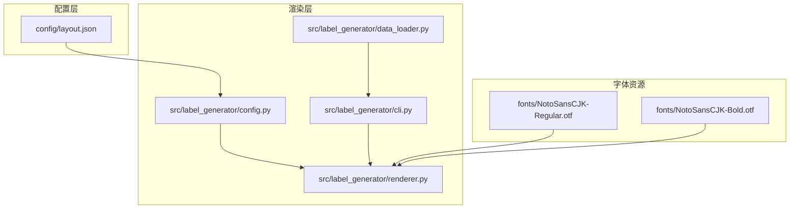
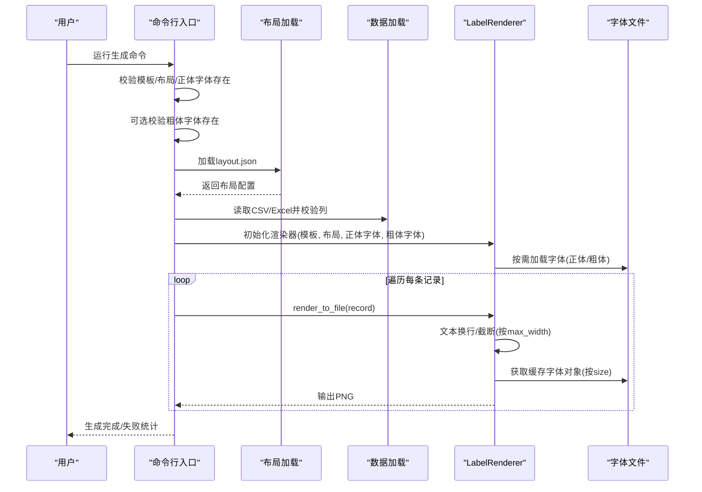
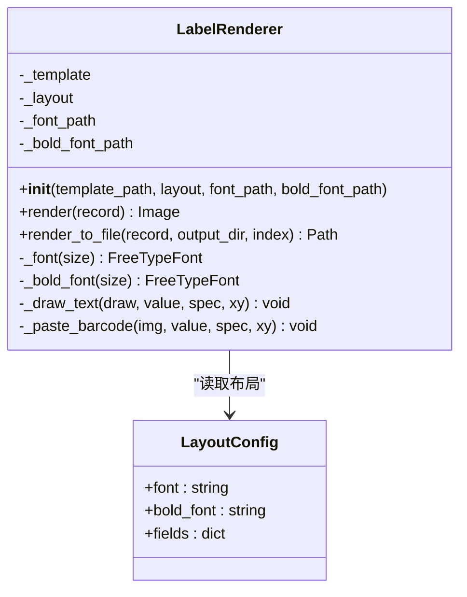
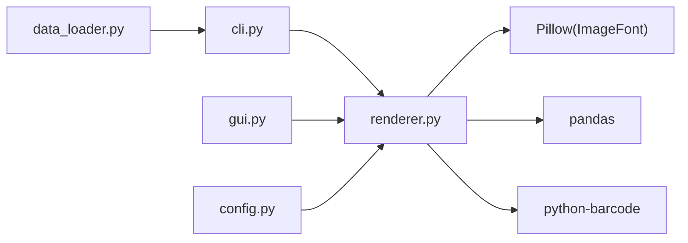

# 字体配置

<cite>
**本文引用的文件**
- [README.md](file://README.md)
- [SPEC.md](file://SPEC.md)
- [CLAUDE.md](file://CLAUDE.md)
- [config/layout.json](file://config/layout.json)
- [src/label_generator/config.py](file://src/label_generator/config.py)
- [src/label_generator/renderer.py](file://src/label_generator/renderer.py)
- [src/label_generator/cli.py](file://src/label_generator/cli.py)
- [src/label_generator/data_loader.py](file://src/label_generator/data_loader.py)
- [fonts/NotoSansCJK-Regular.otf](file://fonts/NotoSansCJK-Regular.otf)
- [fonts/NotoSansCJK-Bold.otf](file://fonts/NotoSansCJK-Bold.otf)
</cite>

## 目录
1. [简介](#简介)
2. [项目结构](#项目结构)
3. [核心组件](#核心组件)
4. [架构总览](#架构总览)
5. [详细组件分析](#详细组件分析)
6. [依赖分析](#依赖分析)
7. [性能考量](#性能考量)
8. [故障排查指南](#故障排查指南)
9. [结论](#结论)
10. [附录](#附录)

## 简介
本文件面向“字体配置”的技术文档需求，聚焦于中日文字体支持的实现原理与工程实践，围绕以下主题展开：
- NotoSansCJK系列字体的特点与适用场景
- 字体文件格式要求、命名规范与路径配置方法
- 正体字与粗体字的配置差异及bold_font参数作用机制
- 字体缓存机制与对象生命周期管理、内存优化策略
- 字体渲染性能考量：字体大小、字符集与渲染质量的平衡
- 字体替换与扩展：自定义字体的集成步骤
- 字体配置调试方法与常见问题（字体缺失、字符显示异常等）的解决方案

## 项目结构
该项目采用“配置外置 + 代码解耦”的设计，将模板、布局与字体资源分离，便于维护与扩展。关键目录与文件如下：
- config/layout.json：布局与字体路径配置
- fonts/NotoSansCJK-Regular.otf 与 NotoSansCJK-Bold.otf：中日文兼容的OpenType字体文件
- src/label_generator/renderer.py：核心渲染器，负责字体加载、缓存与文本绘制
- src/label_generator/cli.py：命令行入口，负责参数解析、文件存在性检查与错误处理
- src/label_generator/config.py：布局JSON加载工具
- src/label_generator/data_loader.py：数据加载与列校验

图表来源
- [config/layout.json:1-56](file://config/layout.json#L1-L56)
- [src/label_generator/renderer.py:53-82](file://src/label_generator/renderer.py#L53-L82)
- [src/label_generator/cli.py:16-60](file://src/label_generator/cli.py#L16-L60)

章节来源
- [README.md:40-59](file://README.md#L40-L59)
- [SPEC.md:120-148](file://SPEC.md#L120-L148)

## 核心组件
- LabelRenderer：负责模板加载、布局解析、字体对象缓存、文本绘制与条形码叠加。其构造函数接收字体路径与粗体路径，内部通过LRU缓存分别维护正体与粗体字体对象，避免重复加载。
- CLI入口：负责参数解析、文件存在性检查（模板、布局、正体字体）、粗体字体可选存在性检查与回退提示。
- 布局加载：通过独立模块加载layout.json，确保渲染器只关注渲染逻辑。
- 数据加载与校验：读取CSV/Excel，进行列缺失校验，保证渲染字段与布局一致。

章节来源
- [src/label_generator/renderer.py:53-82](file://src/label_generator/renderer.py#L53-L82)
- [src/label_generator/cli.py:16-60](file://src/label_generator/cli.py#L16-L60)
- [src/label_generator/config.py:8-14](file://src/label_generator/config.py#L8-L14)
- [src/label_generator/data_loader.py:9-32](file://src/label_generator/data_loader.py#L9-L32)

## 架构总览
整体流程：CLI解析参数并进行启动期校验，加载布局与数据，构建渲染器，逐条渲染并输出PNG。字体加载与缓存集中在渲染器内部，布局文件指定字体路径与粗体路径。

图表来源
- [src/label_generator/cli.py:16-86](file://src/label_generator/cli.py#L16-L86)
- [src/label_generator/renderer.py:83-132](file://src/label_generator/renderer.py#L83-L132)
- [config/layout.json:1-56](file://config/layout.json#L1-L56)

## 详细组件分析

### 字体加载与缓存机制
- 字体加载策略
  - 正体字体：通过构造函数显式传入正体字体路径，若不存在则抛出异常。
  - 粗体字体：可选传入，若不存在则回退到正体字体路径。
  - 布局文件在_meta中声明字体路径，供CLI与GUI入口使用。
- 字体对象缓存
  - 使用LRU缓存分别缓存正体与粗体字体对象，键为(size)，容量分别为32。
  - 通过Pillow的FreeType字体接口按size动态生成字体对象，避免重复I/O与解析开销。
- 文本测量与换行
  - 使用getbbox测量文本宽度，避免使用已废弃的getsize。
  - 当指定max_width时，CJK按字符断行，最多两行，超过两行时末行追加省略号。

图表来源
- [src/label_generator/renderer.py:53-82](file://src/label_generator/renderer.py#L53-L82)
- [config/layout.json:1-56](file://config/layout.json#L1-L56)

章节来源
- [src/label_generator/renderer.py:53-82](file://src/label_generator/renderer.py#L53-L82)
- [src/label_generator/renderer.py:18-50](file://src/label_generator/renderer.py#L18-L50)
- [SPEC.md:150-160](file://SPEC.md#L150-L160)

### 布局与字体路径配置
- 布局文件_meta中声明正体与粗体字体路径，字段名分别为font与bold_font。
- 文本字段可通过bold属性控制是否使用粗体字体。
- CLI入口默认参数指向fonts目录下的NotoSansCJK字体文件，GUI入口亦遵循相同约定。

章节来源
- [config/layout.json:1-56](file://config/layout.json#L1-L56)
- [src/label_generator/cli.py:28-33](file://src/label_generator/cli.py#L28-L33)
- [SPEC.md:134-136](file://SPEC.md#L134-L136)

### 正体与粗体配置差异
- bold属性为true时，渲染器选择粗体字体；否则使用正体字体。
- 若未提供粗体字体文件，渲染器会回退到正体字体，CLI会在警告后继续执行。
- 字体路径在布局文件中分别声明，便于灵活切换。

章节来源
- [src/label_generator/renderer.py:111-116](file://src/label_generator/renderer.py#L111-L116)
- [src/label_generator/cli.py:42-47](file://src/label_generator/cli.py#L42-L47)
- [SPEC.md:152-155](file://SPEC.md#L152-L155)

### 字体对象生命周期与内存优化
- 生命周期
  - 渲染器实例持有字体路径，按需加载字体对象。
  - LRU缓存按size维度缓存字体对象，避免重复I/O与解析。
- 内存优化
  - 缓存容量限制为32，防止无限增长。
  - 字体对象随渲染器实例销毁而释放，避免长期驻留内存。
  - 文本换行与截断减少不必要的渲染尝试，间接降低内存占用。

章节来源
- [src/label_generator/renderer.py:75-81](file://src/label_generator/renderer.py#L75-L81)
- [SPEC.md:155](file://SPEC.md#L155)

### 字体渲染性能考量
- 字体大小
  - 文本字段通过font_size指定，条形码区域的数字显示也按高度比例动态计算字号。
- 字符集
  - NotoSansCJK覆盖中日韩统一表意文字，适合多语言混排。
- 渲染质量
  - 使用getbbox进行宽度测量，避免过时API导致的精度问题。
  - 条形码生成使用高质量重采样算法，保证缩放后清晰度。

章节来源
- [src/label_generator/renderer.py:111-131](file://src/label_generator/renderer.py#L111-L131)
- [src/label_generator/renderer.py:156-173](file://src/label_generator/renderer.py#L156-L173)
- [SPEC.md:157-160](file://SPEC.md#L157-L160)

### 字体替换与扩展
- 替换步骤
  - 准备目标字体文件（建议OTF格式，与现有字体保持风格一致）。
  - 在布局文件_meta中更新font与bold_font路径。
  - 如需GUI/CLI入口支持，可同步更新默认参数或界面选项。
- 扩展建议
  - 保持字体文件命名与路径稳定，便于版本管理。
  - 如需多语言扩展，可在布局中为不同字段指定不同字体族（需在渲染器中扩展支持）。

章节来源
- [config/layout.json:1-56](file://config/layout.json#L1-L56)
- [SPEC.md:134-136](file://SPEC.md#L134-L136)

## 依赖分析
- 组件耦合
  - 渲染器依赖Pillow的ImageFont进行字体加载与测量。
  - CLI与GUI入口负责文件存在性检查与参数传递，降低渲染器对文件系统的依赖。
  - 布局加载模块独立，便于后续扩展其他配置格式。
- 外部依赖
  - Pillow：图像与字体渲染。
  - pandas：CSV/Excel数据读取。
  - python-barcode：条形码生成（与字体渲染同级功能）。

图表来源
- [src/label_generator/cli.py:7-9](file://src/label_generator/cli.py#L7-L9)
- [src/label_generator/renderer.py:9](file://src/label_generator/renderer.py#L9)

章节来源
- [SPEC.md:111-118](file://SPEC.md#L111-L118)

## 性能考量
- 字体缓存
  - LRU缓存按size维度缓存字体对象，显著降低重复加载成本。
  - 缓存容量适中，避免内存膨胀。
- 文本测量
  - 使用getbbox进行宽度测量，避免旧API导致的精度与兼容性问题。
- 渲染路径
  - 文本换行与截断在渲染前完成，减少无效绘制。
  - 条形码生成与缩放在独立模块中完成，保持渲染器职责单一。

章节来源
- [SPEC.md:155-160](file://SPEC.md#L155-L160)
- [src/label_generator/renderer.py:18-50](file://src/label_generator/renderer.py#L18-L50)

## 故障排查指南
- 字体缺失
  - 现象：启动时报错提示字体文件不存在。
  - 处理：确认fonts目录下存在NotoSansCJK-Regular.otf与NotoSansCJK-Bold.otf；若仅存在正体，CLI会发出警告并回退到正体。
- 字体路径错误
  - 现象：布局文件中的字体路径与实际文件不一致。
  - 处理：核对config/layout.json中的font与bold_font路径，确保相对路径或绝对路径正确。
- 字符显示异常（方块）
  - 现象：中日文字符显示为方块。
  - 处理：确认使用NotoSansCJK系列字体；检查字体文件完整性与编码；确保布局中未误用非CJK字体。
- 粗体回退
  - 现象：设置bold=true但未提供粗体字体文件。
  - 处理：CLI会发出警告并回退到正体；如需粗体效果，请提供NotoSansCJK-Bold.otf。
- 文本溢出与截断
  - 现象：文本过长未按预期换行或被截断。
  - 处理：在布局中为该字段设置max_width；确认CJK按字符断行逻辑生效。

章节来源
- [src/label_generator/cli.py:36-47](file://src/label_generator/cli.py#L36-L47)
- [src/label_generator/renderer.py:64-73](file://src/label_generator/renderer.py#L64-L73)
- [SPEC.md:205-212](file://SPEC.md#L205-L212)

## 结论
本项目通过“显式字体加载 + LRU缓存 + 布局外置”的设计，实现了稳定、可维护且高性能的中日文字体支持。NotoSansCJK系列字体覆盖广泛字符集，配合合理的缓存与换行策略，能够在批量渲染场景下兼顾质量与效率。通过清晰的路径配置与回退机制，项目具备良好的可扩展性与可维护性。

## 附录

### 字体文件格式与命名规范
- 格式要求
  - 推荐使用OpenType格式（.otf），与Pillow FreeType兼容良好。
- 命名规范
  - 正体：NotoSansCJK-Regular.otf
  - 粗体：NotoSansCJK-Bold.otf
- 路径配置
  - 布局文件_meta中声明font与bold_font字段，指向fonts目录下的具体文件。
  - CLI与GUI入口提供默认参数，便于快速运行。

章节来源
- [SPEC.md:134-136](file://SPEC.md#L134-L136)
- [config/layout.json:1-56](file://config/layout.json#L1-L56)

### bold_font参数作用机制
- 作用：当文本字段spec中bold为true时，渲染器优先使用粗体字体；否则使用正体字体。
- 回退：若未提供粗体字体文件，渲染器自动回退到正体字体路径。
- 配置：在布局文件中分别声明正体与粗体字体路径，确保渲染器正确选择。

章节来源
- [src/label_generator/renderer.py:111-116](file://src/label_generator/renderer.py#L111-L116)
- [src/label_generator/renderer.py:72-73](file://src/label_generator/renderer.py#L72-L73)
- [SPEC.md:152-155](file://SPEC.md#L152-L155)

### 字体缓存与生命周期
- 缓存策略
  - 正体与粗体分别使用LRU缓存，键为字体大小，容量为32。
  - 避免重复I/O与解析，提升批量渲染性能。
- 生命周期
  - 字体对象随渲染器实例销毁而释放，避免内存泄漏。
  - 文本换行与截断在渲染前完成，减少无效绘制。

章节来源
- [src/label_generator/renderer.py:75-81](file://src/label_generator/renderer.py#L75-L81)
- [SPEC.md:155](file://SPEC.md#L155)

### 字体渲染性能平衡
- 字体大小与字符集
  - 通过font_size与max_width控制渲染密度与空间占用。
  - NotoSansCJK覆盖中日韩统一表意文字，减少字符缺失风险。
- 渲染质量
  - 使用getbbox进行宽度测量，避免旧API导致的精度问题。
  - 条形码生成与缩放采用高质量算法，保证缩放后清晰度。

章节来源
- [src/label_generator/renderer.py:111-131](file://src/label_generator/renderer.py#L111-L131)
- [SPEC.md:157-160](file://SPEC.md#L157-L160)

### 字体替换与扩展步骤
- 替换步骤
  - 准备目标字体文件（建议OTF格式）。
  - 更新config/layout.json中的font与bold_font路径。
  - 如需GUI/CLI入口支持，同步更新默认参数或界面选项。
- 扩展建议
  - 保持字体文件命名与路径稳定，便于版本管理。
  - 如需多语言扩展，可在渲染器中扩展支持不同字体族（需相应改造）。

章节来源
- [config/layout.json:1-56](file://config/layout.json#L1-L56)
- [SPEC.md:134-136](file://SPEC.md#L134-L136)