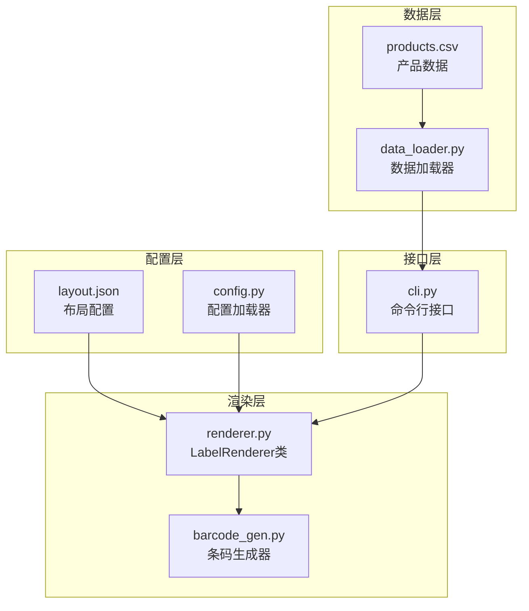
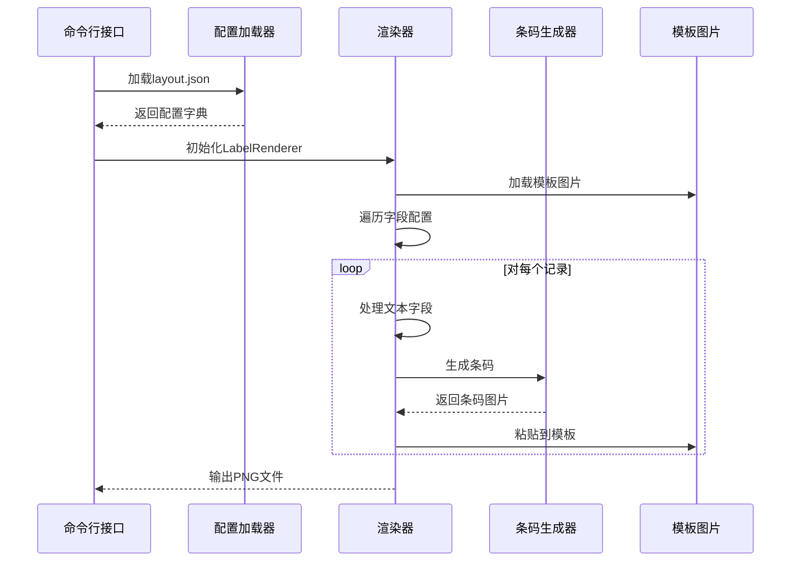
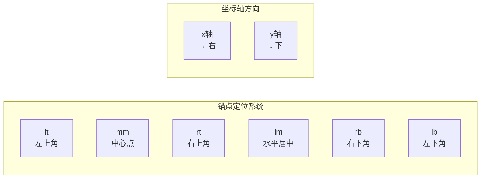
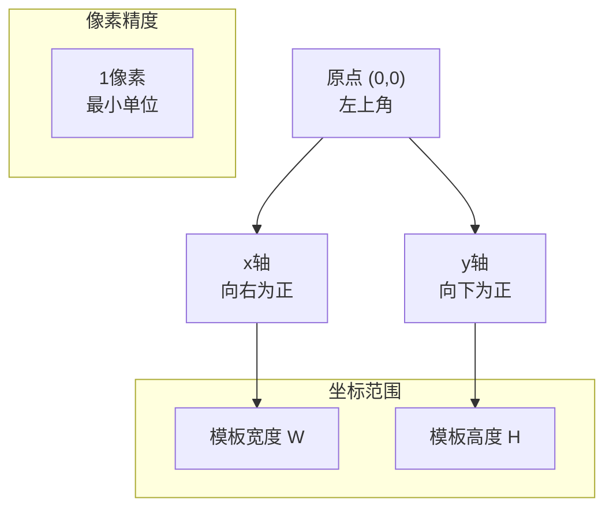
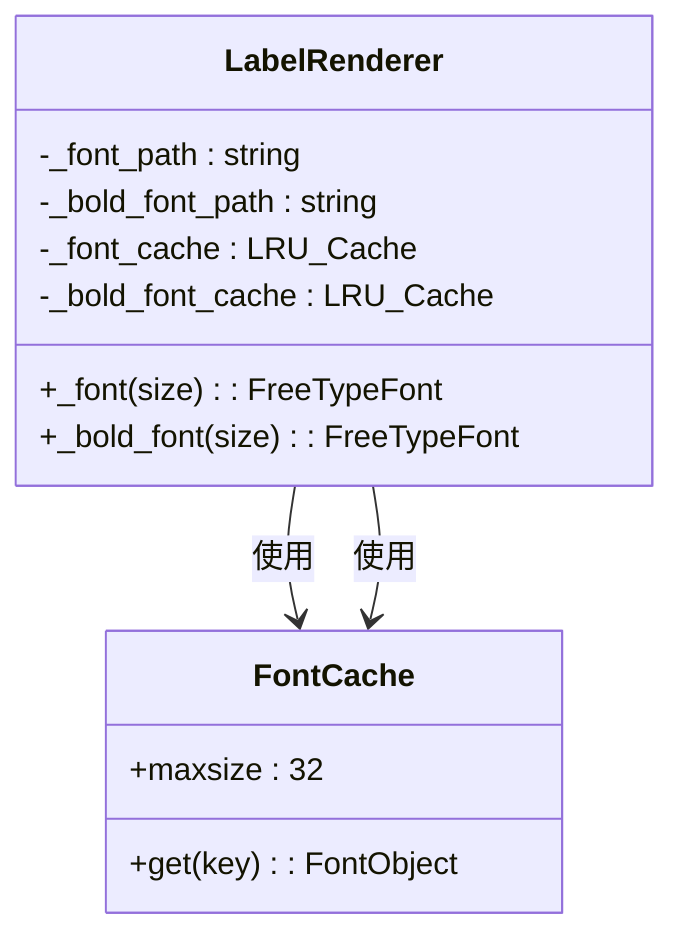
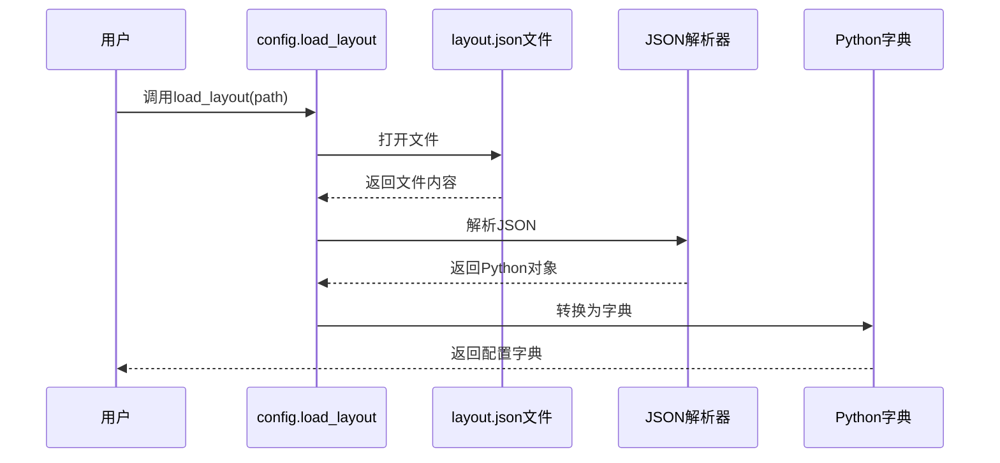
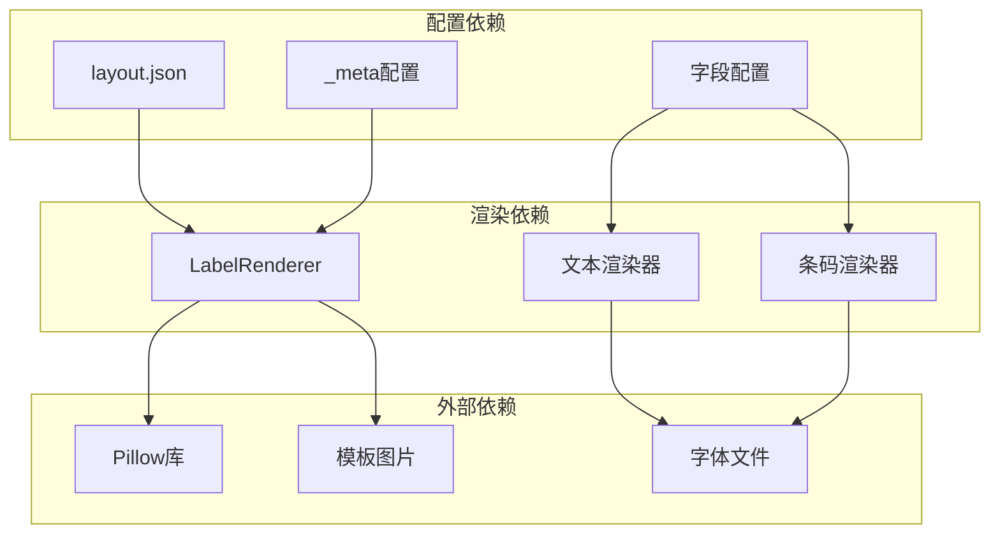
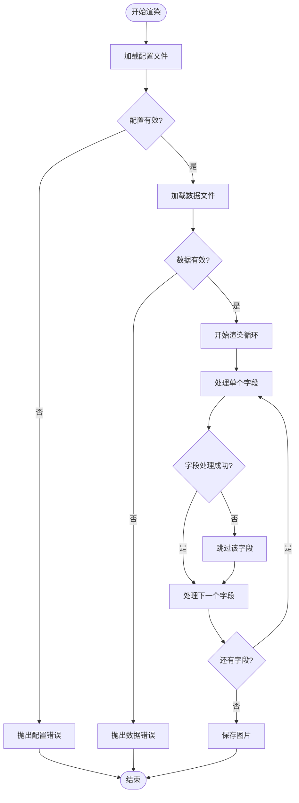

# 布局配置详解

<cite>
**本文档引用的文件**
- [layout.json](file://config/layout.json)
- [config.py](file://src/label_generator/config.py)
- [renderer.py](file://src/label_generator/renderer.py)
- [SPEC.md](file://SPEC.md)
- [barcode_gen.py](file://src/label_generator/barcode_gen.py)
- [data_loader.py](file://src/label_generator/data_loader.py)
- [cli.py](file://src/label_generator/cli.py)
</cite>

## 目录
1. [简介](#简介)
2. [项目结构](#项目结构)
3. [核心组件](#核心组件)
4. [架构概览](#架构概览)
5. [详细组件分析](#详细组件分析)
6. [依赖关系分析](#依赖关系分析)
7. [性能考虑](#性能考虑)
8. [故障排除指南](#故障排除指南)
9. [结论](#结论)

## 简介

本文件详细解释了布局配置文件 `layout.json` 的技术规范和使用方法。该配置文件定义了如何在模板图片上放置和渲染各种字段内容，包括文本字段和条形码字段。文档涵盖了_config元数据部分的模板尺寸设置、坐标系统说明和字体引用，以及各种字段类型的配置选项。

## 项目结构

该项目采用模块化设计，主要包含以下关键组件：

**图表来源**
- [layout.json:1-56](file://config/layout.json#L1-L56)
- [renderer.py:53-251](file://src/label_generator/renderer.py#L53-L251)

**章节来源**
- [SPEC.md:120-148](file://SPEC.md#L120-L148)
- [layout.json:1-56](file://config/layout.json#L1-L56)

## 核心组件

### 布局配置文件结构

布局配置文件采用JSON格式，主要包含两个部分：

1. **_meta 元数据部分**：定义模板的基本信息和全局设置
2. **字段定义部分**：定义各个字段的渲染配置

### _meta 元数据配置

_config元数据部分包含以下关键设置：

- **template_size**：模板图片的尺寸（像素）
- **description**：坐标系统和锚点的说明
- **font**：常规字体文件路径
- **bold_font**：粗体字体文件路径

**章节来源**
- [layout.json:2-7](file://config/layout.json#L2-L7)
- [SPEC.md:29-40](file://SPEC.md#L29-L40)

## 架构概览

系统采用分层架构，配置驱动渲染的设计模式：

**图表来源**
- [cli.py:49-60](file://src/label_generator/cli.py#L49-L60)
- [renderer.py:83-102](file://src/label_generator/renderer.py#L83-L102)
- [barcode_gen.py:41-60](file://src/label_generator/barcode_gen.py#L41-L60)

## 详细组件分析

### 文本字段配置

文本字段支持丰富的配置选项：

#### 基本属性

| 属性名 | 类型 | 必需 | 默认值 | 描述 |
|--------|------|------|--------|------|
| type | string | 是 | - | 字段类型，必须为"text" |
| xy | array | 是 | - | [x, y] 坐标数组 |
| anchor | string | 否 | "lt" | 锚点定位方式 |

#### 文本专属属性

| 属性名 | 类型 | 必需 | 默认值 | 描述 |
|--------|------|------|--------|------|
| font_size | integer | 否 | 24 | 字体大小（像素） |
| color | string | 否 | "#000000" | 十六进制颜色代码 |
| bold | boolean | 否 | false | 是否使用粗体字体 |
| max_width | integer | 否 | - | 最大宽度（像素），超过时自动换行 |

#### 锚点系统详解

锚点采用PIL标准的双字符定位系统：

**图表来源**
- [SPEC.md:106-110](file://SPEC.md#L106-L110)
- [renderer.py:118](file://src/label_generator/renderer.py#L118)

**章节来源**
- [SPEC.md:89-98](file://SPEC.md#L89-L98)
- [layout.json:9-26](file://config/layout.json#L9-L26)

### 条形码字段配置

条形码字段专门用于生成和渲染条形码：

#### 基本属性

| 属性名 | 类型 | 必需 | 默认值 | 描述 |
|--------|------|------|--------|------|
| type | string | 是 | - | 字段类型，必须为"barcode" |
| format | string | 是 | - | 条码格式，当前支持"ean13" |
| xy | array | 是 | - | [x, y] 坐标数组 |
| anchor | string | 否 | "lt" | 锚点定位方式 |

#### 条形码专属属性

| 属性名 | 类型 | 必需 | 默认值 | 描述 |
|--------|------|------|--------|------|
| width | integer | 否 | 300 | 条码宽度（像素） |
| height | integer | 否 | 80 | 条码高度（像素） |
| rotation | integer | 否 | 0 | 旋转角度（度） |
| show_text | boolean | 否 | true | 是否显示条码下方数字 |

**章节来源**
- [SPEC.md:100-104](file://SPEC.md#L100-L104)
- [layout.json:45-54](file://config/layout.json#L45-L54)

### 坐标系统工作原理

系统采用标准的图像坐标系：

**图表来源**
- [SPEC.md:185-187](file://SPEC.md#L185-L187)

**章节来源**
- [SPEC.md:185-187](file://SPEC.md#L185-L187)

### 字体管理系统

系统支持两种字体文件：

1. **常规字体** (`fonts/NotoSansCJK-Regular.otf`)
2. **粗体字体** (`fonts/NotoSansCJK-Bold.otf`)

字体加载采用LRU缓存机制，避免重复加载：

**图表来源**
- [renderer.py:75-81](file://src/label_generator/renderer.py#L75-L81)

**章节来源**
- [SPEC.md:152-155](file://SPEC.md#L152-L155)
- [renderer.py:75-81](file://src/label_generator/renderer.py#L75-L81)

## 依赖关系分析

### 配置加载流程

**图表来源**
- [config.py:8-13](file://src/label_generator/config.py#L8-L13)

### 渲染依赖关系

**图表来源**
- [renderer.py:54-82](file://src/label_generator/renderer.py#L54-L82)

**章节来源**
- [config.py:8-13](file://src/label_generator/config.py#L8-L13)
- [renderer.py:54-82](file://src/label_generator/renderer.py#L54-L82)

## 性能考虑

### 缓存策略

系统实现了多级缓存机制：

1. **字体缓存**：使用 `@lru_cache(maxsize=32)` 缓存字体对象
2. **条码缓存**：使用 `@lru_cache(maxsize=128)` 缓存生成的条码
3. **渲染缓存**：避免重复计算相同的渲染结果

### 内存优化

- 字体对象按 `(path, size)` 组合缓存
- 条码生成结果按输入参数缓存
- 图像操作使用Pillow的高效实现

## 故障排除指南

### 常见配置错误

#### 1. 字段类型错误
**问题**：type字段不是"text"或"barcode"
**解决**：确保type字段值为"text"或"barcode"

#### 2. 坐标越界
**问题**：xy坐标超出模板尺寸范围
**解决**：检查_config.meta.template_size设置，调整xy坐标

#### 3. 字体文件缺失
**问题**：字体文件路径不正确
**解决**：确认字体文件存在于指定路径

#### 4. 锚点参数错误
**问题**：anchor参数格式不正确
**解决**：使用标准的双字符锚点格式（如"mm","lt","rt"等）

### 运行时错误处理

系统提供了完善的错误处理机制：

**图表来源**
- [SPEC.md:205-212](file://SPEC.md#L205-L212)

**章节来源**
- [SPEC.md:205-212](file://SPEC.md#L205-L212)

## 结论

布局配置文件 `layout.json` 提供了灵活而强大的标签生成能力。通过清晰的配置结构和完善的错误处理机制，用户可以轻松定制各种复杂的标签布局。关键特性包括：

1. **模块化设计**：配置与代码分离，便于维护和修改
2. **丰富的配置选项**：支持多种字段类型和样式设置
3. **完善的错误处理**：提供详细的错误信息和恢复机制
4. **高性能实现**：通过缓存机制优化渲染性能

建议在使用时遵循以下最佳实践：
- 使用"mm"锚点进行中心对齐
- 合理设置max_width避免文字溢出
- 确保字体文件路径正确
- 定期验证坐标值的有效性