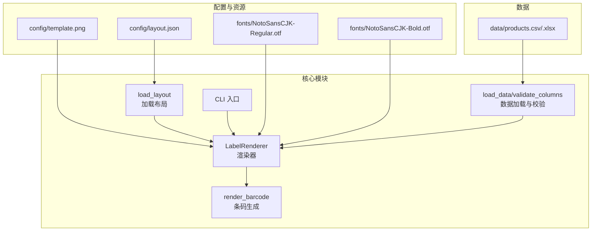
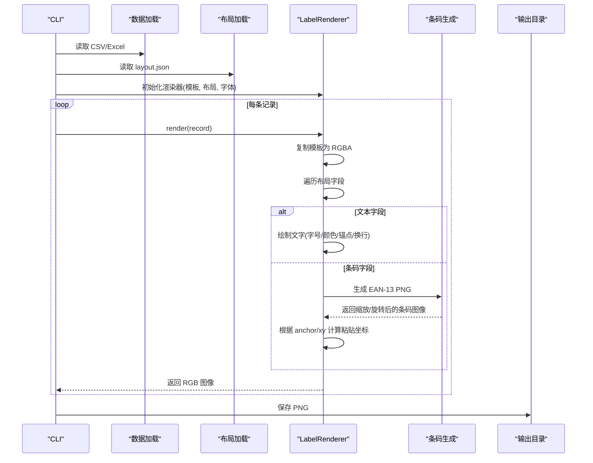
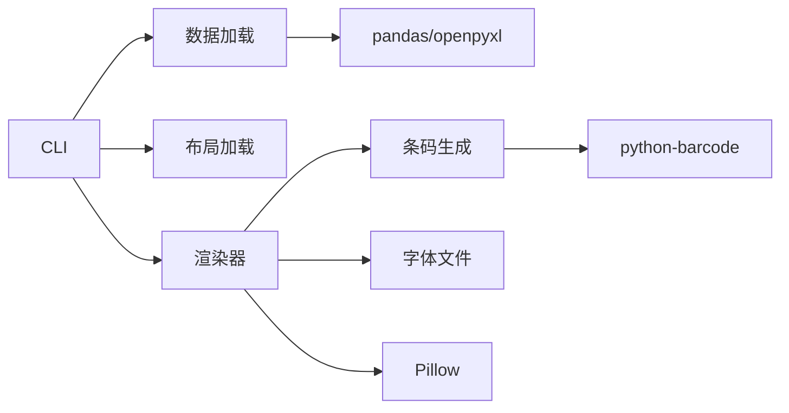

# 模板图片定制

<cite>
**本文引用的文件**
- [SPEC.md](file://SPEC.md)
- [README.md](file://README.md)
- [config/layout.json](file://config/layout.json)
- [src/label_generator/renderer.py](file://src/label_generator/renderer.py)
- [src/label_generator/config.py](file://src/label_generator/config.py)
- [src/label_generator/barcode_gen.py](file://src/label_generator/barcode_gen.py)
- [src/label_generator/data_loader.py](file://src/label_generator/data_loader.py)
- [src/label_generator/cli.py](file://src/label_generator/cli.py)
- [pyproject.toml](file://pyproject.toml)
</cite>

## 目录
1. [简介](#简介)
2. [项目结构](#项目结构)
3. [核心组件](#核心组件)
4. [架构总览](#架构总览)
5. [详细组件分析](#详细组件分析)
6. [依赖关系分析](#依赖关系分析)
7. [性能考量](#性能考量)
8. [故障排查指南](#故障排查指南)
9. [结论](#结论)
10. [附录](#附录)

## 简介
本指南面向需要定制“模板图片”的设计师与工程师，围绕标签生成系统的模板图片设计与布局配置展开，涵盖分辨率、尺寸比例、像素密度、坐标系统、格式与色彩模式、透明度处理、元数据配置（尤其是 template_size）、留白与安全边距、对齐参考线、测试与验证方法，以及常见问题与优化建议。目标是帮助你设计出与 layout.json 完美匹配、可复用且易于维护的模板图片。

## 项目结构
项目采用“模板图片 + 布局配置 + 数据源”的解耦设计：模板图片作为背景底图，布局配置定义各字段的坐标、字号、锚点、旋转等；运行时通过渲染器将文本与条码叠加到模板上，输出打印就绪的 PNG。

图表来源
- [SPEC.md: 120-148:120-148](file://SPEC.md#L120-L148)
- [src/label_generator/cli.py: 16-94:16-94](file://src/label_generator/cli.py#L16-L94)
- [src/label_generator/renderer.py: 53-251:53-251](file://src/label_generator/renderer.py#L53-L251)
- [src/label_generator/barcode_gen.py: 40-60:40-60](file://src/label_generator/barcode_gen.py#L40-L60)
- [src/label_generator/config.py: 8-14:8-14](file://src/label_generator/config.py#L8-L14)
- [src/label_generator/data_loader.py: 9-32:9-32](file://src/label_generator/data_loader.py#L9-L32)

章节来源
- [SPEC.md: 120-148:120-148](file://SPEC.md#L120-L148)
- [README.md: 40-60:40-60](file://README.md#L40-L60)

## 核心组件
- 模板图片（config/template.png）：打印用底图，包含固定元素（如品牌 Logo、圆角框、固定文案等），不应在代码中重复渲染。
- 布局配置（config/layout.json）：定义每个字段的坐标、字号、锚点、颜色、粗细、最大宽度、条码尺寸与旋转等。
- 渲染器（LabelRenderer）：负责将模板复制为 RGBA，按布局配置绘制文字与条码，最终导出 RGB PNG。
- 条码生成（render_barcode）：基于 python-barcode 生成 EAN-13 PNG，并按布局尺寸缩放与旋转。
- 数据加载（load_data/validate_columns）：读取 CSV/Excel 并校验列是否满足布局需求。
- CLI：命令行入口，串联数据、布局、模板与渲染器。

章节来源
- [SPEC.md: 150-171:150-171](file://SPEC.md#L150-L171)
- [src/label_generator/renderer.py: 53-251:53-251](file://src/label_generator/renderer.py#L53-L251)
- [src/label_generator/barcode_gen.py: 40-60:40-60](file://src/label_generator/barcode_gen.py#L40-L60)
- [src/label_generator/data_loader.py: 9-32:9-32](file://src/label_generator/data_loader.py#L9-L32)
- [src/label_generator/cli.py: 16-94:16-94](file://src/label_generator/cli.py#L16-L94)

## 架构总览
模板图片与布局配置的对应关系由 LabelRenderer 在运行时建立：模板被打开为 RGBA，逐字段读取布局配置，按 anchor 与 xy 计算粘贴坐标，绘制文字或贴入条码，最后转换为 RGB 输出。

图表来源
- [src/label_generator/cli.py: 16-94:16-94](file://src/label_generator/cli.py#L16-L94)
- [src/label_generator/renderer.py: 83-102:83-102](file://src/label_generator/renderer.py#L83-L102)
- [src/label_generator/barcode_gen.py: 40-60:40-60](file://src/label_generator/barcode_gen.py#L40-L60)

## 详细组件分析

### 模板图片设计原则与制作要求
- 分辨率与尺寸比例
  - 模板尺寸由布局元数据决定：_meta.template_size 指定模板像素尺寸，所有 xy 坐标均以此为基准。
  - 当前示例模板尺寸为 591×354 像素，布局中也明确标注“坐标基于 591x354 像素模板”。
- 像素密度（DPI）
  - 输出为 PNG，通常以 300 DPI 打印。模板的像素尺寸与目标打印尺寸共同决定视觉清晰度。
  - 若模板像素过大，可能导致文件体积增大；过小则可能影响细节清晰度。
- 格式与色彩模式
  - 模板图片应为 PNG，以支持透明通道（RGBA），便于与渲染器叠加。
  - 渲染器内部将模板转换为 RGBA，确保透明区域正确参与合成。
- 透明度处理
  - 模板中需要保留透明区域以便文字与条码正确叠放。
  - 渲染结束时导出为 RGB，透明度信息丢失，仅保留可见内容。

章节来源
- [SPEC.md: 35-39:35-39](file://SPEC.md#L35-L39)
- [SPEC.md: 253-262:253-262](file://SPEC.md#L253-L262)
- [SPEC.md: 185-187:185-187](file://SPEC.md#L185-L187)
- [src/label_generator/renderer.py: 68](file://src/label_generator/renderer.py#L68)
- [src/label_generator/renderer.py: 102](file://src/label_generator/renderer.py#L102)

### 布局配置与坐标系统
- 坐标原点与方向
  - 原点位于左上角，x 向右，y 向下（PIL 标准）。
- 锚点（anchor）
  - 支持 PIL 标准锚点：lt（左上）、mm（中心）、rt（右上）、lb（左下）、rb（右下）等。
  - 推荐使用 mm（中心锚点）以简化定位，xy 指向字符中心。
- 字段类型与属性
  - 文本字段：type="text"，支持 xy、font_size、anchor、color、bold、max_width。
  - 条码字段：type="barcode"，支持 xy、anchor、width、height、rotation、show_text。
- 条码尺寸与旋转
  - width/height 指条码“旋转前”的尺寸（水平状态下的宽高）。
  - rotation 以度为单位逆时针为正，常用于竖排条码。
- 元数据（_meta）
  - template_size：模板像素尺寸 [width, height]。
  - font/bold_font：字体路径，必须与项目约定一致。

章节来源
- [SPEC.md: 29-85:29-85](file://SPEC.md#L29-L85)
- [SPEC.md: 87-110:87-110](file://SPEC.md#L87-L110)
- [SPEC.md: 172-183:172-183](file://SPEC.md#L172-L183)
- [SPEC.md: 185-187:185-187](file://SPEC.md#L185-L187)
- [config/layout.json: 1-56:1-56](file://config/layout.json#L1-L56)

### 模板图片与布局配置的对应关系
- 字段到坐标的映射
  - layout.json 中的每个键（除 _meta）对应 CSV 的一列，其 xy 与 anchor 描述在模板上的放置位置。
- 渲染流程要点
  - 文本：按 anchor 与 xy 直接绘制，支持多行与最大宽度控制。
  - 条码：先生成水平 PNG，再按布局尺寸缩放、按 rotation 旋转，最后根据 anchor 计算粘贴坐标。
- 锚点换算
  - 文本：PIL draw.text 原生支持 anchor。
  - 条码：通过旋转后的尺寸计算左上角粘贴坐标，再进行 paste。

章节来源
- [SPEC.md: 172-183:172-183](file://SPEC.md#L172-L183)
- [src/label_generator/renderer.py: 104-132:104-132](file://src/label_generator/renderer.py#L104-L132)
- [src/label_generator/renderer.py: 133-196:133-196](file://src/label_generator/renderer.py#L133-L196)

### 模板图片的格式、色彩模式与透明度
- 格式要求
  - 必须为 PNG，以支持透明通道。
- 色彩模式
  - 渲染器内部使用 RGBA，最终导出 RGB。
- 透明度处理
  - 模板中的透明区域用于与文字/条码正确叠放。
  - 导出时透明度信息不再保留，仅输出可见内容。

章节来源
- [src/label_generator/renderer.py: 68](file://src/label_generator/renderer.py#L68)
- [src/label_generator/renderer.py: 102](file://src/label_generator/renderer.py#L102)

### 元数据配置：template_size 的作用与设置方法
- 作用
  - 指定模板的实际像素尺寸，所有 xy 坐标均基于此尺寸换算。
- 设置方法
  - 在 _meta.template_size 中以 [width, height] 形式声明。
  - layout.json 中的注释也明确说明“坐标基于 template_size 像素模板”。

章节来源
- [SPEC.md: 35-39:35-39](file://SPEC.md#L35-L39)
- [SPEC.md: 4-7:4-7](file://SPEC.md#L4-L7)
- [config/layout.json: 2-7:2-7](file://config/layout.json#L2-L7)

### 设计最佳实践：留白、对齐与安全边距
- 留白区域
  - 为条码与文字预留足够空白，避免与固定装饰元素重叠。
- 对齐参考线
  - 使用 mm 锚点统一以字符中心对齐，便于在预画框内居中放置。
- 安全边距
  - 文字与条码区域应与模板边缘保持安全距离，防止裁切或打印溢出。
- 固定元素规划
  - 圆角框、Logo、固定文案等应尽量放在模板边缘或非关键区域，避免遮挡动态字段。

章节来源
- [SPEC.md: 255-262:255-262](file://SPEC.md#L255-L262)
- [SPEC.md: 107-109:107-109](file://SPEC.md#L107-L109)

### 测试模板与配置的匹配度
- 自动化验证步骤
  - 运行 CLI，检查输出目录是否生成与数据行数一致的 PNG。
  - 使用条码扫描工具验证生成的条码可被识别。
  - 检查中日文字符是否正常显示，避免方块。
  - 长文本是否按 max_width 正确换行或截断。
- 人工对比
  - 将生成的 PNG 与设计稿进行视觉对比，确认关键元素位置与尺寸一致。

章节来源
- [SPEC.md: 244-252:244-252](file://SPEC.md#L244-L252)
- [src/label_generator/cli.py: 66-85:66-85](file://src/label_generator/cli.py#L66-L85)

### 常见问题与优化建议
- 坐标越界或错位
  - 检查 layout.json 的 xy 是否在模板尺寸范围内；确认 anchor 与预期一致。
- 字体缺失导致方块
  - 确保 fonts 目录下存在指定字体文件，且路径与布局配置一致。
- 条码不可识别
  - 检查条码生成流程：12 位自动补校验位，13 位校验校验位；确认缩放与旋转参数合理。
- 性能优化
  - 字体缓存：渲染器已对字体对象进行缓存，避免重复加载。
  - 输出格式：导出 PNG，避免不必要的格式转换。

章节来源
- [SPEC.md: 152-155:152-155](file://SPEC.md#L152-L155)
- [SPEC.md: 162-171:162-171](file://SPEC.md#L162-L171)
- [src/label_generator/renderer.py: 75-81:75-81](file://src/label_generator/renderer.py#L75-L81)

## 依赖关系分析
- 外部依赖
  - Pillow：图像处理与绘制。
  - python-barcode：条码生成。
  - pandas/openpyxl：CSV/Excel 读取。
  - typer：命令行接口。
- 内部模块耦合
  - CLI 依赖数据加载、布局加载与渲染器。
  - 渲染器依赖布局配置、字体与条码生成模块。
  - 条码生成模块独立，仅依赖外部库。

图表来源
- [pyproject.toml: 10-16:10-16](file://pyproject.toml#L10-L16)
- [src/label_generator/cli.py: 7-9:7-9](file://src/label_generator/cli.py#L7-L9)
- [src/label_generator/renderer.py: 9,140](file://src/label_generator/renderer.py#L9,L140)
- [src/label_generator/barcode_gen.py: 6,7](file://src/label_generator/barcode_gen.py#L6,L7)

章节来源
- [pyproject.toml: 10-16:10-16](file://pyproject.toml#L10-L16)
- [src/label_generator/cli.py: 7-9:7-9](file://src/label_generator/cli.py#L7-L9)

## 性能考量
- 字体缓存：渲染器对字体对象使用 LRU 缓存，减少重复加载开销。
- 条码缓存：条码生成函数对输入进行缓存，避免重复生成相同参数的条码。
- 输出格式：直接导出 PNG，避免中间格式转换带来的额外处理。

章节来源
- [SPEC.md: 152-155:152-155](file://SPEC.md#L152-L155)
- [src/label_generator/renderer.py: 75-81:75-81](file://src/label_generator/renderer.py#L75-L81)
- [src/label_generator/barcode_gen.py: 40-60:40-60](file://src/label_generator/barcode_gen.py#L40-L60)

## 故障排查指南
- 模板/字体/布局文件缺失
  - CLI 会在启动时快速失败并提示具体缺失路径。
- 数据列缺失
  - 启动时一次性报告所有缺失列，避免逐行报错。
- 条码校验失败
  - 跳过该行并汇总失败清单，不影响其他行生成。
- 锚点与粘贴坐标
  - 文本锚点直接传入 PIL；条码需根据旋转后尺寸与 anchor 计算左上角坐标。

章节来源
- [SPEC.md: 205-212:205-212](file://SPEC.md#L205-L212)
- [src/label_generator/cli.py: 36-58:36-58](file://src/label_generator/cli.py#L36-L58)
- [src/label_generator/renderer.py: 172-196:172-196](file://src/label_generator/renderer.py#L172-L196)

## 结论
模板图片与布局配置的解耦设计使得模板更换与字段调整变得简单：只需更新 template.png 与 layout.json，无需改动代码。遵循本文的设计原则与最佳实践，可以确保模板在不同设备与打印条件下保持一致的视觉效果与可读性，并通过自动化测试与人工对比验证生成质量。

## 附录
- 常用锚点示例
  - lt：左上角；mm：中心；rt：右上角。
- 建议的测试清单
  - 输出数量与数据行数一致；条码可被扫描识别；中日文正常显示；长文本换行/截断正确；坐标与设计稿一致。