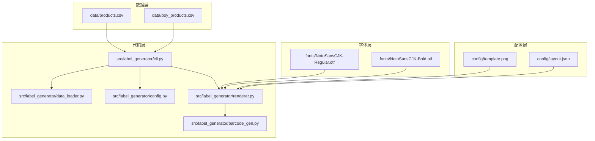
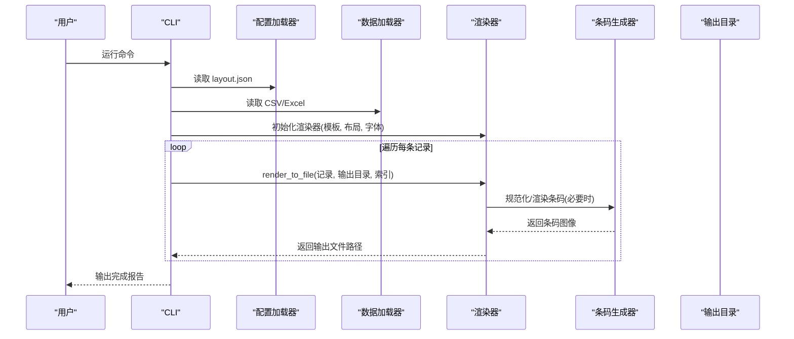
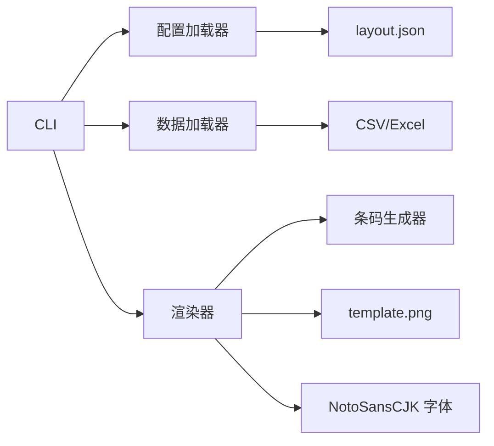
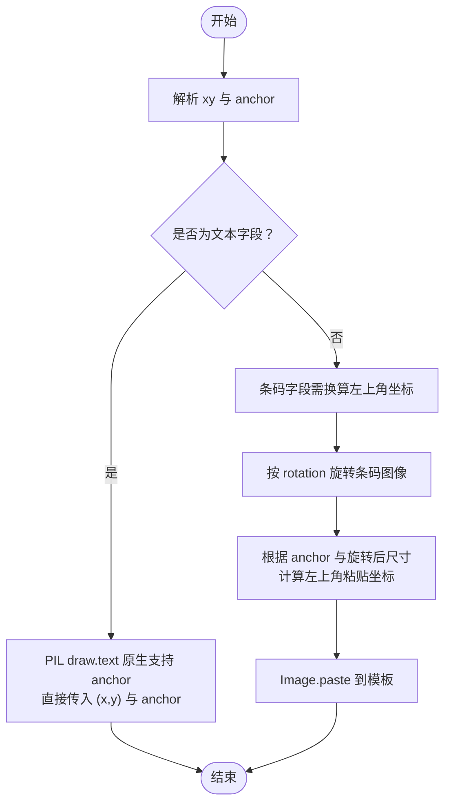

# 配置与定制

<cite>
**本文引用的文件**
- [layout.json](file://config/layout.json)
- [config.py](file://src/label_generator/config.py)
- [renderer.py](file://src/label_generator/renderer.py)
- [barcode_gen.py](file://src/label_generator/barcode_gen.py)
- [cli.py](file://src/label_generator/cli.py)
- [data_loader.py](file://src/label_generator/data_loader.py)
- [README.md](file://README.md)
- [SPEC.md](file://SPEC.md)
- [products.csv](file://data/products.csv)
- [boy_products.csv](file://data/boy_products.csv)
</cite>

## 目录
1. [简介](#简介)
2. [项目结构](#项目结构)
3. [核心组件](#核心组件)
4. [架构总览](#架构总览)
5. [详细组件分析](#详细组件分析)
6. [依赖分析](#依赖分析)
7. [性能考虑](#性能考虑)
8. [故障排查指南](#故障排查指南)
9. [结论](#结论)
10. [附录](#附录)

## 简介
本指南面向需要定制标签布局与样式的用户，围绕 layout.json 布局配置文件的语法、字段含义、坐标系统与锚点、模板图片定制、字体配置与缓存机制进行系统讲解，并结合实际示例与最佳实践帮助你快速完成不同业务场景下的标签生成。同时提供配置验证、调试方法以及常见问题的解决方案与性能优化建议。

## 项目结构
项目采用“配置外置 + 渲染内核”的设计：模板图片与布局配置独立于代码，便于非技术用户通过修改配置文件即可完成定制，无需改动代码。

图表来源
- [SPEC.md](file://SPEC.md)
- [README.md](file://README.md)

章节来源
- [SPEC.md](file://SPEC.md)
- [README.md](file://README.md)

## 核心组件
- 布局配置加载器：负责读取并校验 layout.json，确保文件存在且为合法JSON。
- 数据加载器：支持CSV/Excel，统一转换为字典列表供渲染使用。
- 渲染器：核心逻辑，负责将模板、字体、布局与数据合成输出PNG。
- 条码生成器：负责EAN-13条码的规范化、渲染与尺寸控制。
- CLI：命令行入口，串联数据、配置、渲染与输出。

章节来源
- [config.py](file://src/label_generator/config.py)
- [data_loader.py](file://src/label_generator/data_loader.py)
- [renderer.py](file://src/label_generator/renderer.py)
- [barcode_gen.py](file://src/label_generator/barcode_gen.py)
- [cli.py](file://src/label_generator/cli.py)

## 架构总览
下面的序列图展示了从命令行到最终输出的关键流程。

图表来源
- [cli.py](file://src/label_generator/cli.py)
- [renderer.py](file://src/label_generator/renderer.py)
- [barcode_gen.py](file://src/label_generator/barcode_gen.py)

## 详细组件分析

### layout.json 布局配置详解
- 结构概览
  - 根级键分为两类：普通字段键（映射CSV列名）与元信息键（以“_”开头，渲染时跳过）。
  - 元信息键“_meta”包含模板尺寸、默认字体路径等全局设置。
- 字段分类
  - 通用字段（text与barcode共用）
    - type：类型，取值为"text"或"barcode"。
    - xy：二维数组[x, y]，像素坐标，原点位于左上角，x向右、y向下。
    - anchor：锚点，PIL标准记法，如"lt"（左上）、"mm"（中心）、"rt"（右上）等。推荐使用"mm"以获得更直观的居中定位。
  - 文本字段专属
    - font_size：字号（像素）。
    - color：十六进制颜色，默认"#000000"。
    - bold：布尔值，true时使用粗体字体。
    - max_width：最大宽度（像素），超过时按规则换行或截断。
  - 条码字段专属
    - format：条码类型，当前仅支持"ean13"。
    - width/height：条码在水平状态下的尺寸（旋转前）。
    - rotation：旋转角度（度，逆时针为正）。
    - show_text：是否在条码下方显示数字。
- 坐标系统与锚点
  - 原点在左上角，x向右、y向下。
  - anchor决定“xy”指向的位置：例如"mm"表示xy为文字中心点；"lt"表示左上角。
  - 条码粘贴时需要将anchor转换为左上角坐标，再进行paste操作。
- 示例与参考
  - 参考仓库中的布局文件与规格说明，了解各字段的实际取值与组合方式。

章节来源
- [layout.json](file://config/layout.json)
- [SPEC.md](file://SPEC.md)
- [README.md](file://README.md)

### 字体配置与缓存机制
- 字体选择
  - 项目使用Noto Sans CJK系列字体，分别提供常规与粗体版本，确保中日文字符显示正常。
  - 字体路径在布局元信息中指定，渲染器会显式加载，避免依赖系统字体。
- 字体缓存
  - 渲染器内部对字体对象按(size)进行LRU缓存，减少重复加载开销。
  - 粗体与常规字体分别缓存，互不影响。
- 文本换行与截断
  - 当指定max_width时，渲染器会按字符粒度进行换行，最多两行，超出部分以省略号截断。
  - 行高通过字体度量计算，保证多行文本的垂直间距稳定。

章节来源
- [renderer.py](file://src/label_generator/renderer.py)
- [SPEC.md](file://SPEC.md)

### 条码生成与贴图
- 规范化
  - 支持12位或13位JAN/EAN-13输入：12位自动补校验位；13位验证校验位正确性。
- 渲染流程
  - 使用python-barcode生成EAN13 PNG，随后按layout的width/height进行resize。
  - 若设置了rotation，则对条码图像进行旋转（expand=true以保留完整区域）。
  - 根据anchor与xy计算左上角粘贴坐标，最终paste到模板图像上。
- 数字显示
  - 当show_text为true时，会在条码下方绘制数字，数字均匀分布并按锚点对齐。

章节来源
- [barcode_gen.py](file://src/label_generator/barcode_gen.py)
- [renderer.py](file://src/label_generator/renderer.py)
- [SPEC.md](file://SPEC.md)

### 模板图片定制方法
- 更换模板
  - 仅需替换config/template.png，并同步更新config/layout.json中的坐标与尺寸。
  - 模板尺寸变化不会影响代码逻辑，因为坐标与尺寸均来自配置文件。
- 固定元素
  - 模板中已包含logo、圆角框、固定文案等不变元素，避免在代码中重复渲染。
- 输出命名
  - 输出文件名优先使用sku，其次sku_code，再其次jan，最后回退到行号。

章节来源
- [SPEC.md](file://SPEC.md)
- [README.md](file://README.md)
- [renderer.py](file://src/label_generator/renderer.py)

### 数据与列校验
- 数据格式
  - 支持CSV与Excel，读取后统一转换为字符串字典列表。
- 列校验
  - CLI启动阶段会检查layout.json中引用的字段是否存在于数据列中，缺失则一次性报错。
- 空值处理
  - 若某字段为空字符串，渲染器会跳过该字段，不报错。

章节来源
- [data_loader.py](file://src/label_generator/data_loader.py)
- [cli.py](file://src/label_generator/cli.py)
- [SPEC.md](file://SPEC.md)

### 配置示例与最佳实践
- 建议使用"mm"锚点
  - 文本字段推荐使用"mm"锚点，使xy直接指向中心，便于在预设框内居中放置。
- 文本换行策略
  - 对可能超长的字段（如color_name）设置max_width，避免遮挡条码区域。
- 条码方向与展示
  - 根据条码区空间与阅读习惯设置rotation（如90度竖排），并合理设置show_text。
- 字体与颜色
  - 统一使用Noto Sans CJK系列字体，确保中日文显示一致；颜色建议使用深色以提升对比度。
- 模板与布局分离
  - 模板与布局解耦，更换设计只需替换模板与调整布局坐标，无需改动代码。

章节来源
- [SPEC.md](file://SPEC.md)
- [layout.json](file://config/layout.json)

## 依赖分析
- 组件耦合
  - CLI依赖配置加载器、数据加载器与渲染器；渲染器依赖条码生成器与字体资源。
  - 布局配置与模板图片通过文件路径与键名关联，形成“配置驱动”的渲染模式。
- 外部依赖
  - Pillow用于图像处理；python-barcode用于条码生成；pandas用于数据读取；typer用于CLI。

图表来源
- [cli.py](file://src/label_generator/cli.py)
- [config.py](file://src/label_generator/config.py)
- [data_loader.py](file://src/label_generator/data_loader.py)
- [renderer.py](file://src/label_generator/renderer.py)
- [barcode_gen.py](file://src/label_generator/barcode_gen.py)

章节来源
- [cli.py](file://src/label_generator/cli.py)
- [renderer.py](file://src/label_generator/renderer.py)
- [SPEC.md](file://SPEC.md)

## 性能考虑
- 字体缓存
  - 渲染器对字体对象进行LRU缓存，减少重复加载；建议合理设置缓存大小，避免频繁切换字号导致缓存失效。
- 条码渲染
  - 条码生成与resize在内存中完成，注意width/height设置避免过大导致内存占用上升。
- 文本换行
  - 换行算法按字符粒度处理，尽量避免极长文本；必要时在上游数据清洗阶段截断。
- 批处理
  - CLI逐条渲染，遇到异常会跳过并汇总失败清单；建议在运行前进行数据与布局校验，减少失败重试。

章节来源
- [renderer.py](file://src/label_generator/renderer.py)
- [barcode_gen.py](file://src/label_generator/barcode_gen.py)
- [SPEC.md](file://SPEC.md)

## 故障排查指南
- 常见错误与定位
  - 模板/字体/layout文件缺失：启动时fail-fast，直接报错并显示具体路径。
  - 数据列缺失：启动阶段一次性报出所有缺失列，修复后再运行。
  - JAN校验失败：跳过该行并汇总失败清单，不影响其他行生成。
  - 空字段：渲染器会跳过空值字段，不报错。
- 调试步骤
  - 先确认数据列与layout键一致；再检查anchor与xy是否在模板范围内；最后验证条码rotation与show_text设置。
  - 使用最小化数据集（单行）快速验证布局效果。
- 输出验证
  - 生成的PNG应可被扫码APP识别；中日文字符不应出现方块；长文本应按max_width换行或截断。

章节来源
- [cli.py](file://src/label_generator/cli.py)
- [SPEC.md](file://SPEC.md)
- [README.md](file://README.md)

## 结论
通过将布局与模板外置化，本项目实现了“配置驱动”的标签生成能力。遵循锚点与坐标体系、合理设置字体与条码参数、严格进行数据与布局校验，即可在不改动代码的前提下满足多样化的业务需求。配合缓存与批处理策略，可在保证质量的同时提升整体效率。

## 附录

### layout.json 字段速查表
- 通用字段
  - type：text 或 barcode
  - xy：[x, y] 像素坐标
  - anchor：lt/mm/rt/lb/rb 等（PIL标准）
- 文本字段专属
  - font_size：字号（像素）
  - color：十六进制颜色
  - bold：布尔
  - max_width：最大宽度（像素）
- 条码字段专属
  - format：当前仅支持 ean13
  - width/height：水平状态下的尺寸
  - rotation：角度（逆时针为正）
  - show_text：是否显示数字

章节来源
- [SPEC.md](file://SPEC.md)
- [layout.json](file://config/layout.json)

### 坐标系统与锚点换算流程

图表来源
- [renderer.py](file://src/label_generator/renderer.py)

### 示例数据参考
- 示例CSV包含至少5行，覆盖不同尺码、品类、颜色与JAN码，可用于验证中日文渲染与条码识别。

章节来源
- [SPEC.md](file://SPEC.md)
- [products.csv](file://data/products.csv)
- [boy_products.csv](file://data/boy_products.csv)