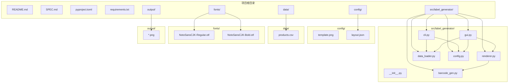
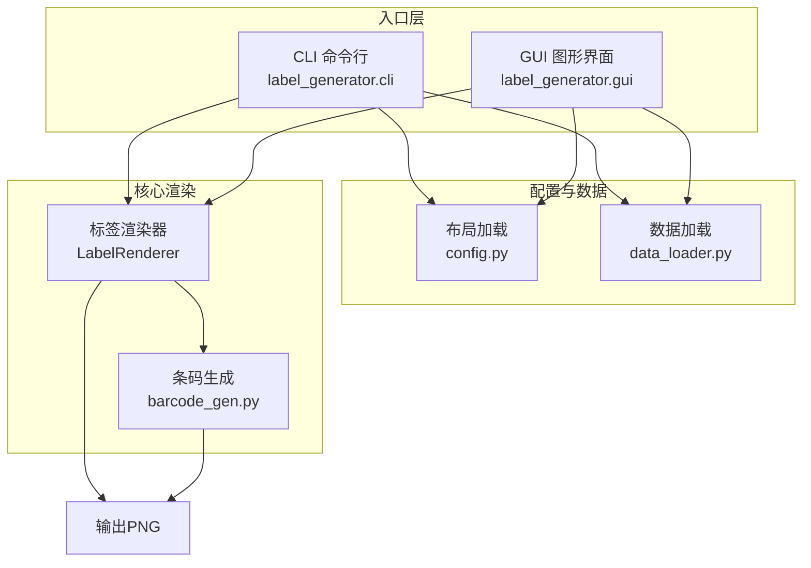
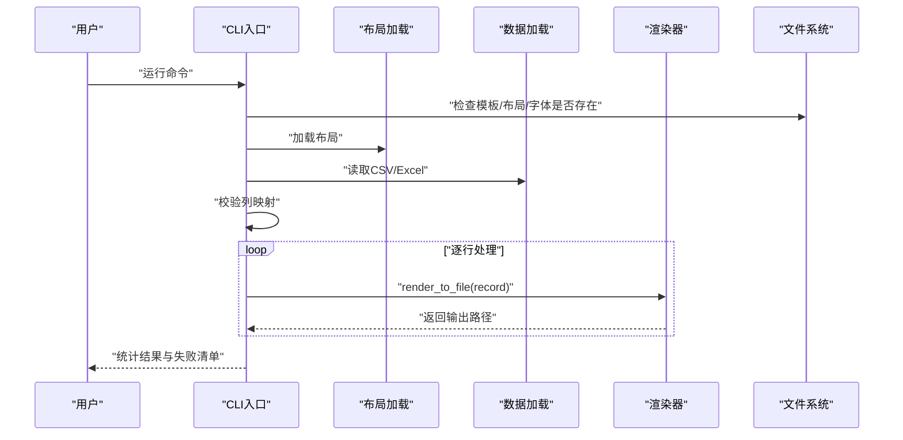
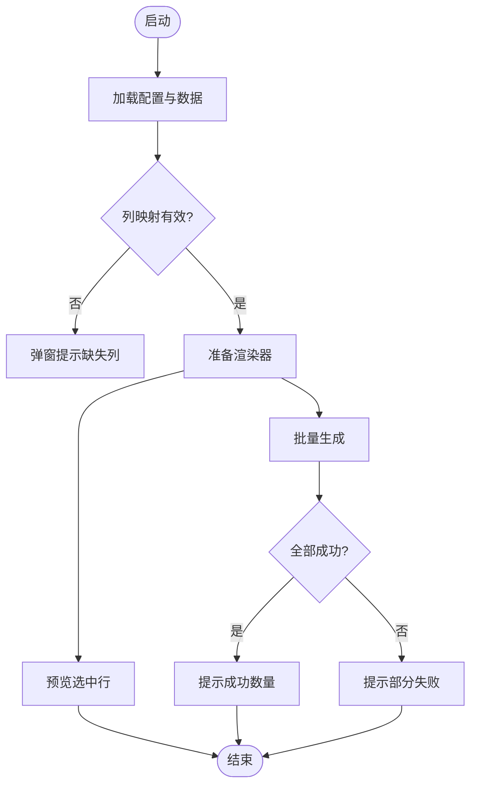
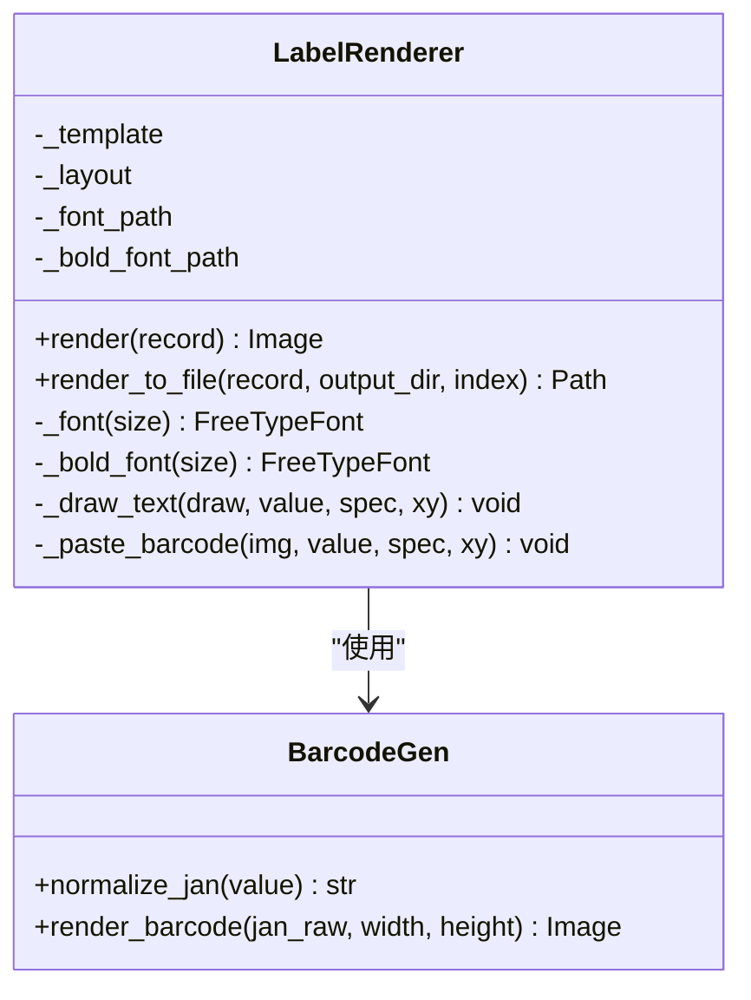
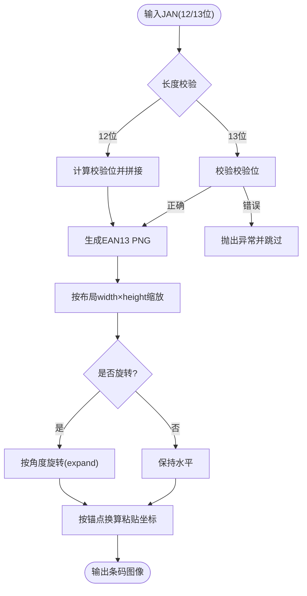
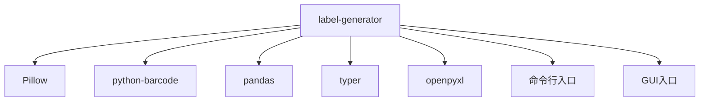

# 项目概述

<cite>
**本文档引用的文件**
- [README.md](file://README.md)
- [SPEC.md](file://SPEC.md)
- [pyproject.toml](file://pyproject.toml)
- [requirements.txt](file://requirements.txt)
- [src/label_generator/__init__.py](file://src/label_generator/__init__.py)
- [src/label_generator/cli.py](file://src/label_generator/cli.py)
- [src/label_generator/gui.py](file://src/label_generator/gui.py)
- [src/label_generator/renderer.py](file://src/label_generator/renderer.py)
- [src/label_generator/barcode_gen.py](file://src/label_generator/barcode_gen.py)
- [src/label_generator/data_loader.py](file://src/label_generator/data_loader.py)
- [src/label_generator/config.py](file://src/label_generator/config.py)
- [config/layout.json](file://config/layout.json)
- [data/products.csv](file://data/products.csv)
</cite>

## 目录
1. [简介](#简介)
2. [项目结构](#项目结构)
3. [核心组件](#核心组件)
4. [架构总览](#架构总览)
5. [详细组件分析](#详细组件分析)
6. [依赖分析](#依赖分析)
7. [性能考虑](#性能考虑)
8. [故障排查指南](#故障排查指南)
9. [结论](#结论)
10. [附录](#附录)

## 简介
本项目是一个批量生成服装商品标签的工具，目标是通过模板底图叠加文本与JAN-13条码，自动生成打印就绪的PNG标签图片。项目支持CSV/Excel数据输入、JAN-13条码生成、多语言文本渲染（中日文）、以及CLI与GUI两种使用方式，满足从入门用户到专业开发者的不同需求。

- 主要能力
  - 批量生成：逐行读取数据，输出对应数量的PNG标签文件
  - 数据处理：支持CSV与Excel，自动校验列映射
  - 文本渲染：中日文兼容、粗体切换、最大宽度换行、锚点定位
  - 条码生成：JAN/EAN-13条码，支持旋转与数字显示
  - 双入口：命令行与图形界面，便于不同场景使用

- 应用场景
  - 服装仓储与分拣：快速生成尺码、品类、颜色、条码等信息的标签
  - 快速打样与测试：通过GUI预览与批量导出，验证模板与布局
  - 自动化集成：CLI模式接入CI/CD或批处理脚本

**章节来源**
- [README.md:1-107](file://README.md#L1-L107)
- [SPEC.md:1-262](file://SPEC.md#L1-L262)

## 项目结构
项目采用“功能模块化 + 配置外置”的组织方式，核心逻辑集中在src/label_generator目录，配置与资源分别位于config、data、fonts、output等目录。

**图表来源**
- [pyproject.toml:12-20](file://pyproject.toml#L12-L20)
- [SPEC.md:120-148](file://SPEC.md#L120-L148)

**章节来源**
- [SPEC.md:40-59](file://SPEC.md#L40-L59)
- [SPEC.md:120-148](file://SPEC.md#L120-L148)

## 核心组件
- CLI入口：提供命令行参数解析与批量执行流程
- GUI界面：提供可视化配置、数据加载、预览与批量生成
- 渲染器：负责模板合成、文本换行与锚点定位、条码绘制与旋转
- 条码生成：封装JAN/EAN-13生成、校验与缩放
- 数据加载：统一读取CSV/Excel并进行列校验
- 配置加载：加载布局JSON并校验字段映射

**章节来源**
- [src/label_generator/cli.py:11-94](file://src/label_generator/cli.py#L11-L94)
- [src/label_generator/gui.py:19-384](file://src/label_generator/gui.py#L19-L384)
- [src/label_generator/renderer.py:53-251](file://src/label_generator/renderer.py#L53-L251)
- [src/label_generator/barcode_gen.py:11-60](file://src/label_generator/barcode_gen.py#L11-L60)
- [src/label_generator/data_loader.py:9-32](file://src/label_generator/data_loader.py#L9-L32)
- [src/label_generator/config.py:8-14](file://src/label_generator/config.py#L8-L14)

## 架构总览
系统采用“配置驱动 + 组件解耦”的架构设计：
- 配置外置：布局与模板分离，便于调整而不改代码
- 渲染器为核心：统一处理文本与条码的绘制、锚点换算与粘贴
- 条码生成独立：专注条码规范化与图像生成
- 输入输出解耦：数据加载与文件系统交互清晰分离
- 双入口并行：CLI与GUI共享同一套渲染逻辑，降低维护成本

**图表来源**
- [src/label_generator/cli.py:16-86](file://src/label_generator/cli.py#L16-L86)
- [src/label_generator/gui.py:193-254](file://src/label_generator/gui.py#L193-L254)
- [src/label_generator/renderer.py:83-102](file://src/label_generator/renderer.py#L83-L102)
- [src/label_generator/barcode_gen.py:40-60](file://src/label_generator/barcode_gen.py#L40-L60)

## 详细组件分析

### CLI组件分析
- 功能要点
  - 参数解析：数据文件、模板、布局、输出目录、字体路径
  - 初始化校验：文件存在性、列映射一致性
  - 批量渲染：逐行渲染并输出PNG，失败聚合提示
- 流程示意

**图表来源**
- [src/label_generator/cli.py:16-86](file://src/label_generator/cli.py#L16-L86)
- [src/label_generator/data_loader.py:9-32](file://src/label_generator/data_loader.py#L9-L32)
- [src/label_generator/config.py:8-14](file://src/label_generator/config.py#L8-L14)
- [src/label_generator/renderer.py:233-251](file://src/label_generator/renderer.py#L233-L251)

**章节来源**
- [src/label_generator/cli.py:16-86](file://src/label_generator/cli.py#L16-L86)

### GUI组件分析
- 功能要点
  - 可视化配置：路径选择、默认值探测
  - 数据加载：树形展示、列缺失警告
  - 实时预览：选中行渲染并缩放显示
  - 批量生成：后台线程渲染，进度与状态反馈
- 界面流程

**图表来源**
- [src/label_generator/gui.py:193-254](file://src/label_generator/gui.py#L193-L254)
- [src/label_generator/gui.py:259-280](file://src/label_generator/gui.py#L259-L280)
- [src/label_generator/gui.py:303-374](file://src/label_generator/gui.py#L303-L374)

**章节来源**
- [src/label_generator/gui.py:19-384](file://src/label_generator/gui.py#L19-L384)

### 渲染器组件分析
- 核心职责
  - 文本渲染：字体缓存、换行策略、锚点定位
  - 条码渲染：规范化JAN、生成与缩放、旋转、数字显示
  - 文件命名：优先sku/sku_code/jan，非法字符清理
- 类关系图

**图表来源**
- [src/label_generator/renderer.py:53-251](file://src/label_generator/renderer.py#L53-L251)
- [src/label_generator/barcode_gen.py:17-60](file://src/label_generator/barcode_gen.py#L17-L60)

**章节来源**
- [src/label_generator/renderer.py:53-251](file://src/label_generator/renderer.py#L53-L251)

### 条码生成组件分析
- 规范化策略
  - 12位：自动计算校验位拼接
  - 13位：校验校验位，错误则抛出异常
- 渲染流程
  - 使用EAN13与ImageWriter生成PNG
  - 按布局宽高resize
  - 可选显示数字并在条码下方按位点绘制
  - 支持旋转角度

**图表来源**
- [src/label_generator/barcode_gen.py:17-60](file://src/label_generator/barcode_gen.py#L17-L60)
- [src/label_generator/renderer.py:133-197](file://src/label_generator/renderer.py#L133-L197)

**章节来源**
- [src/label_generator/barcode_gen.py:17-60](file://src/label_generator/barcode_gen.py#L17-L60)
- [SPEC.md:162-171](file://SPEC.md#L162-L171)

### 数据加载与配置组件分析
- 数据加载
  - 支持CSV与Excel，统一转换为字典列表
  - 缺失文件与格式错误进行明确提示
- 配置加载
  - JSON布局文件，包含_meta元信息与字段定义
  - 启动阶段一次性校验列映射，避免运行期分散报错

**章节来源**
- [src/label_generator/data_loader.py:9-32](file://src/label_generator/data_loader.py#L9-L32)
- [src/label_generator/config.py:8-14](file://src/label_generator/config.py#L8-L14)
- [SPEC.md:29-85](file://SPEC.md#L29-L85)

## 依赖分析
- 运行时依赖
  - Pillow：图像处理与绘制
  - python-barcode：条码生成（注意版本兼容）
  - pandas：CSV/Excel读取
  - typer：CLI参数与帮助
  - openpyxl：Excel支持
- 安装与入口
  - 支持可编辑安装与命令行入口
  - 提供GUI入口

**图表来源**
- [pyproject.toml:10-16](file://pyproject.toml#L10-L16)
- [pyproject.toml:18-20](file://pyproject.toml#L18-L20)

**章节来源**
- [pyproject.toml:1-27](file://pyproject.toml#L1-L27)
- [requirements.txt:1-6](file://requirements.txt#L1-L6)

## 性能考虑
- 字体缓存：渲染器对字体对象进行LRU缓存，减少重复加载开销
- 条码缓存：条码生成函数对输入进行LRU缓存，避免重复生成
- 批处理：CLI与GUI均采用逐行处理，内存占用可控
- 图像缩放：使用高质量重采样算法，保证缩放质量
- I/O优化：输出目录提前创建，避免运行期多次mkdir

**章节来源**
- [SPEC.md:152-156](file://SPEC.md#L152-L156)
- [src/label_generator/renderer.py:75-82](file://src/label_generator/renderer.py#L75-L82)
- [src/label_generator/barcode_gen.py:40-60](file://src/label_generator/barcode_gen.py#L40-L60)

## 故障排查指南
- 文件缺失
  - 模板、布局、字体文件不存在：启动时fail-fast，给出具体路径
  - 数据文件不存在：提示找不到文件
- 列映射错误
  - 布局引用的列在数据中缺失：一次性列出缺失项
  - 建议：确保layout.json中的键与CSV/Excel列名一致
- JAN条码错误
  - 非数字或长度不符：抛出异常并跳过该行
  - 13位校验位错误：提示期望值与实际值
- 文本渲染异常
  - 字体文件缺失：渲染器初始化阶段报错
  - 建议：确认fonts目录包含所需字体文件
- GUI使用
  - 预览失败：检查数据加载与渲染器初始化
  - 批量生成卡顿：确认后台线程未阻塞UI

**章节来源**
- [src/label_generator/cli.py:35-58](file://src/label_generator/cli.py#L35-L58)
- [src/label_generator/gui.py:200-207](file://src/label_generator/gui.py#L200-L207)
- [SPEC.md:205-213](file://SPEC.md#L205-L213)

## 结论
本项目以“配置驱动 + 组件解耦”为核心理念，通过CLI与GUI双入口满足不同用户需求，结合Pillow与python-barcode实现高质量的标签批量生成。其设计强调易用性与可扩展性，适合在仓储、打样与自动化流水线中落地应用。

## 附录
- 使用场景示例
  - 快速打样：在GUI中加载数据与布局，预览并导出少量标签
  - 批量生产：在CLI中指定数据与模板，一键生成大量PNG
  - 模板迭代：更换模板与布局文件，无需修改代码
- 常用命令
  - CLI：参考项目说明中的命令示例
  - GUI：安装后通过命令入口启动图形界面

**章节来源**
- [README.md:24-39](file://README.md#L24-L39)
- [SPEC.md:193-203](file://SPEC.md#L193-L203)