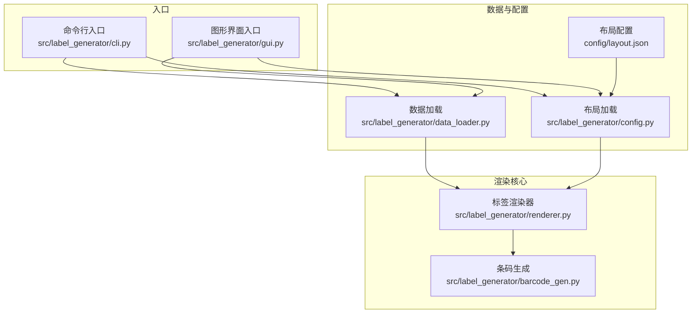
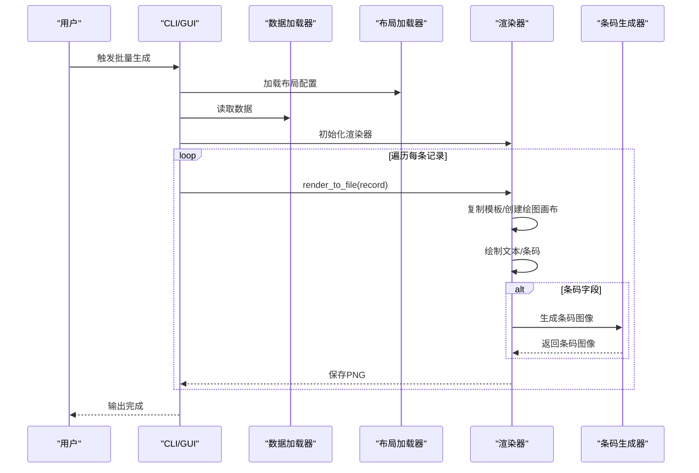
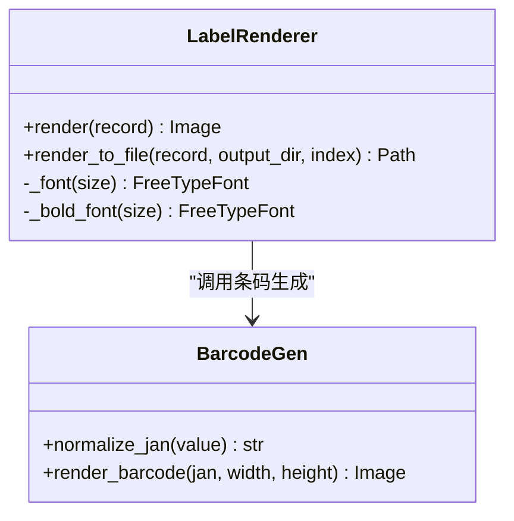
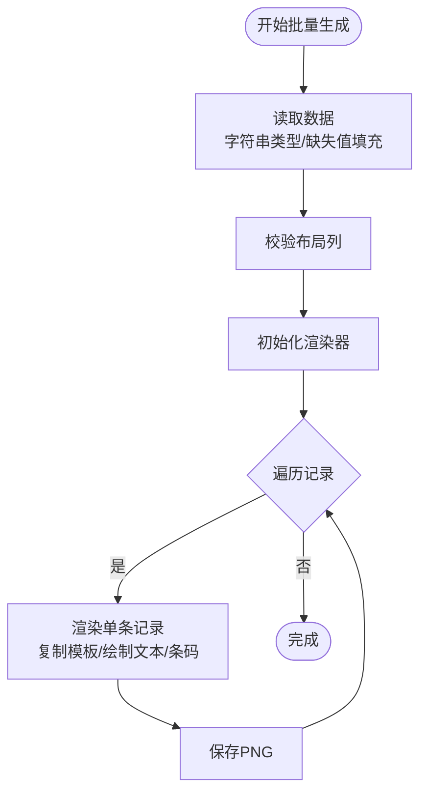
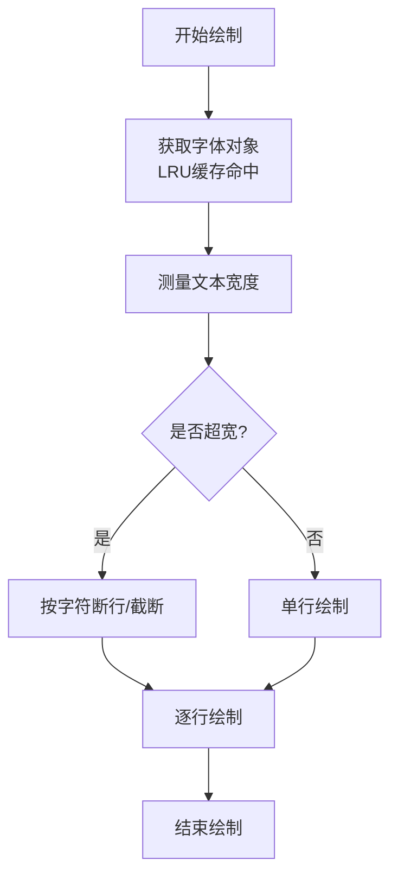
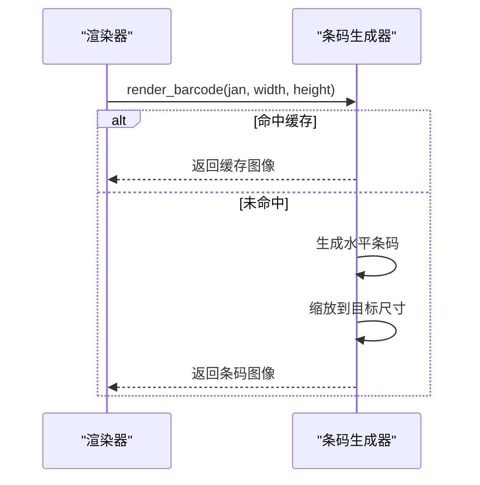
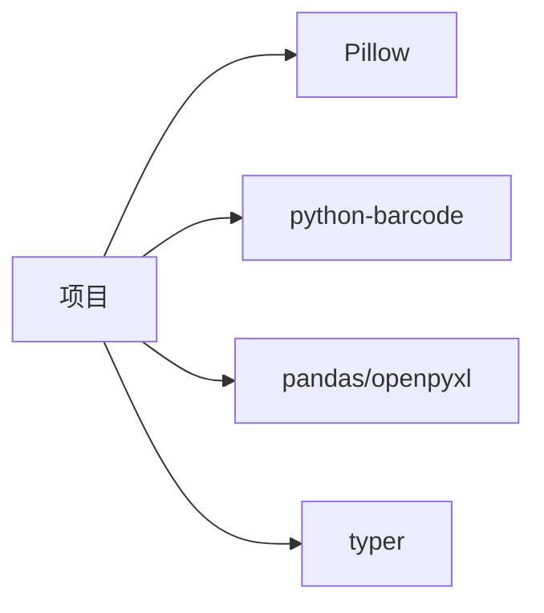

# 性能优化

<cite>
**本文引用的文件**
- [README.md](file://README.md)
- [SPEC.md](file://SPEC.md)
- [pyproject.toml](file://pyproject.toml)
- [requirements.txt](file://requirements.txt)
- [src/label_generator/renderer.py](file://src/label_generator/renderer.py)
- [src/label_generator/barcode_gen.py](file://src/label_generator/barcode_gen.py)
- [src/label_generator/data_loader.py](file://src/label_generator/data_loader.py)
- [src/label_generator/cli.py](file://src/label_generator/cli.py)
- [src/label_generator/gui.py](file://src/label_generator/gui.py)
- [src/label_generator/config.py](file://src/label_generator/config.py)
- [config/layout.json](file://config/layout.json)
</cite>

## 目录
1. [简介](#简介)
2. [项目结构](#项目结构)
3. [核心组件](#核心组件)
4. [架构总览](#架构总览)
5. [详细组件分析](#详细组件分析)
6. [依赖关系分析](#依赖关系分析)
7. [性能考量](#性能考量)
8. [故障排查指南](#故障排查指南)
9. [结论](#结论)
10. [附录](#附录)

## 简介
本指南聚焦于标签生成器的性能优化，围绕以下主题展开：
- 缓存机制：字体对象缓存（functools.lru_cache）与图像对象缓存策略
- 批处理优化：批量数据处理、内存管理与并发策略
- 渲染引擎性能：Pillow 图像处理调优
- 内存监控与大文件处理：内存使用控制与优化建议
- 性能测试与基准分析：测试方法与结果解读
- 实践案例与最佳实践：可落地的优化建议

## 项目结构
项目采用模块化分层组织，CLI/GUI 提供用户入口，数据加载与布局解析负责输入准备，渲染器负责核心绘制逻辑，条码生成模块负责 EAN-13 条码生成。

图表来源
- [src/label_generator/cli.py:16-86](file://src/label_generator/cli.py#L16-L86)
- [src/label_generator/gui.py:193-373](file://src/label_generator/gui.py#L193-L373)
- [src/label_generator/data_loader.py:9-24](file://src/label_generator/data_loader.py#L9-L24)
- [src/label_generator/config.py:8-14](file://src/label_generator/config.py#L8-L14)
- [src/label_generator/renderer.py:53-102](file://src/label_generator/renderer.py#L53-L102)
- [src/label_generator/barcode_gen.py:40-59](file://src/label_generator/barcode_gen.py#L40-L59)
- [config/layout.json:1-56](file://config/layout.json#L1-L56)

章节来源
- [README.md:40-59](file://README.md#L40-L59)
- [SPEC.md:120-148](file://SPEC.md#L120-L148)

## 核心组件
- 渲染器（LabelRenderer）：负责模板复制、逐字段绘制文本与条码、锚点转换、旋转与粘贴、输出保存。
- 条码生成器：封装 EAN-13 条码生成、校验与缩放，使用 LRU 缓存减少重复生成开销。
- 数据加载器：统一 CSV/Excel 读取，保持字符串类型一致性，缺失值填充为空字符串。
- CLI/GUI：提供批处理与交互式体验，GUI 支持后台线程与进度反馈。

章节来源
- [src/label_generator/renderer.py:53-102](file://src/label_generator/renderer.py#L53-L102)
- [src/label_generator/barcode_gen.py:17-59](file://src/label_generator/barcode_gen.py#L17-L59)
- [src/label_generator/data_loader.py:9-24](file://src/label_generator/data_loader.py#L9-L24)
- [src/label_generator/cli.py:16-86](file://src/label_generator/cli.py#L16-L86)
- [src/label_generator/gui.py:303-373](file://src/label_generator/gui.py#L303-L373)

## 架构总览
渲染流程从数据与布局配置出发，通过渲染器将文本与条码叠加至模板图像，最终输出 PNG。条码生成模块独立于渲染器，通过 LRU 缓存复用相同参数的条码图像。

图表来源
- [src/label_generator/cli.py:67-81](file://src/label_generator/cli.py#L67-L81)
- [src/label_generator/gui.py:322-348](file://src/label_generator/gui.py#L322-L348)
- [src/label_generator/renderer.py:83-102](file://src/label_generator/renderer.py#L83-L102)
- [src/label_generator/barcode_gen.py:40-59](file://src/label_generator/barcode_gen.py#L40-L59)

## 详细组件分析

### 缓存机制：字体对象与图像对象缓存
- 字体对象缓存
  - 渲染器对常规与粗体字体分别维护 LRU 缓存，键为字号，值为字体对象。该策略避免重复加载同一字号字体，显著降低 IO 与解析成本。
  - 缓存大小限制为 32，兼顾命中率与内存占用。
- 条码图像缓存
  - 条码生成函数对相同参数组合进行 LRU 缓存，键为 (jan, width, height)，值为生成并缩放后的条码图像。该策略在相同尺寸与编码重复出现时避免重复计算。
  - 缓存大小为 128，适合条码参数有限且重复率较高的场景。

图表来源
- [src/label_generator/renderer.py:75-81](file://src/label_generator/renderer.py#L75-L81)
- [src/label_generator/barcode_gen.py:40-59](file://src/label_generator/barcode_gen.py#L40-L59)

章节来源
- [src/label_generator/renderer.py:75-81](file://src/label_generator/renderer.py#L75-L81)
- [src/label_generator/barcode_gen.py:40-59](file://src/label_generator/barcode_gen.py#L40-L59)
- [SPEC.md:150-156](file://SPEC.md#L150-L156)

### 批处理优化：批量数据处理、内存管理与并发策略
- 批量数据处理
  - 数据读取阶段统一为字符串类型，缺失值填充为空字符串，保证后续渲染稳定性。
  - 布局列校验在启动阶段一次性完成，避免逐行报错带来的额外开销。
- 内存管理
  - 渲染器在每次绘制前复制模板图像，避免跨记录污染；绘制完成后将 RGBA 转换为 RGB 输出，减小文件体积。
  - 条码生成返回 RGB 图像，减少通道转换成本。
- 并发策略
  - GUI 使用后台线程执行批量生成，主线程通过回调安全更新进度与状态，确保界面响应。
  - CLI 采用顺序遍历，便于调试与错误定位；如需更高吞吐，可在 CLI 层引入多进程池（见“性能考量”中的建议）。

图表来源
- [src/label_generator/data_loader.py:9-24](file://src/label_generator/data_loader.py#L9-L24)
- [src/label_generator/cli.py:52-60](file://src/label_generator/cli.py#L52-L60)
- [src/label_generator/gui.py:322-348](file://src/label_generator/gui.py#L322-L348)

章节来源
- [src/label_generator/data_loader.py:9-24](file://src/label_generator/data_loader.py#L9-L24)
- [src/label_generator/cli.py:52-60](file://src/label_generator/cli.py#L52-L60)
- [src/label_generator/gui.py:316-348](file://src/label_generator/gui.py#L316-L348)

### 渲染引擎性能瓶颈与优化方法
- 文本测量与换行
  - 使用字体边界盒测量宽度，避免过时接口；按字符断行并限制最大行数，防止溢出与过度绘制。
- 条码生成与缩放
  - 先生成水平条码，再按目标尺寸缩放，最后根据旋转角度与锚点计算粘贴坐标，减少多次重绘。
- 锚点与粘贴
  - 文本锚点由绘图接口直接支持，条码通过手动计算左上角坐标粘贴，避免不必要的中间变换。
- Pillow 性能调优要点
  - 缩放采样使用高质量插值；RGBA 转 RGB 仅在输出阶段进行；尽量减少图像拷贝次数。

图表来源
- [src/label_generator/renderer.py:104-132](file://src/label_generator/renderer.py#L104-L132)

章节来源
- [src/label_generator/renderer.py:104-132](file://src/label_generator/renderer.py#L104-L132)
- [SPEC.md:157-161](file://SPEC.md#L157-L161)

### 条码生成性能优化
- 参数化缓存：相同编码与尺寸组合直接命中缓存，避免重复生成。
- 输出格式：生成阶段即转换为 RGB，减少后续转换成本。
- 选项裁剪：禁用写入文本与字体渲染，降低绘制复杂度。

图表来源
- [src/label_generator/barcode_gen.py:40-59](file://src/label_generator/barcode_gen.py#L40-L59)

章节来源
- [src/label_generator/barcode_gen.py:17-59](file://src/label_generator/barcode_gen.py#L17-L59)

## 依赖关系分析
- Pillow：图像读写、绘制、缩放与格式转换
- python-barcode：条码生成（EAN-13）
- pandas/openpyxl：CSV/Excel 读取
- typer：CLI 入口

图表来源
- [pyproject.toml:10-16](file://pyproject.toml#L10-L16)
- [requirements.txt:1-6](file://requirements.txt#L1-L6)

章节来源
- [pyproject.toml:10-16](file://pyproject.toml#L10-L16)
- [requirements.txt:1-6](file://requirements.txt#L1-L6)

## 性能考量
- 缓存参数建议
  - 字体缓存：当前 32，若字号种类较多可适度增大；若字号集中可减小以节省内存。
  - 条码缓存：当前 128，适合有限参数集；若条码参数多样化可评估增大。
- 批处理与并发
  - CLI 层可引入进程池（例如按批次拆分）以提升吞吐；注意避免过多进程导致上下文切换开销。
  - GUI 已采用后台线程，建议在生成前进行预热（提前加载模板与字体）以减少首帧延迟。
- 内存优化
  - 优先在输出阶段进行格式转换；避免在渲染过程中频繁创建与销毁中间图像。
  - 对大尺寸模板与高分辨率输出，建议在布局配置中控制条码与文本的最大宽度，减少缩放与绘制成本。
- 性能测试与基准
  - 建议使用统一数据集（如 1k~10k 条记录）进行基准测试，关注指标：总耗时、平均单图耗时、峰值内存、I/O 时间占比。
  - 测试维度：不同字号、不同条码尺寸、不同锚点与旋转组合、不同并发度。
- 监控与诊断
  - 使用系统工具（如 ps/top/htop）观察 CPU 与内存；结合 Python 内置 profile 工具定位热点函数。
  - 对渲染器与条码生成器分别进行微基准测试，验证缓存命中率与生成耗时。

[本节为通用性能指导，不直接分析具体文件]

## 故障排查指南
- 常见问题
  - 字体未找到：检查字体路径与权限；确保渲染器初始化时路径有效。
  - 布局列缺失：启动阶段一次性报错，核对 layout.json 与数据列名。
  - 条码校验失败：输入非数字或校验位错误，跳过该条并记录失败清单。
  - 模板/布局文件缺失：fail-fast 提示，补齐文件后重试。
- 调试建议
  - CLI/GUI 均提供逐条失败记录，优先修复前几条以验证环境与配置。
  - 对异常条码进行单独测试，确认输入格式与缓存行为。

章节来源
- [src/label_generator/cli.py:36-60](file://src/label_generator/cli.py#L36-L60)
- [src/label_generator/gui.py:200-252](file://src/label_generator/gui.py#L200-L252)
- [src/label_generator/renderer.py:62-66](file://src/label_generator/renderer.py#L62-L66)
- [src/label_generator/barcode_gen.py:17-32](file://src/label_generator/barcode_gen.py#L17-L32)

## 结论
本项目在渲染器与条码生成模块中已内置关键缓存策略，并通过 CLI/GUI 提供批处理与并发能力。进一步优化可围绕缓存参数调优、并发策略扩展、内存与 I/O 优化以及系统化的性能测试体系展开。遵循本文的最佳实践，可在保证质量的前提下显著提升吞吐与资源利用率。

[本节为总结性内容，不直接分析具体文件]

## 附录
- 快速参考
  - 字体缓存：渲染器内部对常规/粗体字体分别缓存，键为字号
  - 条码缓存：条码生成函数对 (jan, width, height) 缓存
  - 数据读取：CSV/Excel 统一为字符串类型，缺失值填充为空
  - 输出格式：RGBA 转 RGB 后保存 PNG
- 相关配置
  - 布局文件定义字段类型、坐标、锚点、尺寸与旋转等

章节来源
- [src/label_generator/renderer.py:75-81](file://src/label_generator/renderer.py#L75-L81)
- [src/label_generator/barcode_gen.py:40-59](file://src/label_generator/barcode_gen.py#L40-L59)
- [src/label_generator/data_loader.py:9-24](file://src/label_generator/data_loader.py#L9-L24)
- [config/layout.json:1-56](file://config/layout.json#L1-L56)