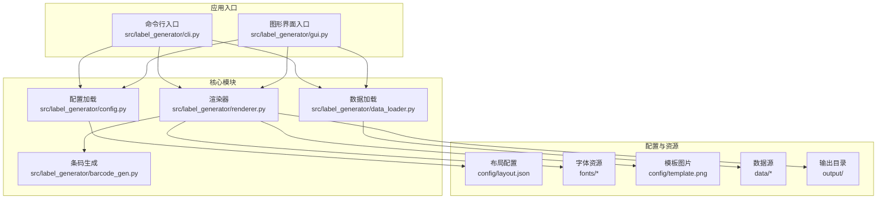
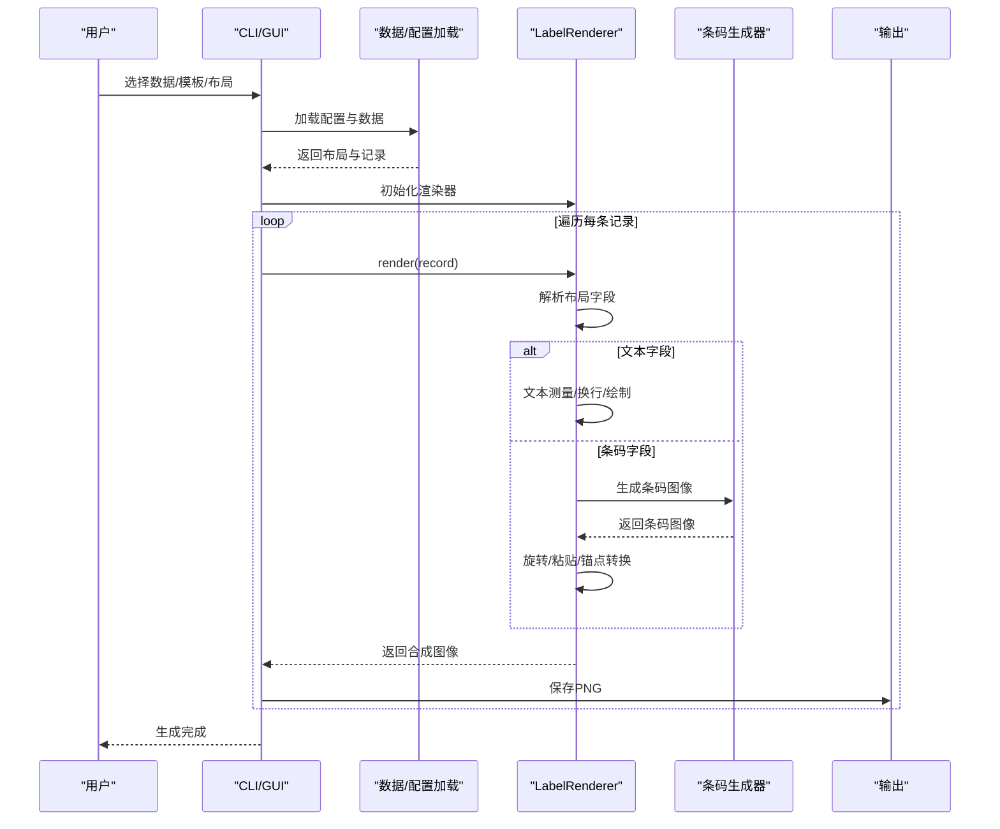
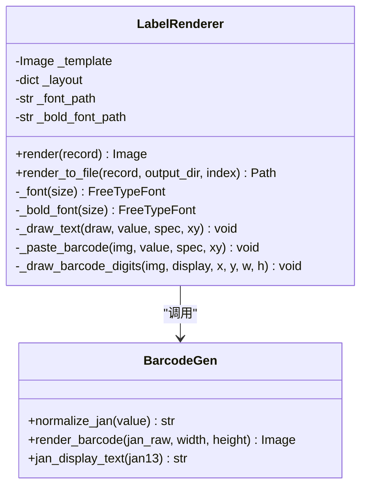
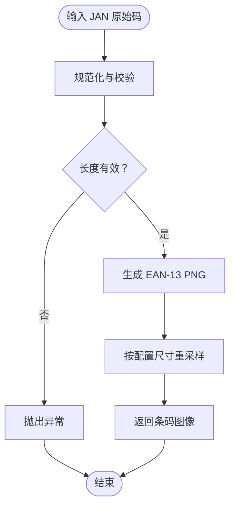
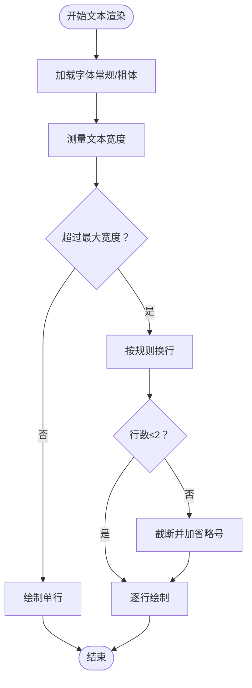
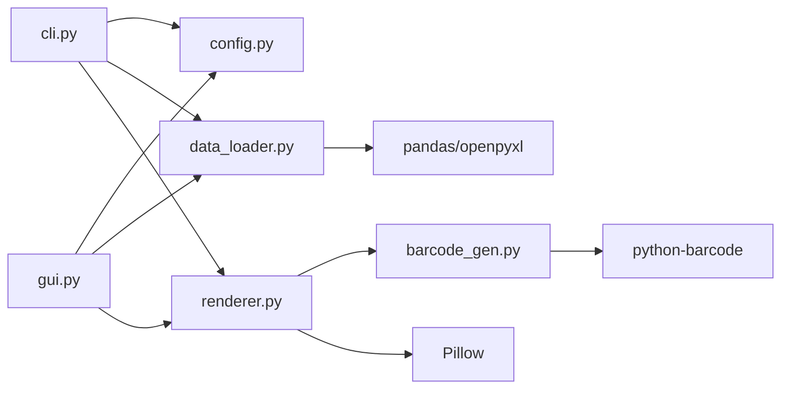

# 扩展开发

<cite>
**本文档引用的文件**
- [README.md](file://README.md)
- [SPEC.md](file://SPEC.md)
- [pyproject.toml](file://pyproject.toml)
- [requirements.txt](file://requirements.txt)
- [src/label_generator/__init__.py](file://src/label_generator/__init__.py)
- [src/label_generator/config.py](file://src/label_generator/config.py)
- [src/label_generator/data_loader.py](file://src/label_generator/data_loader.py)
- [src/label_generator/renderer.py](file://src/label_generator/renderer.py)
- [src/label_generator/barcode_gen.py](file://src/label_generator/barcode_gen.py)
- [src/label_generator/cli.py](file://src/label_generator/cli.py)
- [src/label_generator/gui.py](file://src/label_generator/gui.py)
- [config/layout.json](file://config/layout.json)
</cite>

## 目录
1. [简介](#简介)
2. [项目结构](#项目结构)
3. [核心组件](#核心组件)
4. [架构总览](#架构总览)
5. [详细组件分析](#详细组件分析)
6. [扩展点识别与设计原则](#扩展点识别与设计原则)
7. [API接口文档](#api接口文档)
8. [配置系统扩展](#配置系统扩展)
9. [渲染功能扩展](#渲染功能扩展)
10. [第三方库与外部服务集成](#第三方库与外部服务集成)
11. [依赖关系分析](#依赖关系分析)
12. [性能考虑](#性能考虑)
13. [故障排除指南](#故障排除指南)
14. [结论](#结论)

## 简介
本指南面向高级开发者，提供标签生成器扩展开发的完整指导。项目采用“配置驱动 + 插件化渲染”的架构，通过可扩展的布局配置和模块化的渲染器实现，支持新增渲染类型、条码格式、图像处理扩展以及第三方服务集成。文档涵盖扩展点识别、API规范、配置扩展方法、最佳实践与架构建议。

## 项目结构
项目采用分层模块化设计，核心逻辑集中在 src/label_generator 目录，配置与数据分离，CLI/GUI 提供用户入口，配置文件与字体资源独立管理。

图表来源
- [src/label_generator/cli.py:1-94](file://src/label_generator/cli.py#L1-L94)
- [src/label_generator/gui.py:1-384](file://src/label_generator/gui.py#L1-L384)
- [src/label_generator/config.py:1-14](file://src/label_generator/config.py#L1-L14)
- [src/label_generator/data_loader.py:1-32](file://src/label_generator/data_loader.py#L1-L32)
- [src/label_generator/renderer.py:1-251](file://src/label_generator/renderer.py#L1-L251)
- [src/label_generator/barcode_gen.py:1-60](file://src/label_generator/barcode_gen.py#L1-L60)
- [config/layout.json:1-56](file://config/layout.json#L1-L56)

章节来源
- [README.md:40-59](file://README.md#L40-L59)
- [SPEC.md:120-148](file://SPEC.md#L120-L148)

## 核心组件
- 配置加载器：负责解析布局配置文件，提供统一的配置访问接口。
- 数据加载器：支持 CSV/Excel，统一数据格式并进行列校验。
- 渲染器：核心渲染引擎，支持文本与条码渲染，具备缓存优化与锚点坐标转换。
- 条码生成器：封装 JAN/EAN-13 条码生成、校验与尺寸调整。
- CLI/GUI：提供命令行与图形界面两种使用方式，统一调用核心模块。

章节来源
- [src/label_generator/config.py:8-14](file://src/label_generator/config.py#L8-L14)
- [src/label_generator/data_loader.py:9-32](file://src/label_generator/data_loader.py#L9-L32)
- [src/label_generator/renderer.py:53-251](file://src/label_generator/renderer.py#L53-L251)
- [src/label_generator/barcode_gen.py:17-60](file://src/label_generator/barcode_gen.py#L17-L60)
- [src/label_generator/cli.py:16-94](file://src/label_generator/cli.py#L16-L94)
- [src/label_generator/gui.py:19-384](file://src/label_generator/gui.py#L19-L384)

## 架构总览
系统采用“配置驱动 + 渲染器”模式，渲染器根据布局配置动态决定渲染策略。条码渲染通过独立模块实现，文本渲染利用 Pillow 的字体与绘制能力，整体架构清晰、扩展性强。

图表来源
- [src/label_generator/cli.py:16-94](file://src/label_generator/cli.py#L16-L94)
- [src/label_generator/renderer.py:83-102](file://src/label_generator/renderer.py#L83-L102)
- [src/label_generator/renderer.py:133-197](file://src/label_generator/renderer.py#L133-L197)
- [src/label_generator/barcode_gen.py:40-60](file://src/label_generator/barcode_gen.py#L40-L60)

## 详细组件分析

### 渲染器类（LabelRenderer）
LabelRenderer 是扩展开发的核心入口，负责：
- 字体缓存与切换（常规/粗体）
- 文本渲染（测量、换行、多行绘制）
- 条码渲染（生成、尺寸调整、旋转、粘贴）
- 锚点坐标转换（支持 lt/mm/rt 等）
- 文件命名与输出

图表来源
- [src/label_generator/renderer.py:53-251](file://src/label_generator/renderer.py#L53-L251)
- [src/label_generator/barcode_gen.py:17-60](file://src/label_generator/barcode_gen.py#L17-L60)

章节来源
- [src/label_generator/renderer.py:53-251](file://src/label_generator/renderer.py#L53-L251)

### 条码生成器
条码生成器提供 JAN/EAN-13 的标准化处理：
- 校验位计算与验证
- 生成中间 PNG 并按指定尺寸重采样
- 缓存机制减少重复计算

图表来源
- [src/label_generator/barcode_gen.py:17-60](file://src/label_generator/barcode_gen.py#L17-L60)

章节来源
- [src/label_generator/barcode_gen.py:17-60](file://src/label_generator/barcode_gen.py#L17-L60)

### 数据加载器与配置加载器
- 数据加载器支持 CSV/Excel，统一为字典列表，缺失值填充为空字符串。
- 配置加载器读取 JSON，提供 fail-fast 的文件存在性检查。

章节来源
- [src/label_generator/data_loader.py:9-32](file://src/label_generator/data_loader.py#L9-L32)
- [src/label_generator/config.py:8-14](file://src/label_generator/config.py#L8-L14)

### CLI 与 GUI
- CLI 提供命令行参数与错误处理，支持批量生成与进度反馈。
- GUI 提供可视化配置、数据预览、实时预览与后台生成。

章节来源
- [src/label_generator/cli.py:16-94](file://src/label_generator/cli.py#L16-L94)
- [src/label_generator/gui.py:19-384](file://src/label_generator/gui.py#L19-L384)

## 扩展点识别与设计原则
- 配置驱动：所有渲染行为由 layout.json 决定，新增渲染类型只需扩展配置字段与渲染分支。
- 模块化：渲染器与条码生成器解耦，便于独立扩展与测试。
- 缓存优化：字体与条码生成均使用缓存，提升批量渲染性能。
- 错误隔离：条码异常不影响整批数据处理，保证稳定性。
- 可替换性：模板与字体路径通过配置注入，无需修改代码。

章节来源
- [SPEC.md:150-188](file://SPEC.md#L150-L188)
- [SPEC.md:205-213](file://SPEC.md#L205-L213)

## API接口文档

### 渲染器 API
- render(record: dict[str, Any]) -> Image.Image
  - 功能：根据记录与布局配置渲染单张标签。
  - 输入：记录字典（列名需与布局配置一致）。
  - 输出：RGBA 合成图像，内部转换为 RGB 保存。
  - 异常：文件缺失、布局字段无效等。
- render_to_file(record: dict[str, Any], output_dir: str | Path, index: int = 0) -> Path
  - 功能：渲染并保存为 PNG 文件，文件名优先级：sku/sku_code/jan/行号。
  - 输出：保存路径。

章节来源
- [src/label_generator/renderer.py:83-102](file://src/label_generator/renderer.py#L83-L102)
- [src/label_generator/renderer.py:233-251](file://src/label_generator/renderer.py#L233-L251)

### 条码生成 API
- normalize_jan(value: str) -> str
  - 功能：规范化 JAN 码（12 位自动补校验，13 位验证校验）。
- render_barcode(jan_raw: str, width: int, height: int) -> Image.Image
  - 功能：生成指定尺寸的 EAN-13 条码图像，缓存中间结果。
- jan_display_text(jan13: str) -> str
  - 功能：返回人类可读的 EAN-13 字符串格式。

章节来源
- [src/label_generator/barcode_gen.py:17-60](file://src/label_generator/barcode_gen.py#L17-L60)

### 配置加载 API
- load_layout(path: str | Path) -> dict[str, Any]
  - 功能：加载并解析布局 JSON，提供统一访问接口。

章节来源
- [src/label_generator/config.py:8-14](file://src/label_generator/config.py#L8-L14)

### 数据加载 API
- load_data(path: str | Path) -> list[dict[str, Any]]
  - 功能：读取 CSV/Excel，统一为字典列表。
- validate_columns(records: list[dict], layout: dict) -> list[str]
  - 功能：校验数据列与布局配置一致性。

章节来源
- [src/label_generator/data_loader.py:9-32](file://src/label_generator/data_loader.py#L9-L32)

## 配置系统扩展
### 新增字段类型
- 在布局配置中新增字段类型，例如：
  - type: "image"（待实现）
  - type: "qrcode"（待实现）
- 在渲染器中添加对应的渲染分支：
  - 在 render 方法中识别新类型并调用相应处理函数。
  - 在 _draw_text/_paste_barcode 之外新增 _draw_image/_draw_qrcode 等方法。
- 注意：保留现有字段的兼容性，避免破坏已有布局。

章节来源
- [src/label_generator/renderer.py:83-102](file://src/label_generator/renderer.py#L83-L102)

### 新增字段属性
- 文本字段：max_width、color、bold 等。
- 条码字段：format、rotation、show_text、width/height 等。
- 扩展时需：
  - 在渲染器中读取新属性并应用。
  - 在 CLI/GUI 中提供相应的参数或界面控件。
  - 更新配置加载与校验逻辑（如有必要）。

章节来源
- [SPEC.md:87-110](file://SPEC.md#L87-L110)
- [config/layout.json:9-55](file://config/layout.json#L9-L55)

### 布局配置扩展方法
- 保持 _meta 区域用于元信息，不参与渲染。
- 新增字段时确保与数据源列名一致或通过映射处理。
- 批量生成时对缺失列进行一次性报错，避免逐行中断。

章节来源
- [SPEC.md:205-213](file://SPEC.md#L205-L213)
- [src/label_generator/cli.py:52-58](file://src/label_generator/cli.py#L52-L58)

## 渲染功能扩展

### 自定义文本渲染
- 支持中日文字符、粗体切换、最大宽度换行、多行绘制。
- 实现要点：
  - 使用字体缓存（_font/_bold_font）避免重复加载。
  - 文本测量使用 getbbox，避免过时的 getsize。
  - 换行策略：CJK 按字符断行，英文按单词断行，最多两行并以省略号收尾。
  - 多行绘制时计算行高并累加 y 坐标。

图表来源
- [src/label_generator/renderer.py:104-132](file://src/label_generator/renderer.py#L104-L132)
- [src/label_generator/renderer.py:23-51](file://src/label_generator/renderer.py#L23-L51)

章节来源
- [SPEC.md:157-161](file://SPEC.md#L157-L161)
- [src/label_generator/renderer.py:104-132](file://src/label_generator/renderer.py#L104-L132)

### 特殊条码格式支持
- 当前支持 EAN-13，扩展步骤：
  - 在条码生成器中新增格式判断与生成逻辑。
  - 在渲染器中读取 format 字段并调用对应生成函数。
  - 更新布局配置示例与文档。
- 校验与尺寸：
  - 统一使用 normalize_jan 与 render_barcode，确保尺寸与旋转一致处理。
  - 保持 show_text 与数字绘制的一致性。

章节来源
- [SPEC.md:162-171](file://SPEC.md#L162-L171)
- [src/label_generator/renderer.py:133-197](file://src/label_generator/renderer.py#L133-L197)
- [src/label_generator/barcode_gen.py:17-60](file://src/label_generator/barcode_gen.py#L17-L60)

### 图像处理扩展
- 建议新增 "image" 字段类型：
  - 支持外部图片叠加、缩放、旋转与锚点对齐。
  - 实现流程：加载图像 → 按配置缩放 → 旋转 → 锚点转换 → 粘贴到模板。
  - 注意：与现有条码锚点转换逻辑保持一致。

章节来源
- [SPEC.md:172-184](file://SPEC.md#L172-L184)
- [src/label_generator/renderer.py:184-197](file://src/label_generator/renderer.py#L184-L197)

## 第三方库与外部服务集成
- Pillow：图像处理与字体渲染。
- python-barcode：条码生成（注意版本兼容性）。
- pandas/openpyxl：数据读取。
- typer：CLI 入口。
- tkinter：GUI 前端。

集成建议：
- 通过 pip 依赖管理，避免版本冲突。
- GUI 与 CLI 共享核心模块，确保行为一致。
- 对外部服务调用进行异步化与错误隔离，防止阻塞主流程。

章节来源
- [pyproject.toml:10-16](file://pyproject.toml#L10-L16)
- [SPEC.md:111-118](file://SPEC.md#L111-L118)
- [src/label_generator/gui.py:19-384](file://src/label_generator/gui.py#L19-L384)

## 依赖关系分析

图表来源
- [src/label_generator/cli.py:7-9](file://src/label_generator/cli.py#L7-L9)
- [src/label_generator/gui.py:12-14](file://src/label_generator/gui.py#L12-L14)
- [src/label_generator/renderer.py:140](file://src/label_generator/renderer.py#L140)
- [src/label_generator/data_loader.py:6](file://src/label_generator/data_loader.py#L6)
- [pyproject.toml:10-16](file://pyproject.toml#L10-L16)

章节来源
- [pyproject.toml:10-16](file://pyproject.toml#L10-L16)

## 性能考虑
- 字体缓存：使用 lru_cache 缓存字体对象，避免重复加载。
- 条码缓存：缓存中间 PNG，减少重复生成。
- 批量处理：GUI 使用后台线程，CLI 使用迭代器，避免阻塞。
- 尺寸重采样：使用高质量插值（LANCZOS）保证清晰度。
- 文件命名：非法字符替换，避免文件系统错误。

章节来源
- [SPEC.md:152-156](file://SPEC.md#L152-L156)
- [SPEC.md:162-171](file://SPEC.md#L162-L171)
- [SPEC.md:189-192](file://SPEC.md#L189-L192)
- [src/label_generator/renderer.py:75-81](file://src/label_generator/renderer.py#L75-L81)
- [src/label_generator/barcode_gen.py:40-60](file://src/label_generator/barcode_gen.py#L40-L60)

## 故障排除指南
- 模板/字体/layout 文件缺失：启动时 fail-fast，提供明确路径提示。
- 数据列缺失：一次性报出所有缺失列，避免逐行中断。
- JAN 校验失败：跳过该行并汇总失败列表，不中断全流程。
- layout 中引用了 CSV 不存在的列：启动时报错。
- 文件命名非法：替换非法字符为下划线。

章节来源
- [SPEC.md:205-213](file://SPEC.md#L205-L213)
- [src/label_generator/cli.py:35-58](file://src/label_generator/cli.py#L35-L58)
- [src/label_generator/renderer.py:14-16](file://src/label_generator/renderer.py#L14-L16)

## 结论
本项目通过“配置驱动 + 渲染器”的架构实现了良好的扩展性。开发者可通过新增字段类型、扩展配置属性与集成第三方库，在不修改核心代码的前提下实现定制化需求。遵循缓存优化、错误隔离与配置外置化的原则，可确保扩展的稳定性与可维护性。