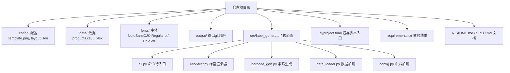
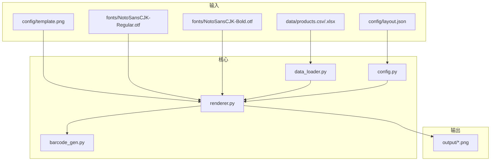
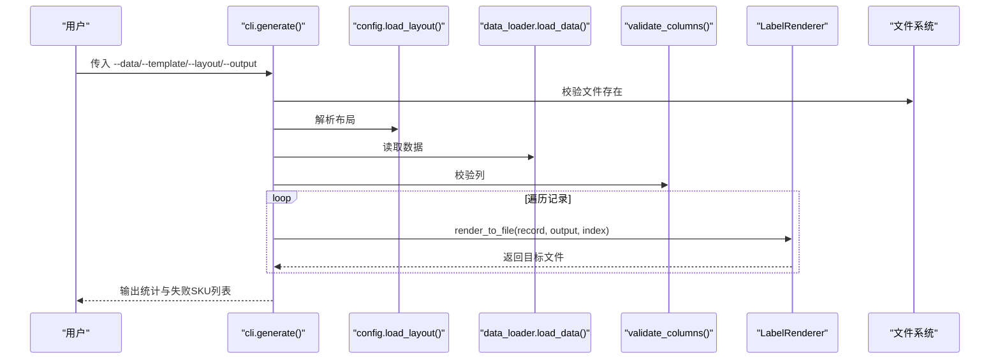
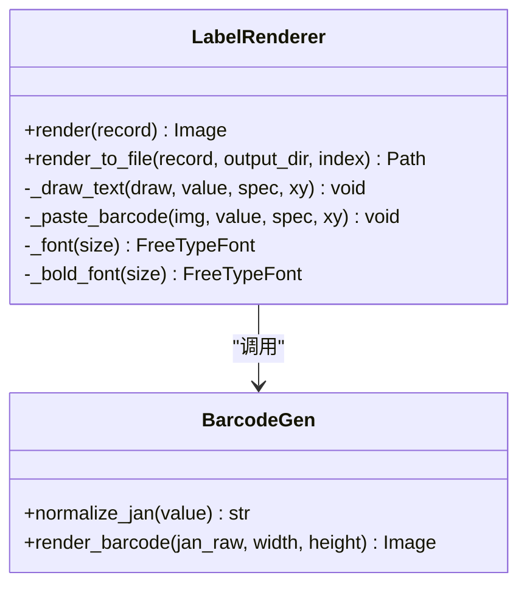
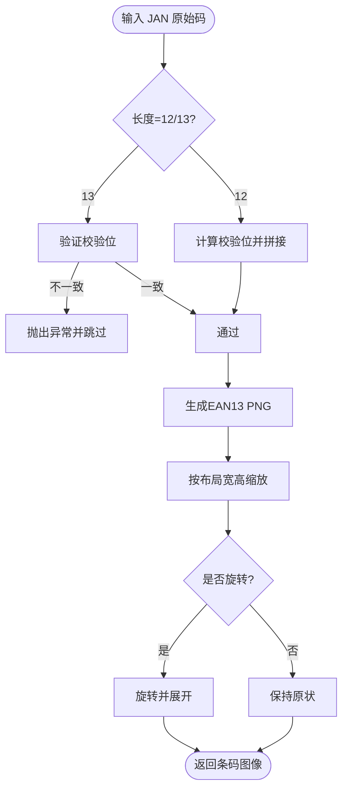
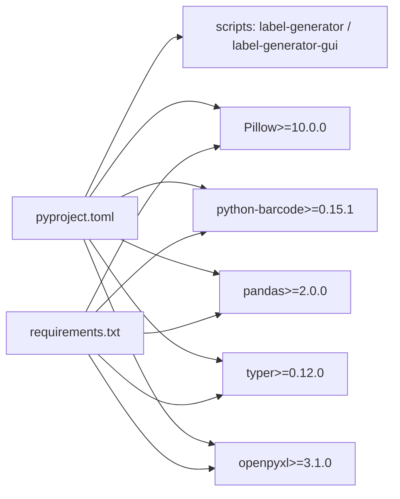

# 自动化集成

<cite>
**本文引用的文件**
- [README.md](file://README.md)
- [SPEC.md](file://SPEC.md)
- [pyproject.toml](file://pyproject.toml)
- [requirements.txt](file://requirements.txt)
- [src/label_generator/cli.py](file://src/label_generator/cli.py)
- [src/label_generator/renderer.py](file://src/label_generator/renderer.py)
- [src/label_generator/barcode_gen.py](file://src/label_generator/barcode_gen.py)
- [src/label_generator/data_loader.py](file://src/label_generator/data_loader.py)
- [src/label_generator/config.py](file://src/label_generator/config.py)
- [src/label_generator/gui.py](file://src/label_generator/gui.py)
</cite>

## 目录
1. [简介](#简介)
2. [项目结构](#项目结构)
3. [核心组件](#核心组件)
4. [架构总览](#架构总览)
5. [详细组件分析](#详细组件分析)
6. [依赖分析](#依赖分析)
7. [性能考虑](#性能考虑)
8. [故障排查指南](#故障排查指南)
9. [结论](#结论)
10. [附录](#附录)

## 简介
本指南面向运维与DevOps工程师，提供标签生成器的自动化集成方案，涵盖：
- 批处理脚本编写（Shell与Python）
- CI/CD流水线集成（GitHub Actions、GitLab CI）
- Docker容器化与Kubernetes编排
- Web API接口开发与远程/批量调用
- 监控与日志最佳实践
- 自动化测试与质量保障
- 完整的运维落地建议

标签生成器支持批量从CSV/Excel读取数据，基于模板与布局配置生成打印就绪的PNG标签，内置JAN-13条码生成与中日文排版能力。

## 项目结构
项目采用“源码分层 + 配置/数据/字体/输出”分离的组织方式，便于自动化与容器化部署。

图表来源
- [SPEC.md:120-148](file://SPEC.md#L120-L148)
- [README.md:40-59](file://README.md#L40-L59)

章节来源
- [SPEC.md:120-148](file://SPEC.md#L120-L148)
- [README.md:40-59](file://README.md#L40-L59)

## 核心组件
- 命令行入口：解析参数、执行批处理、输出统计与失败列表
- 渲染器：按布局将文本/条码叠加到模板图上，输出PNG
- 条码生成：JAN-13规范化与渲染，支持旋转与数字显示
- 数据加载：CSV/Excel读取，列校验
- 布局加载：JSON布局解析，元信息与字段分离
- GUI：图形界面，支持预览与批量生成

章节来源
- [src/label_generator/cli.py:16-86](file://src/label_generator/cli.py#L16-L86)
- [src/label_generator/renderer.py:53-251](file://src/label_generator/renderer.py#L53-L251)
- [src/label_generator/barcode_gen.py:17-60](file://src/label_generator/barcode_gen.py#L17-L60)
- [src/label_generator/data_loader.py:9-32](file://src/label_generator/data_loader.py#L9-L32)
- [src/label_generator/config.py:8-14](file://src/label_generator/config.py#L8-L14)
- [src/label_generator/gui.py:19-384](file://src/label_generator/gui.py#L19-L384)

## 架构总览
整体工作流：CLI/GUI读取数据与布局，渲染器调用条码生成器，最终写入PNG文件。

图表来源
- [src/label_generator/cli.py:49-60](file://src/label_generator/cli.py#L49-L60)
- [src/label_generator/renderer.py:83-102](file://src/label_generator/renderer.py#L83-L102)
- [src/label_generator/barcode_gen.py:40-60](file://src/label_generator/barcode_gen.py#L40-L60)

## 详细组件分析

### 命令行入口（CLI）
- 提供默认路径参数，fail-fast检查文件存在性
- 校验布局所需列是否齐全
- 逐行渲染并统计成功/失败，失败SKU汇总输出
- 支持通过环境变量设置PYTHONPATH运行

图表来源
- [src/label_generator/cli.py:35-86](file://src/label_generator/cli.py#L35-L86)
- [src/label_generator/data_loader.py:26-32](file://src/label_generator/data_loader.py#L26-L32)
- [src/label_generator/config.py:8-14](file://src/label_generator/config.py#L8-L14)
- [src/label_generator/renderer.py:233-251](file://src/label_generator/renderer.py#L233-L251)

章节来源
- [src/label_generator/cli.py:16-86](file://src/label_generator/cli.py#L16-L86)
- [README.md:24-38](file://README.md#L24-L38)

### 渲染器（LabelRenderer）
- 初始化时加载模板与字体，缓存字体对象
- 遍历布局字段，绘制文本或粘贴条码
- 文本自动换行与截断，支持粗体与最大宽度
- 条码渲染后按布局尺寸缩放与旋转，按锚点计算粘贴坐标

图表来源
- [src/label_generator/renderer.py:53-251](file://src/label_generator/renderer.py#L53-L251)
- [src/label_generator/barcode_gen.py:17-60](file://src/label_generator/barcode_gen.py#L17-L60)

章节来源
- [src/label_generator/renderer.py:53-251](file://src/label_generator/renderer.py#L53-L251)
- [SPEC.md:150-188](file://SPEC.md#L150-L188)

### 条码生成（JAN-13）
- 规范化：12位自动补校验，13位校验校验位
- 渲染：EAN13 PNG，按布局宽高缩放，可选显示数字
- 缓存：LRU缓存避免重复生成

图表来源
- [src/label_generator/barcode_gen.py:17-60](file://src/label_generator/barcode_gen.py#L17-L60)
- [src/label_generator/renderer.py:133-197](file://src/label_generator/renderer.py#L133-L197)

章节来源
- [src/label_generator/barcode_gen.py:17-60](file://src/label_generator/barcode_gen.py#L17-L60)
- [SPEC.md:162-171](file://SPEC.md#L162-L171)

### 数据加载与布局
- 数据：CSV/Excel统一读取，缺失值填充为空字符串
- 列校验：布局中非_meta键必须在数据列中出现
- 布局：UTF-8 JSON，包含元信息与字段定义

章节来源
- [src/label_generator/data_loader.py:9-32](file://src/label_generator/data_loader.py#L9-L32)
- [src/label_generator/config.py:8-14](file://src/label_generator/config.py#L8-L14)
- [SPEC.md:29-85](file://SPEC.md#L29-L85)

### GUI（可选）
- 提供图形界面，支持浏览文件、加载数据、预览、后台批量生成
- 与CLI共享同一套渲染逻辑，适合本地调试与演示

章节来源
- [src/label_generator/gui.py:19-384](file://src/label_generator/gui.py#L19-L384)

## 依赖分析
- 包与脚本入口：通过pyproject.toml注册命令行工具与GUI入口
- 运行时依赖：Pillow、python-barcode、pandas、typer、openpyxl
- 版本约束：Python 3.11+，避免Pillow 10+与旧版python-barcode的兼容问题

图表来源
- [pyproject.toml:5-27](file://pyproject.toml#L5-L27)
- [requirements.txt:1-6](file://requirements.txt#L1-L6)

章节来源
- [pyproject.toml:5-27](file://pyproject.toml#L5-L27)
- [requirements.txt:1-6](file://requirements.txt#L1-L6)
- [SPEC.md:111-118](file://SPEC.md#L111-L118)

## 性能考虑
- 字体缓存：渲染器对字体对象进行LRU缓存，减少I/O与解析开销
- 条码缓存：条码图像按参数缓存，避免重复生成
- 批处理：CLI逐行渲染，失败不影响其他记录
- I/O：输出目录提前创建，避免多次mkdir

章节来源
- [src/label_generator/renderer.py:75-82](file://src/label_generator/renderer.py#L75-L82)
- [src/label_generator/barcode_gen.py:40-60](file://src/label_generator/barcode_gen.py#L40-L60)
- [src/label_generator/cli.py:62-85](file://src/label_generator/cli.py#L62-L85)

## 故障排查指南
- 文件缺失：模板/布局/字体不存在时fail-fast，CLI会输出具体路径
- 列缺失：启动时一次性报告所有缺失列
- JAN校验失败：跳过该行并汇总失败SKU，不影响其他记录
- 字体问题：确保使用项目自带字体文件，避免系统字体差异
- 输出命名：非法字符会被替换，文件名优先级为sku/sku_code/jan/行号

章节来源
- [src/label_generator/cli.py:35-58](file://src/label_generator/cli.py#L35-L58)
- [src/label_generator/data_loader.py:26-32](file://src/label_generator/data_loader.py#L26-L32)
- [src/label_generator/renderer.py:14-16](file://src/label_generator/renderer.py#L14-L16)
- [SPEC.md:205-213](file://SPEC.md#L205-L213)

## 结论
本项目提供了清晰的批处理与渲染流程，具备良好的可扩展性与可维护性。结合本文提供的自动化集成方案，可在本地、CI/CD、容器与Kubernetes环境中稳定运行，并通过Web API实现远程与批量调用。

## 附录

### 批处理脚本编写（Shell与Python）
- Shell脚本要点
  - 设置PYTHONPATH指向src目录
  - 统一指定 --data/--template/--layout/--output
  - 使用输出重定向捕获统计与失败SKU
  - 失败时退出码非零，便于CI判断
- Python脚本要点
  - 直接调用CLI模块的入口函数，或复用LabelRenderer进行批量渲染
  - 使用多进程/线程加速渲染（注意GIL影响）
  - 异常捕获与日志记录，失败SKU汇总输出

章节来源
- [README.md:24-38](file://README.md#L24-L38)
- [src/label_generator/cli.py:88-94](file://src/label_generator/cli.py#L88-L94)

### CI/CD流水线集成（GitHub Actions / GitLab CI）
- GitHub Actions
  - 使用actions/setup-python安装Python 3.11+
  - 使用actions/checkout检出代码
  - 安装依赖：pip install -r requirements.txt
  - 运行CLI生成标签，上传artifact
  - 可选：添加单元测试步骤
- GitLab CI
  - 使用python:3.11镜像
  - 步骤：安装依赖、运行CLI、归档输出

章节来源
- [pyproject.toml:9](file://pyproject.toml#L9)
- [requirements.txt:1-6](file://requirements.txt#L1-L6)
- [README.md:10-22](file://README.md#L10-L22)

### Docker容器化与Kubernetes编排
- Dockerfile建议
  - FROM python:3.11-slim
  - COPY requirements.txt .
  - RUN pip install -r requirements.txt
  - COPY . /app
  - WORKDIR /app
  - ENTRYPOINT ["python", "-m", "label_generator.cli"]
- Kubernetes
  - Deployment：挂载数据卷与输出卷
  - ConfigMap：存放layout.json
  - Job/CronJob：按需触发批处理
  - HPA：根据CPU/内存或队列长度扩缩容（若接入消息队列）

（本节为概念性说明，不直接映射到具体源文件）

### Web API接口开发（FastAPI示例思路）
- 设计
  - POST /generate/batch：接收CSV/Excel与布局配置，返回任务ID
  - GET /generate/status/{task_id}：查询进度与结果
  - GET /download/{sku}.png：下载单个标签
- 实现要点
  - 后台任务：使用异步队列（如Celery/RQ）执行LabelRenderer
  - 文件存储：S3/MinIO或本地持久卷
  - 并发控制：限制并发数，避免内存峰值过高
  - 错误处理：返回标准化错误码与消息

（本节为概念性说明，不直接映射到具体源文件）

### 监控与日志最佳实践
- 日志
  - 使用标准logging模块，输出JSON格式
  - 关键指标：每批次耗时、成功/失败数、平均渲染时延
- 监控
  - 指标：CPU/内存/磁盘IO、队列长度（如启用消息队列）
  - 告警：失败率阈值、长时间未产出、磁盘空间不足
- 链路追踪
  - 为API请求生成trace_id，串联从接收数据到输出文件的链路

（本节为概念性说明，不直接映射到具体源文件）

### 自动化测试与质量保证
- 单元测试
  - 测试渲染器：构造小布局与少量数据，断言输出尺寸与关键像素
  - 测试条码：断言12位自动补校验、13位校验失败跳过
- 集成测试
  - 使用示例数据与模板，断言输出PNG数量与视觉一致性
- 质量门禁
  - 代码覆盖率阈值、静态检查（flake8/ruff）、依赖漏洞扫描

章节来源
- [SPEC.md:244-252](file://SPEC.md#L244-L252)