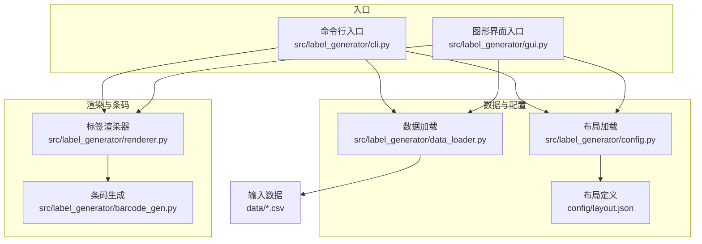
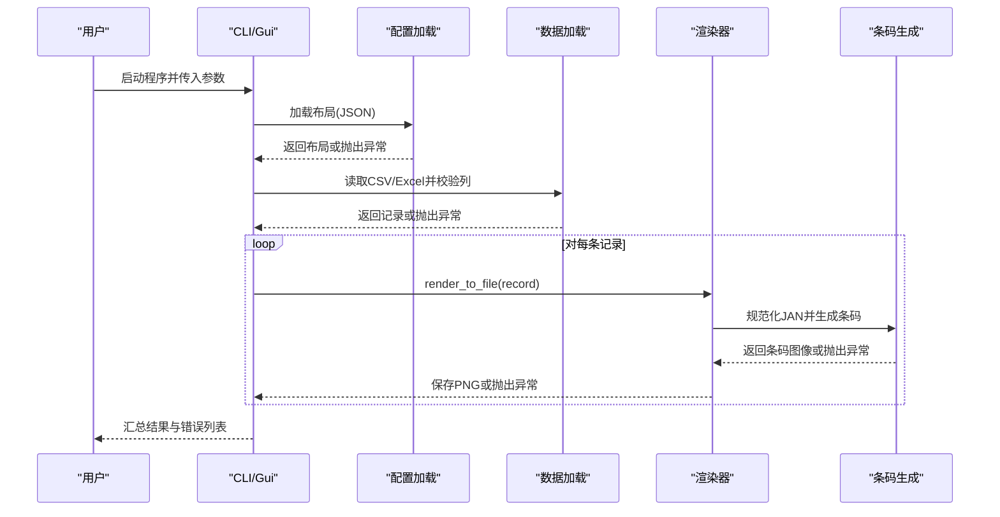
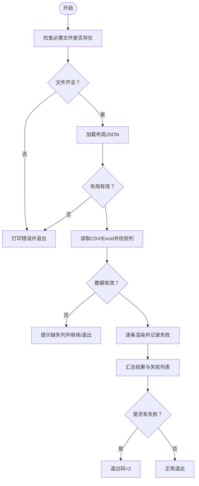
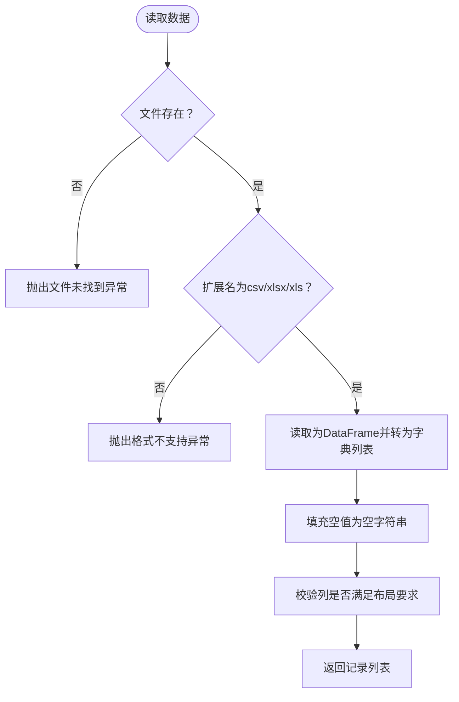
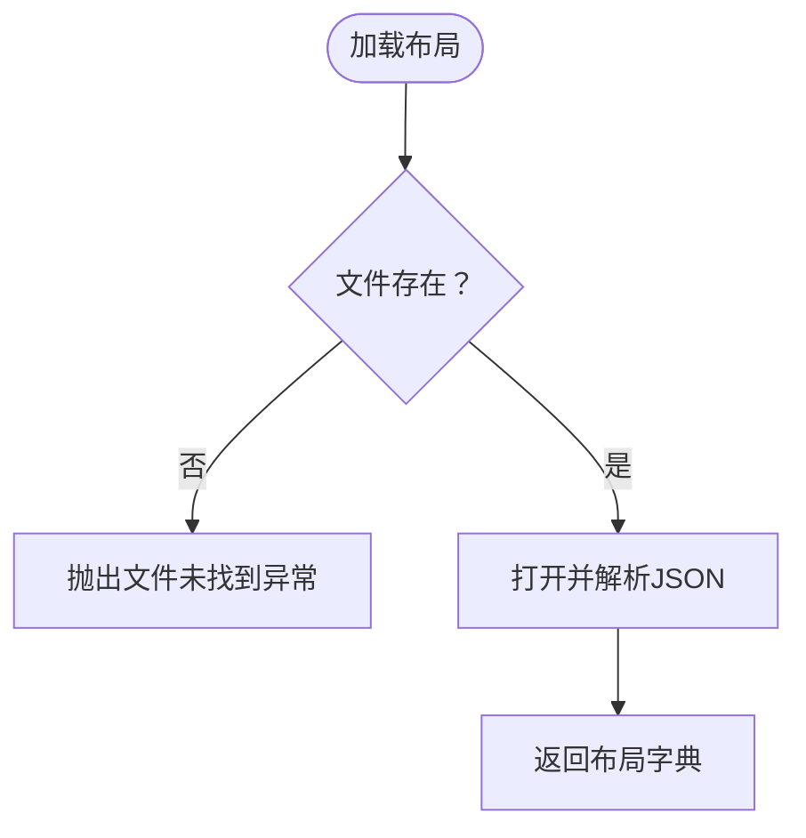
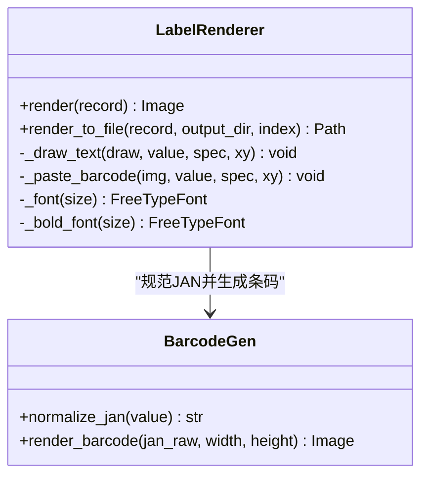
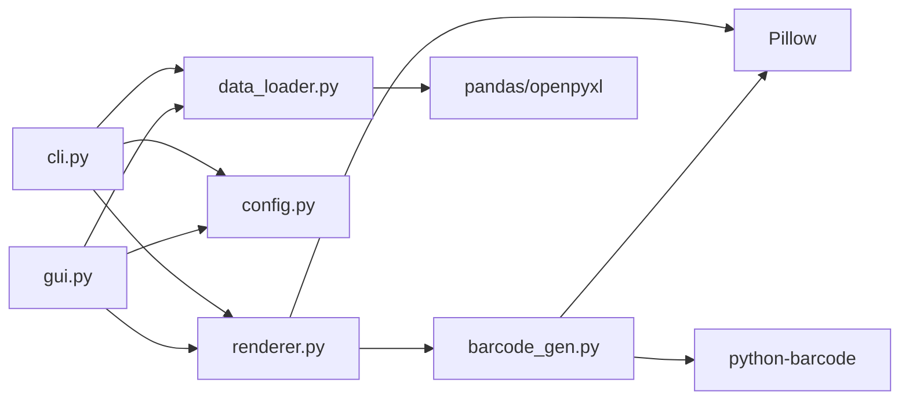

# 错误处理与调试

<cite>
**本文引用的文件**
- [README.md](file://README.md)
- [pyproject.toml](file://pyproject.toml)
- [requirements.txt](file://requirements.txt)
- [cli.py](file://src/label_generator/cli.py)
- [gui.py](file://src/label_generator/gui.py)
- [data_loader.py](file://src/label_generator/data_loader.py)
- [config.py](file://src/label_generator/config.py)
- [renderer.py](file://src/label_generator/renderer.py)
- [barcode_gen.py](file://src/label_generator/barcode_gen.py)
- [layout.json](file://config/layout.json)
- [products.csv](file://data/products.csv)
- [boy_products.csv](file://data/boy_products.csv)
- [girl_products.csv](file://data/girl_products.csv)
</cite>

## 目录
1. [简介](#简介)
2. [项目结构](#项目结构)
3. [核心组件](#核心组件)
4. [架构总览](#架构总览)
5. [详细组件分析](#详细组件分析)
6. [依赖关系分析](#依赖关系分析)
7. [性能考量](#性能考量)
8. [故障排除指南](#故障排除指南)
9. [结论](#结论)
10. [附录](#附录)

## 简介
本指南聚焦于标签生成器的错误处理与调试实践，覆盖数据验证错误、文件读取错误、渲染错误与系统错误的分类与处理策略；提供日志记录、断点调试与性能分析的方法；给出常见问题（如CSV格式错误、字体加载失败、条码生成异常等）的诊断与修复步骤；并总结错误恢复与容错机制，以及调试脚本与工具的使用建议。

## 项目结构
项目采用模块化分层设计：CLI与GUI作为入口，负责参数解析、路径校验与批量执行；数据加载模块负责CSV/Excel读取与列校验；配置模块负责布局JSON解析；渲染器负责模板绘制、文本换行、条形码叠加与输出；条码生成模块负责JAN/EAN-13规范化与图像生成。

图示来源
- [cli.py:16-86](file://src/label_generator/cli.py#L16-L86)
- [gui.py:19-384](file://src/label_generator/gui.py#L19-L384)
- [data_loader.py:9-31](file://src/label_generator/data_loader.py#L9-L31)
- [config.py:8-13](file://src/label_generator/config.py#L8-L13)
- [renderer.py:53-251](file://src/label_generator/renderer.py#L53-L251)
- [barcode_gen.py:17-60](file://src/label_generator/barcode_gen.py#L17-L60)
- [layout.json:1-56](file://config/layout.json#L1-L56)
- [products.csv:1-7](file://data/products.csv#L1-L7)

章节来源
- [README.md:40-107](file://README.md#L40-L107)
- [pyproject.toml:18-20](file://pyproject.toml#L18-L20)

## 核心组件
- CLI与GUI：统一进行文件存在性检查、布局与数据加载、列校验、逐条渲染与汇总统计；异常时输出错误信息并以非零退出码提示失败。
- 数据加载：支持CSV/Excel，自动填充空值，按布局键校验缺失列。
- 配置加载：JSON布局文件存在性与编码校验。
- 渲染器：模板与字体存在性校验、文本换行、条形码绘制、锚点转换、输出文件名安全化。
- 条码生成：JAN/EAN-13规范化、校验位计算、EAN-13图像生成与缩放。

章节来源
- [cli.py:16-86](file://src/label_generator/cli.py#L16-L86)
- [gui.py:193-384](file://src/label_generator/gui.py#L193-L384)
- [data_loader.py:9-31](file://src/label_generator/data_loader.py#L9-L31)
- [config.py:8-13](file://src/label_generator/config.py#L8-L13)
- [renderer.py:53-251](file://src/label_generator/renderer.py#L53-L251)
- [barcode_gen.py:17-60](file://src/label_generator/barcode_gen.py#L17-L60)

## 架构总览
下图展示从入口到渲染的关键调用链与错误传播路径。

图示来源
- [cli.py:16-86](file://src/label_generator/cli.py#L16-L86)
- [gui.py:303-374](file://src/label_generator/gui.py#L303-L374)
- [data_loader.py:9-31](file://src/label_generator/data_loader.py#L9-L31)
- [config.py:8-13](file://src/label_generator/config.py#L8-L13)
- [renderer.py:133-197](file://src/label_generator/renderer.py#L133-L197)
- [barcode_gen.py:17-60](file://src/label_generator/barcode_gen.py#L17-L60)

## 详细组件分析

### CLI与GUI错误处理策略
- 文件存在性检查：在启动阶段对模板、布局、字体进行存在性校验，缺失则立即报错并退出。
- 布局与数据加载：捕获异常并提示具体错误；列缺失时给出缺失列清单。
- 渲染过程：逐条渲染，记录失败SKU并汇总；最终根据失败数量决定退出码。
- GUI线程模型：后台线程执行批量生成，通过主线程更新进度与状态，避免UI阻塞。

图示来源
- [cli.py:35-86](file://src/label_generator/cli.py#L35-L86)
- [gui.py:200-254](file://src/label_generator/gui.py#L200-L254)

章节来源
- [cli.py:16-86](file://src/label_generator/cli.py#L16-L86)
- [gui.py:193-384](file://src/label_generator/gui.py#L193-L384)

### 数据加载与列校验
- 支持CSV与Excel，统一读取为字符串类型，缺失值填充为空字符串。
- 列校验：遍历布局键（跳过_meta），对比数据首行列名，返回缺失项列表。
- 异常：文件不存在或格式不支持时抛出异常。

图示来源
- [data_loader.py:9-31](file://src/label_generator/data_loader.py#L9-L31)

章节来源
- [data_loader.py:9-31](file://src/label_generator/data_loader.py#L9-L31)

### 配置加载
- JSON布局文件存在性检查与UTF-8解码。
- 异常：文件不存在时抛出异常。

图示来源
- [config.py:8-13](file://src/label_generator/config.py#L8-L13)
- [layout.json:1-56](file://config/layout.json#L1-L56)

章节来源
- [config.py:8-13](file://src/label_generator/config.py#L8-L13)
- [layout.json:1-56](file://config/layout.json#L1-L56)

### 渲染器与条码生成
- 模板与字体存在性校验；缓存字体对象以提升性能。
- 文本绘制：支持加粗、颜色、锚点、最大宽度与自动换行。
- 条码绘制：规范化JAN/EAN-13，生成EAN-13图像，可选显示数字；异常时跳过该字段并记录提示。
- 输出：安全化文件名，保存PNG。

图示来源
- [renderer.py:53-251](file://src/label_generator/renderer.py#L53-L251)
- [barcode_gen.py:17-60](file://src/label_generator/barcode_gen.py#L17-L60)

章节来源
- [renderer.py:53-251](file://src/label_generator/renderer.py#L53-L251)
- [barcode_gen.py:17-60](file://src/label_generator/barcode_gen.py#L17-L60)

## 依赖关系分析
- CLI与GUI依赖数据加载、配置加载与渲染器。
- 渲染器依赖Pillow进行图像操作，依赖条码生成模块进行条码绘制。
- 条码生成模块依赖python-barcode与Pillow。
- 数据加载依赖pandas与openpyxl。

图示来源
- [cli.py:7-9](file://src/label_generator/cli.py#L7-L9)
- [gui.py:12-14](file://src/label_generator/gui.py#L12-L14)
- [data_loader.py](file://src/label_generator/data_loader.py#L6)
- [renderer.py](file://src/label_generator/renderer.py#L9)
- [barcode_gen.py:6-8](file://src/label_generator/barcode_gen.py#L6-8)
- [pyproject.toml:10-16](file://pyproject.toml#L10-L16)

章节来源
- [pyproject.toml:10-16](file://pyproject.toml#L10-L16)
- [requirements.txt:1-6](file://requirements.txt#L1-L6)

## 性能考量
- 字体缓存：渲染器对字体对象进行LRU缓存，减少重复加载开销。
- 条码缓存：条码生成函数对输入进行LRU缓存，避免重复计算。
- 批量生成：GUI使用后台线程执行批量渲染，主线程仅负责UI更新，保证交互流畅。
- 文本测量与换行：按字符粒度测量与截断，限制行数，避免过长文本导致渲染缓慢。

章节来源
- [renderer.py:75-81](file://src/label_generator/renderer.py#L75-L81)
- [barcode_gen.py:40-43](file://src/label_generator/barcode_gen.py#L40-L43)
- [gui.py:316-348](file://src/label_generator/gui.py#L316-L348)

## 故障排除指南

### 错误分类与处理策略
- 数据验证错误
  - 表现：列缺失、空数据、格式不支持。
  - 处理：在加载阶段尽早发现并提示；CLI/GUI分别输出缺失列清单并优雅退出或警告。
  - 参考实现位置
    - [data_loader.py:26-31](file://src/label_generator/data_loader.py#L26-L31)
    - [cli.py:52-58](file://src/label_generator/cli.py#L52-L58)
    - [gui.py:220-226](file://src/label_generator/gui.py#L220-L226)
- 文件读取错误
  - 表现：文件不存在、路径错误、权限不足。
  - 处理：入口处集中检查并提示；渲染器与配置加载同样进行存在性校验。
  - 参考实现位置
    - [cli.py:36-40](file://src/label_generator/cli.py#L36-L40)
    - [renderer.py:62-66](file://src/label_generator/renderer.py#L62-L66)
    - [config.py:10-11](file://src/label_generator/config.py#L10-L11)
- 渲染错误
  - 表现：字体无法加载、模板损坏、锚点/尺寸异常。
  - 处理：渲染器在初始化阶段校验字体与模板；异常时抛出并由上层捕获。
  - 参考实现位置
    - [renderer.py:61-74](file://src/label_generator/renderer.py#L61-L74)
- 系统错误
  - 表现：磁盘空间不足、输出目录不可写、并发写冲突。
  - 处理：输出前确保目录存在；逐条渲染捕获异常并记录失败项。
  - 参考实现位置
    - [cli.py:62-85](file://src/label_generator/cli.py#L62-L85)
    - [gui.py:309-348](file://src/label_generator/gui.py#L309-L348)
    - [renderer.py:236-250](file://src/label_generator/renderer.py#L236-L250)

### 调试技术与工具
- 日志记录
  - CLI/GUI：使用标准输出与错误输出区分成功与失败信息；失败时打印SKU与异常描述。
  - 条码模块：在异常路径打印跳过提示，便于定位问题字段。
  - 参考实现位置
    - [cli.py:78-85](file://src/label_generator/cli.py#L78-L85)
    - [gui.py:336-337](file://src/label_generator/gui.py#L336-L337)
    - [renderer.py:152-154](file://src/label_generator/renderer.py#L152-L154)
- 断点调试
  - 在渲染器关键节点设置断点：字体加载、文本换行、条码生成、锚点转换与粘贴。
  - 参考实现位置
    - [renderer.py:75-81](file://src/label_generator/renderer.py#L75-L81)
    - [renderer.py:104-132](file://src/label_generator/renderer.py#L104-L132)
    - [renderer.py:133-197](file://src/label_generator/renderer.py#L133-L197)
- 性能分析
  - 使用装饰器或计时器包装渲染函数，统计耗时分布。
  - 分析条码生成与字体缓存命中率，优化布局配置。
  - 参考实现位置
    - [renderer.py:75-81](file://src/label_generator/renderer.py#L75-L81)
    - [barcode_gen.py:40-43](file://src/label_generator/barcode_gen.py#L40-L43)

### 常见问题诊断与解决
- CSV格式错误
  - 现象：列数不一致、编码异常、空表。
  - 排查：确认CSV编码为UTF-8；检查是否有隐藏字符或合并单元格；确保首行包含完整列头。
  - 解决：修正CSV；或改用Excel格式并确保扩展名为xlsx/xls。
  - 参考实现位置
    - [data_loader.py:14-23](file://src/label_generator/data_loader.py#L14-L23)
- 字体加载失败
  - 现象：初始化渲染器时报错，提示字体不存在。
  - 排查：确认字体路径正确且文件存在；检查文件权限；尝试使用默认字体。
  - 解决：修正字体路径；确保字体文件可用；GUI会回退至常规字体。
  - 参考实现位置
    - [renderer.py:64-73](file://src/label_generator/renderer.py#L64-L73)
    - [gui.py:244-252](file://src/label_generator/gui.py#L244-L252)
- 条码生成异常
  - 现象：条码字段被跳过，控制台打印“skip”提示。
  - 排查：检查JAN字段是否为纯数字、长度是否为12或13；核对校验位。
  - 解决：修正JAN；或在布局中关闭显示文本以减少干扰。
  - 参考实现位置
    - [barcode_gen.py:17-32](file://src/label_generator/barcode_gen.py#L17-L32)
    - [renderer.py:149-154](file://src/label_generator/renderer.py#L149-L154)
- 输出文件名非法
  - 现象：文件名包含非法字符导致保存失败。
  - 排查：检查SKU/编号中是否包含斜杠、冒号等非法字符。
  - 解决：使用安全化函数替换非法字符；或在数据源清洗。
  - 参考实现位置
    - [renderer.py:14-15](file://src/label_generator/renderer.py#L14-L15)
    - [renderer.py:240-246](file://src/label_generator/renderer.py#L240-L246)

### 错误恢复与容错策略
- 快速失败：入口阶段集中校验，尽早暴露问题。
- 逐条容错：批量渲染时单条失败不影响其他记录，收集失败列表并在最后汇总。
- 回退机制：无粗体字体时回退到常规字体；无输出目录时自动创建。
- 参考实现位置
  - [cli.py:42-47](file://src/label_generator/cli.py#L42-L47)
  - [gui.py:316-348](file://src/label_generator/gui.py#L316-L348)
  - [renderer.py:72-73](file://src/label_generator/renderer.py#L72-L73)

### 调试脚本与工具使用
- 单元测试与最小复现：针对数据加载、布局解析、条码生成编写小用例，快速定位问题。
- 交互式调试：在渲染器中临时打印关键变量（如字段值、锚点坐标、字体尺寸）。
- 性能剖析：对渲染器与条码生成函数添加计时，识别瓶颈。
- 参考实现位置
  - [data_loader.py:9-31](file://src/label_generator/data_loader.py#L9-L31)
  - [config.py:8-13](file://src/label_generator/config.py#L8-L13)
  - [barcode_gen.py:40-60](file://src/label_generator/barcode_gen.py#L40-L60)

## 结论
本项目在入口层进行严格校验，在渲染层提供稳健的容错与回退机制，并通过CLI/GUI双入口提供一致的错误反馈。结合日志、断点与性能分析工具，可高效定位并修复数据、文件、渲染与系统层面的问题。建议在生产环境中保留失败汇总与重试策略，确保批量任务的可靠性。

## 附录
- 示例数据与布局参考
  - [layout.json:1-56](file://config/layout.json#L1-L56)
  - [products.csv:1-7](file://data/products.csv#L1-L7)
  - [boy_products.csv:1-19](file://data/boy_products.csv#L1-L19)
  - [girl_products.csv:1-27](file://data/girl_products.csv#L1-L27)