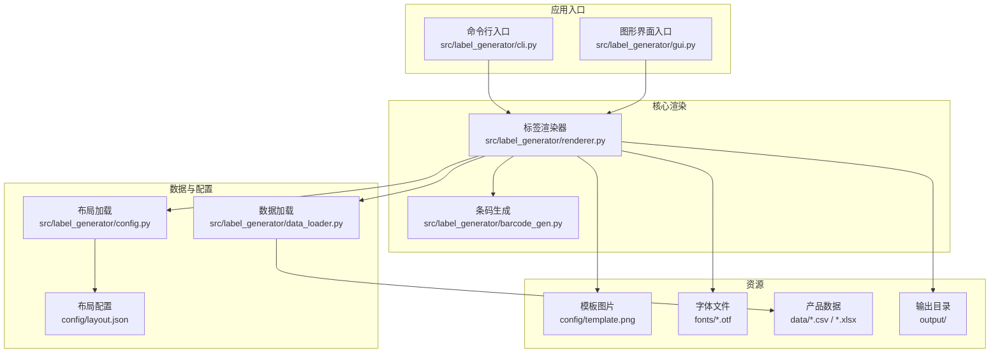
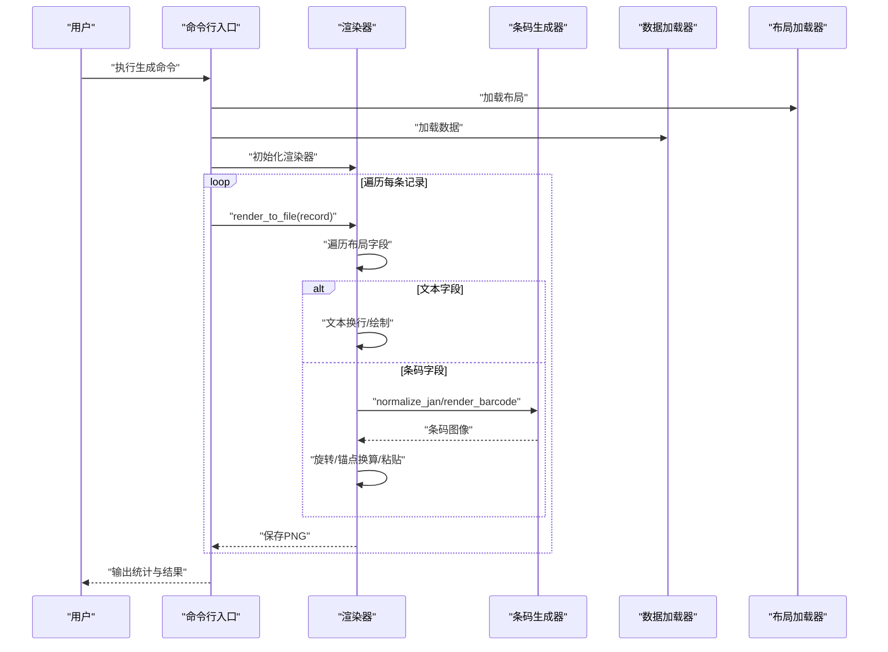
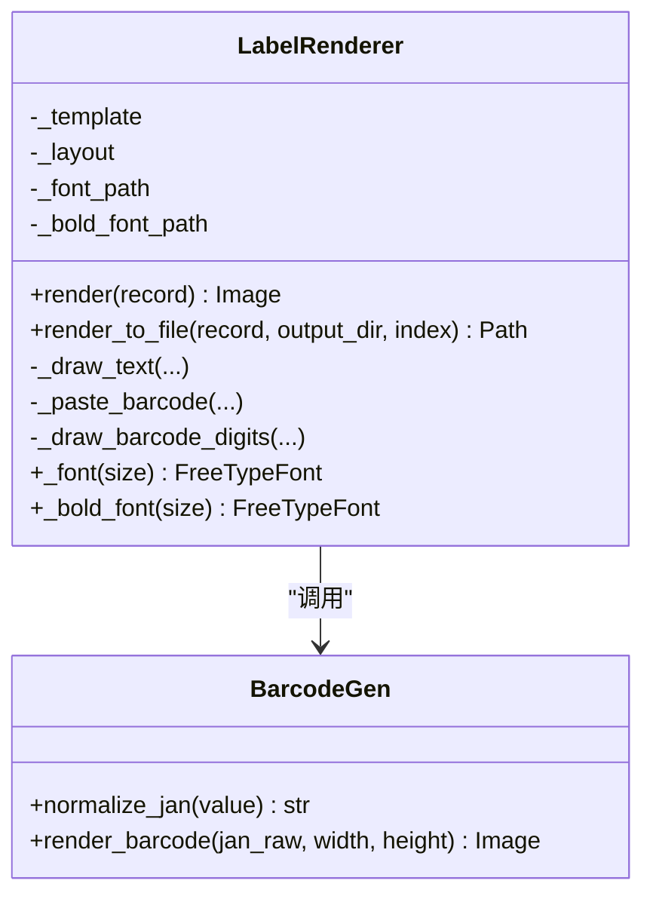
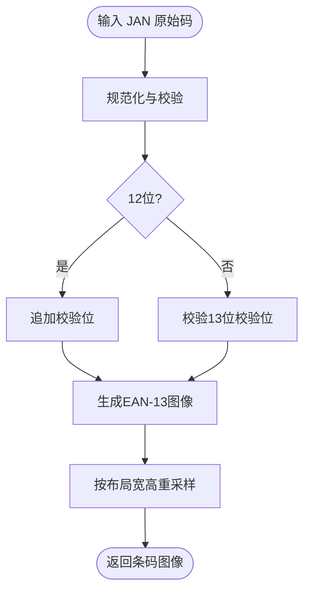
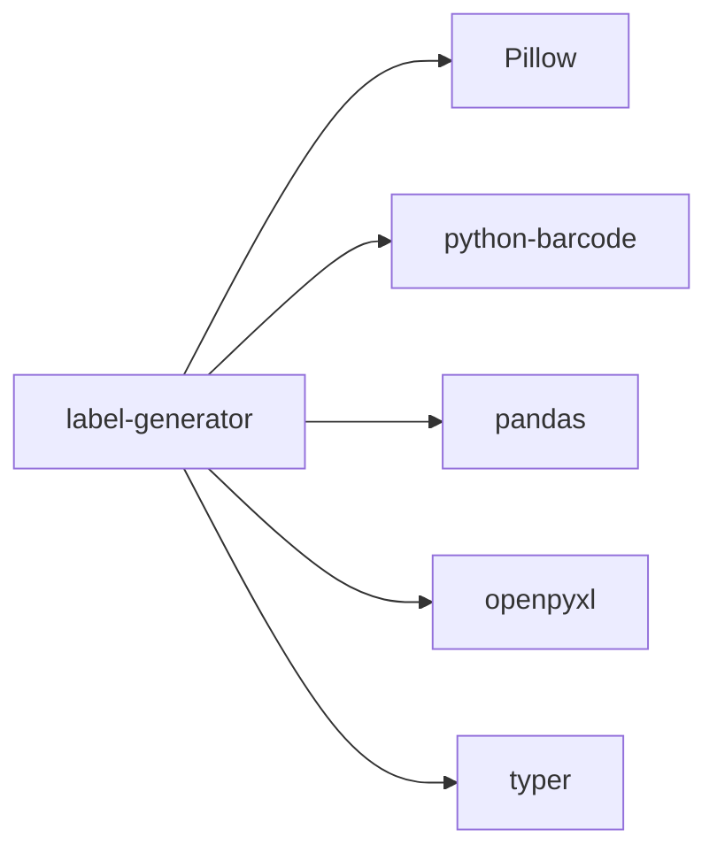

# 高级功能与扩展

<cite>
**本文档引用的文件**
- [README.md](file://README.md)
- [SPEC.md](file://SPEC.md)
- [pyproject.toml](file://pyproject.toml)
- [requirements.txt](file://requirements.txt)
- [src/label_generator/__init__.py](file://src/label_generator/__init__.py)
- [src/label_generator/cli.py](file://src/label_generator/cli.py)
- [src/label_generator/gui.py](file://src/label_generator/gui.py)
- [src/label_generator/renderer.py](file://src/label_generator/renderer.py)
- [src/label_generator/data_loader.py](file://src/label_generator/data_loader.py)
- [src/label_generator/config.py](file://src/label_generator/config.py)
- [src/label_generator/barcode_gen.py](file://src/label_generator/barcode_gen.py)
- [config/layout.json](file://config/layout.json)
- [data/products.csv](file://data/products.csv)
</cite>

## 目录
1. [简介](#简介)
2. [项目结构](#项目结构)
3. [核心组件](#核心组件)
4. [架构总览](#架构总览)
5. [详细组件分析](#详细组件分析)
6. [依赖关系分析](#依赖关系分析)
7. [性能考虑](#性能考虑)
8. [故障排查指南](#故障排查指南)
9. [结论](#结论)
10. [附录](#附录)

## 简介
本指南面向高级用户与扩展开发者，围绕标签生成器的高级功能与扩展能力进行系统化阐述。内容涵盖性能优化（缓存、批处理、内存管理）、错误处理与调试、扩展开发（插件化思路与API边界）、自动化集成与批处理脚本、生产部署最佳实践与监控维护建议，以及代码架构中的设计模式与扩展点。

## 项目结构
项目采用模块化分层组织，CLI与GUI双入口，核心渲染逻辑集中在渲染器模块，数据加载与布局配置分别由独立模块负责，条码生成单独封装，便于复用与替换。

图表来源
- [src/label_generator/cli.py:16-86](file://src/label_generator/cli.py#L16-L86)
- [src/label_generator/gui.py:303-373](file://src/label_generator/gui.py#L303-L373)
- [src/label_generator/renderer.py:53-102](file://src/label_generator/renderer.py#L53-L102)
- [src/label_generator/data_loader.py:9-24](file://src/label_generator/data_loader.py#L9-L24)
- [src/label_generator/config.py:8-14](file://src/label_generator/config.py#L8-L14)
- [config/layout.json:1-56](file://config/layout.json#L1-L56)

章节来源
- [README.md:40-59](file://README.md#L40-L59)
- [SPEC.md:120-148](file://SPEC.md#L120-L148)

## 核心组件
- 命令行入口：负责参数解析、文件存在性检查、数据与布局校验、逐条渲染与失败统计。
- 图形界面入口：提供可视化配置面板、数据预览、单行预览、后台批量生成与进度反馈。
- 渲染器：统一协调模板、布局、字体、条码与文本绘制，提供内存安全的渲染与文件落盘。
- 数据加载器：支持CSV与Excel，统一返回字典列表并进行列校验。
- 布局加载器：加载JSON布局，提供元信息与渲染规格。
- 条码生成器：封装JAN/EAN-13规范化、校验与图像生成，含LRU缓存。

章节来源
- [src/label_generator/cli.py:16-86](file://src/label_generator/cli.py#L16-L86)
- [src/label_generator/gui.py:19-384](file://src/label_generator/gui.py#L19-L384)
- [src/label_generator/renderer.py:53-251](file://src/label_generator/renderer.py#L53-L251)
- [src/label_generator/data_loader.py:9-32](file://src/label_generator/data_loader.py#L9-L32)
- [src/label_generator/config.py:8-14](file://src/label_generator/config.py#L8-L14)
- [src/label_generator/barcode_gen.py:17-60](file://src/label_generator/barcode_gen.py#L17-L60)

## 架构总览
渲染主流程从“记录”出发，依据“布局配置”对“模板图像”叠加“文本/条码”，最终保存为PNG。条码生成器负责EAN-13图像生成与尺寸调整，渲染器负责坐标换算与粘贴。

图表来源
- [src/label_generator/cli.py:67-85](file://src/label_generator/cli.py#L67-L85)
- [src/label_generator/renderer.py:83-102](file://src/label_generator/renderer.py#L83-L102)
- [src/label_generator/renderer.py:133-197](file://src/label_generator/renderer.py#L133-L197)
- [src/label_generator/barcode_gen.py:17-60](file://src/label_generator/barcode_gen.py#L17-L60)

## 详细组件分析

### 渲染器（LabelRenderer）
- 职责：模板复制、字段遍历、文本换行与绘制、条码生成与粘贴、文件落盘。
- 设计要点：
  - 字体缓存：通过LRU缓存字体对象，减少重复I/O与对象创建开销。
  - 文本换行：按最大宽度拆分（CJK按字符、英文按单词特性），最多两行并末尾截断。
  - 条码绘制：支持显示数字、旋转、锚点换算、粘贴到RGBA模板。
  - 文件命名：优先sku/sku_code/jan，非法字符替换，避免冲突。
- 性能影响点：
  - 字体缓存大小与命中率直接影响CPU与内存占用。
  - 条码图像尺寸与旋转操作在高频渲染场景下需关注。
  - 文本换行算法的时间复杂度与max_width设置相关。

图表来源
- [src/label_generator/renderer.py:53-251](file://src/label_generator/renderer.py#L53-L251)
- [src/label_generator/barcode_gen.py:17-60](file://src/label_generator/barcode_gen.py#L17-L60)

章节来源
- [src/label_generator/renderer.py:53-251](file://src/label_generator/renderer.py#L53-L251)

### 条码生成器（JAN/EAN-13）
- 职责：规范化输入（12位补校验、13位校验）、生成EAN-13图像、尺寸重采样、缓存中间结果。
- 设计要点：
  - 校验逻辑：严格区分12/13位输入，异常即抛出。
  - 图像生成：使用ImageWriter直接输出PNG，避免SVG再转导致失真。
  - 缓存：LRU缓存生成结果，显著降低重复渲染成本。
- 性能影响点：
  - 缓存容量与条码种类数量决定命中率。
  - 重采样算法（LANCZOS）质量与速度平衡。

图表来源
- [src/label_generator/barcode_gen.py:17-60](file://src/label_generator/barcode_gen.py#L17-L60)

章节来源
- [src/label_generator/barcode_gen.py:17-60](file://src/label_generator/barcode_gen.py#L17-L60)

### 数据加载器（CSV/Excel）
- 职责：读取数据为字典列表，缺失值填充为空字符串，列校验。
- 设计要点：
  - 统一接口支持CSV与Excel，避免业务层感知格式差异。
  - 列校验在渲染前集中执行，提升健壮性。
- 性能影响点：
  - 大数据集读取与内存占用，建议分批处理或流式读取策略（见“性能考虑”）。

章节来源
- [src/label_generator/data_loader.py:9-32](file://src/label_generator/data_loader.py#L9-L32)

### 布局加载器（layout.json）
- 职责：加载JSON布局，提供字段类型、坐标、锚点、字体、条码参数等。
- 设计要点：
  - _meta键用于元信息，渲染时跳过。
  - anchor遵循PIL约定，xy为锚点坐标。
- 性能影响点：
  - 布局越大、字段越多，遍历渲染开销越高；可通过字段裁剪与缓存优化。

章节来源
- [src/label_generator/config.py:8-14](file://src/label_generator/config.py#L8-L14)
- [config/layout.json:1-56](file://config/layout.json#L1-L56)

### CLI与GUI
- CLI：fail-fast检查、逐条渲染、失败收集与退出码控制。
- GUI：多线程后台生成、进度条与状态提示、错误弹窗。
- 设计要点：
  - GUI通过主线程更新UI，后台线程执行耗时任务，避免阻塞。
  - CLI与GUI共享同一渲染器，保证行为一致性。

章节来源
- [src/label_generator/cli.py:16-86](file://src/label_generator/cli.py#L16-L86)
- [src/label_generator/gui.py:303-373](file://src/label_generator/gui.py#L303-L373)

## 依赖关系分析
- 语言与运行时：Python 3.11+，通过pyproject.toml声明依赖。
- 主要第三方库：Pillow（图像）、python-barcode（条码）、pandas/openpyxl（数据）、typer（CLI框架）。
- 包导出：命令行与GUI入口通过scripts暴露，便于直接运行。

图表来源
- [pyproject.toml:10-16](file://pyproject.toml#L10-L16)
- [requirements.txt:1-6](file://requirements.txt#L1-L6)

章节来源
- [pyproject.toml:1-27](file://pyproject.toml#L1-L27)
- [requirements.txt:1-6](file://requirements.txt#L1-L6)

## 性能考虑
- 缓存机制
  - 字体缓存：渲染器对Regular/Bold字体分别LRU缓存，减少重复I/O与对象创建。
  - 条码缓存：条码生成器对相同参数组合进行LRU缓存，显著降低重复渲染成本。
  - 建议：根据模板与布局变化频率调整缓存容量；在高并发场景下可考虑进程级共享缓存。
- 批处理优化
  - 数据读取：CSV/Excel一次性读入内存，建议在大数据集场景下分批处理或使用流式读取替代方案。
  - 渲染批量化：CLI/GUI均逐条渲染，建议在GUI中增加“批量生成队列”与“并发渲染池”（注意线程安全与内存峰值）。
- 内存管理
  - 图像对象生命周期：尽量在函数作用域内创建与销毁，避免跨调用持有大对象。
  - 预览缩放：GUI预览使用高质量重采样，但仅用于展示；生成阶段使用原尺寸以保证精度。
  - 临时缓冲：条码生成使用BytesIO，及时seek与关闭，避免内存泄漏。
- 并发与异步
  - 当前为单线程渲染；在GUI中已采用后台线程，CLI可引入多进程池以利用多核。
- I/O优化
  - 输出目录提前mkdir，避免频繁系统调用。
  - 文件命名规范化，减少磁盘写入冲突。

章节来源
- [src/label_generator/renderer.py:75-82](file://src/label_generator/renderer.py#L75-L82)
- [src/label_generator/barcode_gen.py:40-60](file://src/label_generator/barcode_gen.py#L40-L60)
- [src/label_generator/gui.py:316-348](file://src/label_generator/gui.py#L316-L348)

## 故障排查指南
- 常见错误类型与定位
  - 文件缺失：模板、布局、字体、数据文件不存在。CLI在启动阶段fail-fast；GUI弹窗提示。
  - 列缺失：布局要求的字段在数据中缺失，一次性报出所有缺失列。
  - JAN校验失败：12位非数字、长度不符、13位校验位错误；渲染时跳过该行并记录失败。
  - 空字段：type为text且值为空字符串时跳过渲染，不报错。
- 调试建议
  - 启用详细日志：在渲染器中添加字段级别日志，记录坐标、尺寸、锚点换算过程。
  - 逐步验证：先验证布局与字体，再验证条码生成，最后整体渲染。
  - 回归测试：针对异常输入（空值、超长文本、非法字符）编写最小化用例。
- 错误处理策略
  - CLI：聚合失败SKU并在结束时统一输出，退出码区分成功/失败。
  - GUI：后台线程捕获异常，主线程弹窗提示前若干条错误。

章节来源
- [src/label_generator/cli.py:35-58](file://src/label_generator/cli.py#L35-L58)
- [src/label_generator/gui.py:200-226](file://src/label_generator/gui.py#L200-L226)
- [src/label_generator/renderer.py:149-154](file://src/label_generator/renderer.py#L149-L154)
- [SPEC.md:205-213](file://SPEC.md#L205-L213)

## 结论
本项目以清晰的模块划分与稳健的错误处理为基础，具备良好的扩展性与可维护性。通过合理运用缓存、批处理与内存管理策略，可在保持质量的同时显著提升吞吐量。GUI与CLI双入口满足不同使用场景，为自动化集成提供了良好基础。后续可在并发渲染、动态布局与插件化渲染器方面进一步演进。

## 附录

### 扩展开发指导原则
- 插件化思路
  - 渲染器抽象：将“文本/条码”渲染抽象为可插拔的渲染器组件，新增渲染类型时仅需实现接口。
  - 字体与资源：通过配置驱动字体与资源路径，避免硬编码。
  - 条码扩展：新增条码类型时，保持normalize/render接口一致，复用现有缓存与尺寸处理。
- API边界
  - 渲染器对外仅暴露render与render_to_file两个方法，内部职责单一，便于替换与测试。
  - 数据加载器与布局加载器提供稳定接口，业务层无需感知底层实现细节。
- 设计模式
  - 缓存模式：在渲染器与条码生成器中广泛使用LRU缓存，提升性能。
  - 策略模式：文本换行策略可注入，便于适配不同语言与排版需求。
  - 观察者模式：GUI通过主线程回调更新进度，解耦UI与后台任务。

章节来源
- [src/label_generator/renderer.py:53-102](file://src/label_generator/renderer.py#L53-L102)
- [src/label_generator/barcode_gen.py:17-60](file://src/label_generator/barcode_gen.py#L17-L60)

### 自动化集成与批处理脚本
- CLI集成
  - 使用命令行入口进行批处理，结合shell脚本或CI工具链实现定时生成。
  - 建议：在脚本中先执行数据与布局校验，再触发生成，最后汇总失败列表。
- GUI自动化
  - GUI适合交互式预览与小批量生成；若需自动化，建议封装为CLI调用或二次开发。
- 失败重试与幂等
  - 生成阶段已具备失败收集与退出码；可在外部脚本中实现重试与去重。

章节来源
- [src/label_generator/cli.py:66-85](file://src/label_generator/cli.py#L66-L85)
- [SPEC.md:193-203](file://SPEC.md#L193-L203)

### 生产环境部署与监控
- 部署建议
  - 使用容器镜像打包，固定Python版本与依赖，确保一致性。
  - 将模板、布局、字体与数据挂载为卷，便于热更新与版本管理。
- 监控与维护
  - 日志：记录每批次生成数量、失败率、平均耗时与峰值内存。
  - 健康检查：定期校验模板与字体是否存在，布局字段是否匹配。
  - 压力测试：模拟高峰期数据规模，评估缓存命中率与并发渲染效果。

章节来源
- [SPEC.md:205-213](file://SPEC.md#L205-L213)